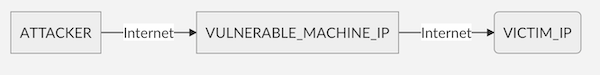
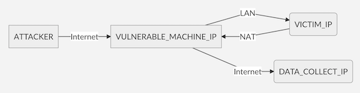

# cve-2020-10136
You can use this code to verify if your device supports default IP-in-IP
encapsulation from arbitrary sources to arbitrary destinations. The intended
use of this code requires at least two more devices with distinct IP
addresses for these two devices. The testing in "bypass" mode requires
the vulnerable device to be "dual-homed" so routing to the "inside"
network from an external network interface can be verified.

Spoof mode:  

The demonstration script can be used in two ways - spoof mode and
bypass mode. Initial setup requires at least three devices for this
testing. In the simple spoofing mode, attacker will send a IP-in-IP
packet from their device to a vulnerable machine
(VULNERABLE_MACHINE_IP sys.argv[1]) to replay a packet to the victim's
device (VICTIM_IP sys.argv[2]). This mode demonstrates a DDOS
capability to send unsolicited traffic to VICTIM_IP. Because this
packet has valid source and destination, anti-spoofing measure such as
BCP-38 will not block this crafted packet. The intended traffic can be
routed through the VULNERABLE_IP to the VICTIM_IP device by an
unauthenticated attacker.

Bypass mode:  

In the bypass mode (using all 4 arguments for the script), the
attacker will send a crafted IP-in-IP packet from the attacker's
device to a vulnerable device (VULNERABLE_MACHINE_IP sys.argv[1]). The
vulnerable device will receive and decapsulate the packet and forward
the inner IP packet to the victim device (VICTIM_IP sys.argv[2])
machine with a source IP Address of DATA_COLLECT_IP (sys.argv[3]). The
attacker can thus solicit information using the sample SNMP query to
be sent to DATA_COLLECT_IP which he has access to.  In the provided
example, device at the VICTIM_IP address is assumed to have SNMP
enabled with the standard "public" community string for read-only
access. SNMP is being demonstrated here, but this forwarding behavior
can allow for many types of unexpected IP traffic to traverse using
the vulnerable machine as a forwarding point for any nefarious
communications as planned by the attacker.
