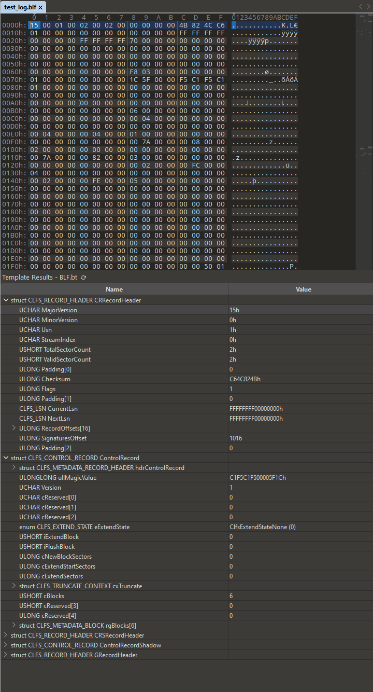
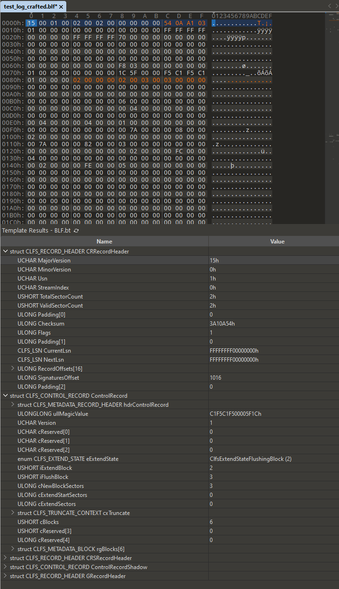

# cve-2021-36955

## Vulnerability Info
https://blog.exodusintel.com/2022/03/10/exploiting-a-use-after-free-in-windows-common-logging-file-system-clfs/

## PoC Crasher
### Overview
The proof-of-concept is very simple, just code to open and close a log file, using `CreateLogFile()` and `CloseHandle()`.

If the log file `test_log.blf` does NOT exist it will be created.  
If the log file `test_log.blf` does exist, then the existing file will be opened.

The file `test_log_crafted.blf` has been modified, such that when opened by `CreateLogFile()`, it will trigger the vulnerability on unpatched systems. The provided proof-of-concept causes a double free when `CloseHandle()` is called, resulting in a BSOD for a BAD_POOL_HEADER.

### BLF Layout

The first 0x200 bytes of test_log.blf are the important bytes. Most of these bytes are 0's (as with the rest of a default newly created file), and only matter for the purposes of the checksum.

These bytes make up a CLFS_RECORD_HEADER and a CLFS_CONTROL_RECORD.

(Screenshots are taken of the [010 Editor](https://www.sweetscape.com/010editor/))

#### Crafting the CLFS_CONTROL_RECORD 
The following fields are changed from the default value of 0 to meet the conditions described in the [referenced blog post](https://blog.exodusintel.com/2022/03/10/exploiting-a-use-after-free-in-windows-common-logging-file-system-clfs/)
- `eExtendState` -> 2
- `iExtendBlock` -> 2
- `iFlushBlock` -> 3
- `cNewBlockSectors` -> 3

After updating these fields, the checksum needs to be updated
The result looks like (the changed bytes are colored orange):

##### Checksum Notes
The checksum is calculated over the first 0x200 bytes, with the checksum field zeroed out.

[Alex Ionescu documents](https://github.com/ionescu007/clfs-docs) that the CRC32 polynomial is `0x04C11DB7`.  
However, after some experimentation with the 010 Editor's CRC32 tool and referencing [Michaelangel007's notes](https://github.com/Michaelangel007/crc32) the checksum can be replicated using the 'reverse' fixed polynomial `0xEDB88320`. 
(This is the same polynomial, just flipped around from the perspective of 010 Editor's CRC32 implementation.)

## Files
- [scripts](./scripts)
    - [BLF.bt](./scripts/BLF.bt)  
A partial 010 Editor Template for BLF files
    - [BLF_Checksum.1sc](./scripts/BLF_Checksum.1sc)   
A 010 Editor Script for updating the Control Record Header checksum.  
This script should be used after the `BLF.bt` template has been applied to the file.
- [src](./src)
    - [poc.c](./src/poc.c)  
A simple C program to open and close a log file.
    - [Makefile](./src/Makefile)  
A simple Makefile with the gcc invocation used to compile `poc.exe`  
MinGW is used to compile on Windows.
    - [test_log_crafted.blf](./src/test_log_crafted.blf)  
a crafted version of a default BLF file created by running `poc.exe` without `test_log.blf` existing.