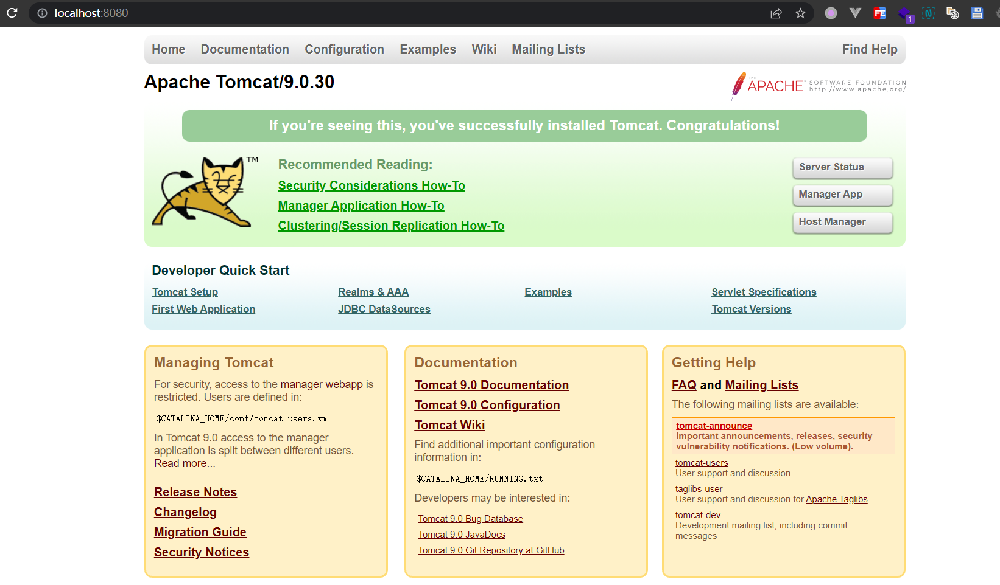
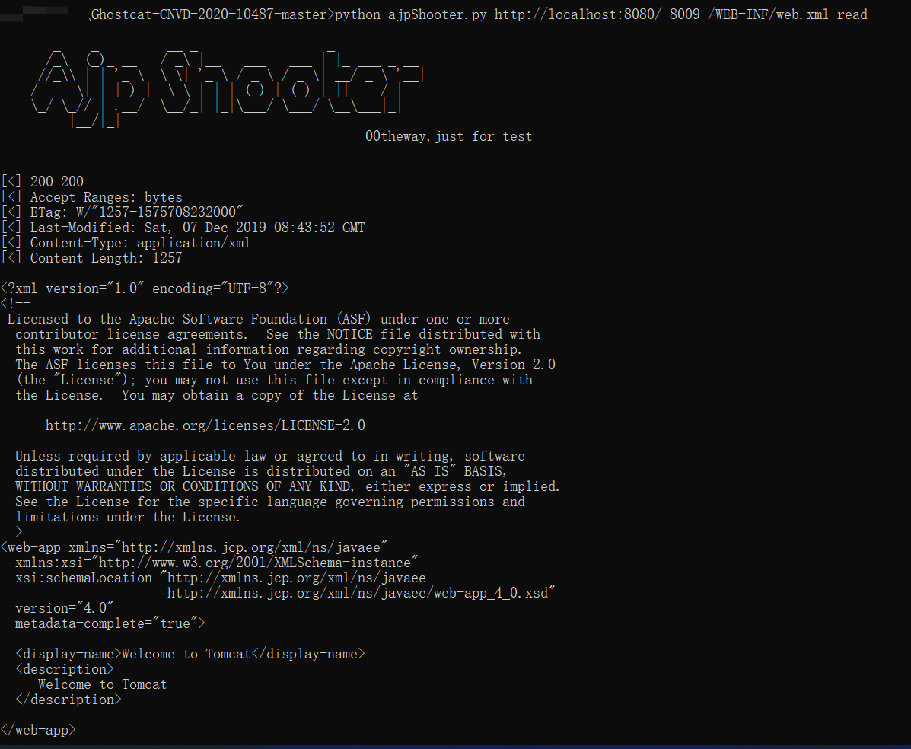

# Apache-Tomcat-Ajp LFI
## 漏洞编号
CVE-2020-1938 / CNVD-2020-10487
## 影响版本
* Apache Tomcat 6  
* Apache Tomcat 7 < 7.0.100  
* Apache Tomcat 8 < 8.5.51  
* Apache Tomcat 9 < 9.0.31  
## 漏洞复现
1. 启动apache tomcat服务，访问localhost:8080可以成功访问如下界面

2. 端口扫描发现8009 8080端口开启，同时上一步的截图中发现版本为`9.0.30` ，证明有该漏洞。  
3. 执行poc 脚本：
```shell
python exp.py http://localhost:8080/ 8009 /WEB-INF/web.xml read
```
4. 执行成功后可以看到成功访问到该文件



