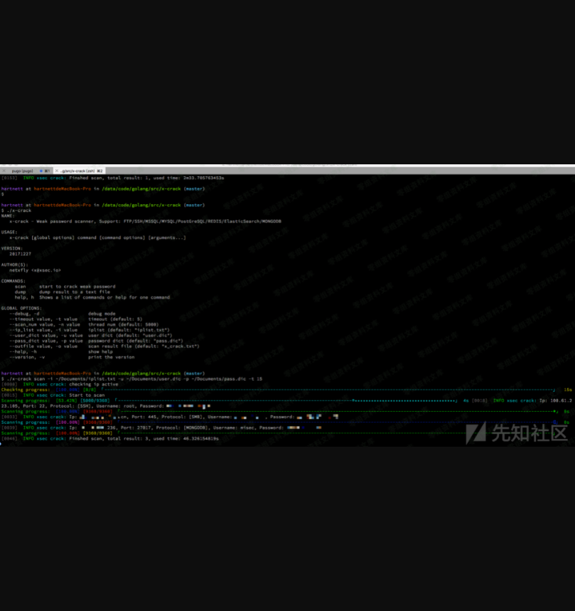

MongoDB未授权访问
=================

一、漏洞简介
------------

MongoDB
默认直接连接，无须身份验证，如果当前机器可以公网访问，且不注意Mongodb
端口（默认
27017）的开放状态，那么Mongodb就会产生安全风险，被利用此配置漏洞，入侵数据库。

-   使用默认 mongod 命令启动 Mongodb

-   机器可以被公网访问

-   在公网上开放了 Mongodb 端口

-   数据库隐私泄露

-   数据库被清空

-   数据库运行缓慢

二、影响范围
------------

三、复现过程
------------

#### 1. 扫描探测

#### 2. 下载：

<http://nmap.org/svn/scripts/mongodb-info.nse>

    nmap -p 27017 --script mongodb-info <ip>

    vim /etc/mongodb.conf
    dbpath = /data/
    logpath = /var/logs/mongodb.log
    ##port = 27017
    ##fork = true
    bind_ip = 0.0.0.0

    ./mongod –config mongodb.conf //启动mongodb加载配置mongodb.conf

##### 1.1 基础

-   <https://www.jianshu.com/p/8bf26effa737>

-   <http://www.runoob.com/mongodb/mongodb-tutorial.html>

-   <https://itbilu.com/database/mongo/E1tWQz4_e.html>

##### 1.2 批量扫描未授权

    import socket
    import sys
    import pymongo

    ipcons = []
    def Scanner(ip):
        global ipcons
        sk = socket.socket(socket.AF_INET, socket.SOCK_STREAM)
        sk.settimeout(0.3)
        try:
            sk.connect((ip,27017))
            ipcons.append(ip)
            sk.close()
        except Exception:
            pass

    def ip2num(ip):
        ip=[int(x) for x in ip.split('.')]
        return ip[0] <<24 | ip[1]<<16 | ip[2]<<8 |ip[3]

    def num2ip(num):
        return '%s.%s.%s.%s' %( (num & 0xff000000) >>24,
                                    (num & 0x00ff0000) >>16,
                                    (num & 0x0000ff00) >>8,
                                    num & 0x000000ff )

    def get_ip(ip):
        start,end = [ip2num(x) for x in ip.split(' ') ]
        return [ num2ip(num) for num in range(start,end+1) if num & 0xff ]

    startIp = sys.argv[1]
    endIp = sys.argv[2]
    iplist = get_ip(sys.argv[1]+" "+sys.argv[2])
    for i in iplist:
        Scanner(i)

    def connMon(ip_addr):
        print ' Connect mongodb: ' + ip_addr + ':27017'
        try:
            conn = pymongo.MongoClient(ip_addr,27017,socketTimeoutMS=3000)
            dbname = conn.database_names()
            print "success"
        except Exception as e:
            print "error"

    print ipcons   
    for ipaddr in ipcons:
        connMon(ipaddr)
        print "================="

##### 1.3 shodan扫描脚本

    ##!/usr/bin/python
    ## -*- coding: UTF-8 -*-
    '''
    @Author：joy_nick
    @博客：http://byd.dropsec.xyz/
    '''
    import shodan
    import os
    iplist = []
    ip_list = []
    shodan_ip_list = []
    def shodanSearch(keywords):
        SHODAN_API_KEY = "your key"
        api = shodan.Shodan(SHODAN_API_KEY)
        total = 0
        try:
            results = api.search(keywords)
            total = int(results['total'])
            for result in results['matches']:
                ##iplist.append({"ip":result['ip_str'],"country":result['location']['country_name']})
                iplist.append(result['ip_str'])
                for i in range(len(iplist)):
                    ip_list = iplist[i].encode('utf-8')
                    shodan_ip_list.append(ip_list)
                    s = '\n'.join(shodan_ip_list)
                    with open('shodan_ip_list.txt','w') as output:
                        output.write(s)
        except shodan.APIError, e:
            print 'Error: %s' % e
    if __name__ == '__main__':
        shodanSearch('redis')

查询操作

#### 2. 爆破脚本

<https://github.com/netxfly/x-crack>

#### 4. 防范措施

**(1).新建管理账户开启MongoDB授权**新建终端\[参数默认可以不加，若有自定义参数，才要加上，下同\] mongod
\--port 27017 \--dbpath /data/db1

另起一个终端，运行下列命令

    mongo --port 27017

      use admin

      db.createUser(
        {
          user: "adminUser",
          pwd: "adminPass",
          roles: [ { role: "userAdminAnyDatabase", db: "admin" } ]
        }
      )

管理员创建成功，现在拥有了用户管理员 用户名:adminUser 密码:adminPass

**(2).本地访问**bind 127.0.0.1 **(3).修改默认端口**修改默认的mongoDB端口(默认为: TCP 27017)为其他端口

**(4).禁用HTTP和REST端口**MongoDB自身带有一个HTTP服务和并支持REST接口。在2.6以后这些接口默认是关闭的。mongoDB默认会使用默认端口监听web服务，一般不需要通过web方式进行远程管理，建议禁用。修改配置文件或在启动的时候选择--nohttpinterface
参数nohttpinterface = false**(5).开启日志审计功能**审计功能可以用来记录用户对数据库的所有相关操作。这些记录可以让系统管理员在需要的时候分析数据库在什么时段发生了什么事情**(6).开启auth认证**

    /etc/mongodb.conf　　
    auth = true

其他:http://www.mottoin.com/10560
