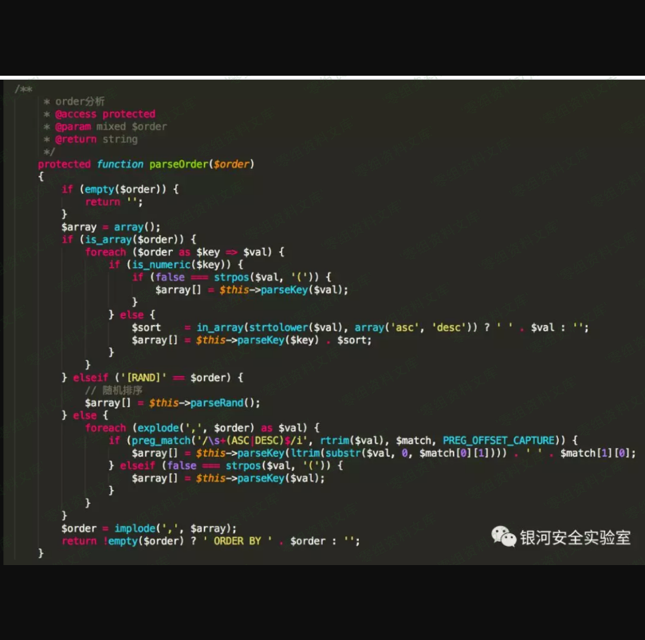

Thinkphp 3.x order by 注入漏洞
==============================

一、漏洞简介
------------

ThinkPHP在处理order
by排序时，当排序参数可控且为关联数组(key-value)时，由于框架未对数组中key值作安全过滤处理，攻击者可利用key构造SQL语句进行注入，该漏洞影响ThinkPHP
3.2.3、5.1.22及以下版本。

二、漏洞影响
------------

ThinkPHP 3.2.3、5.1.22及以下版本。

三、复现过程
------------

ThinkPHP3.2.3漏洞代码（/Library/Think/Db/Driver.class.php）：

ThinkPHP 5.1.22漏洞代码（framework/library/think/db/Query.php）：

从上面漏洞代码可以看出，当\$field参数为关联数组（key-value）时，key值拼接到返回值中，SQL语句最终绕过了框架安全过滤得以执行。

### ThinkPHP 3.2.3

访问如下URL即可进行漏洞利用：

    http://www.0-sec.org/ThinkPHP/?order[updatexml(1,concat(0x3a,user()),1)]=1

参考链接
--------

> <https://mp.weixin.qq.com/s?__biz=MzIwNTcxNTczMQ==&mid=2247483907&idx=1&sn=3c1f9874878c92d10cff30c1c263fa8a&scene=21#wechat_redirect>
