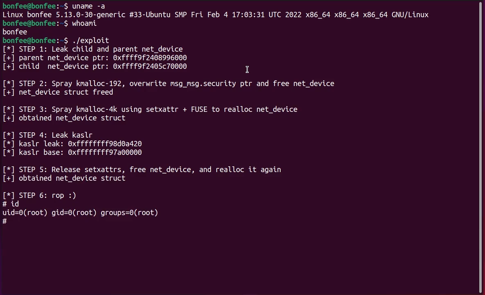

# CVE-2022-25636 Linux 本地提权
This is my exploit for `CVE-2022-25636`.  
I tested it against Ubuntu 21.10 with kernel `5.13.0-30`.  
Works about `~40%` of the time, in the other cases you likely get a kernel panic.  
The exploit might corrupt important data on heap, after an unsuccessful attempt it's best to reboot.  

## USAGE
编译完成后，直接运行即可

