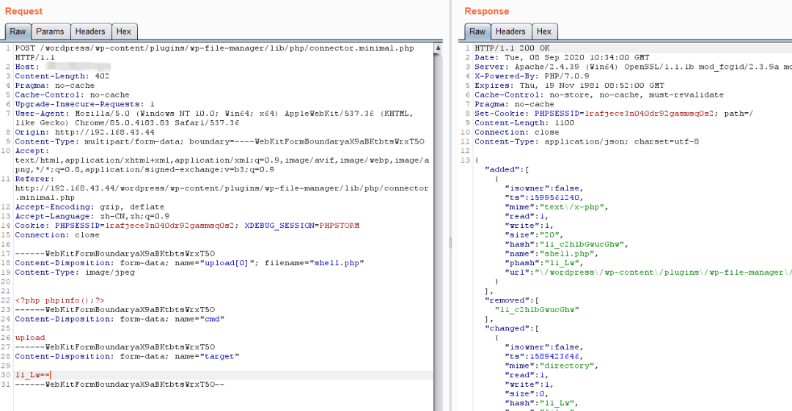

# WordPress File Manager插件任意文件上传漏洞
> File Manager是一个WordPress插件，由于函数处理不严谨，可构造恶意请求包上传任意文件。漏洞主要因为File Manager插件中的elFinder库的调用未进行严格访问控制触发，导致可以被直接利用

### 影响版本
1. 免费版受影响版本：V6.0-V6.8  
2. Pro版受影响版本：V7.6-V7.0

### 漏洞危害
通过上传恶意文件，可以获取webshell 权限
### 漏洞利用
1. burp 发包  

2. 访问 `http://localhost/wordpress/wp-content/plugins/wp-file-manager/lib/files/shell.php`  
