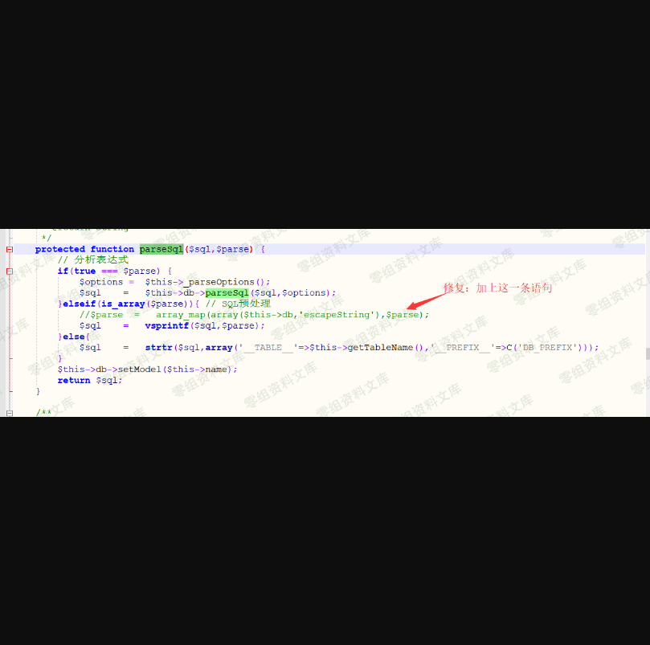
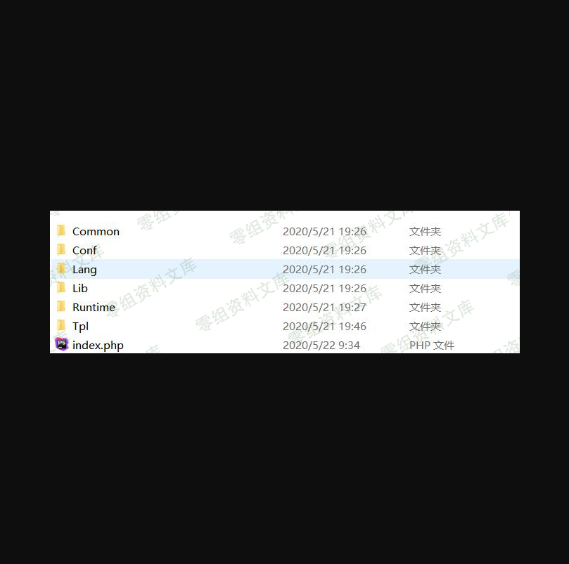

# Thinkphp 3.1.3 sql注入漏洞

## 一、漏洞简介

## 二、漏洞影响

Thinkphp 3.1.3

## 三、复现过程

首先在网上下载对应的压缩包。

漏洞位于`ThinkPHP/Lib/Core/Model.class.php` 文件的parseSql函数

将这一条修复语句注释后开始一步步复现



在ThinkPHP目录下创建app文件夹后创建index.php


访问相应页面，显示这个则说明成功。


成功后app文件夹下会生成工程文件



然后开始配置数据库(在app/conf/config.php下配置)

```php
<?php
return array(
    //'配置项'=>'配置值'
// 添加数据库配置信息
'DB_TYPE'   => 'mysql', // 数据库类型
'DB_HOST'   => 'localhost', // 服务器地址
'DB_NAME'   => 'security', // 数据库名
'DB_USER'   => 'root', // 用户名
'DB_PWD'    => 'root', // 密码
'DB_PORT'   => 3306, // 端口
'DB_PREFIX' => 'think_', // 数据库表前缀
);
?>
```

下一步开始为模块定义一个控制器类:`IndexAction.class.php`。命名规范（模块名+Action.class.php）

```php
<?php
// 本类由系统自动生成，仅供测试用途
class IndexAction extends Action {
    public function index(){
      //$this->name = 'thinkphp'; // 进行模板变量赋值
      //$this->display();
        
    $Data = M('Data'); // 实例化Data数据模型
    $this->data = $Data->select();
    $this->display();
    
    $model=M('think_data');
    $m=$model->query('select * from think_data where id="%s"',array($_GET['id']));
    dump($m);exit;
    }
    
}
```

创建视图：在`./Tpl`下创建`Index/index.html`

```html
<html>
 <head>
   <title></title>
 </head>
 <body>
    //<p>hello, {$name}!</p>
    <volist name="data" id="vo">
    {$vo.id}--{$vo.data}<br/>
    </volist>
 </body>
</html>
```

> 在浏览器访问

`https://www.0-sec.org:9090/ThinkPHP_3.1.3_full/ThinkPHP/app/`


`https://www.0-sec.org:9090/ThinkPHP_3.1.3_full/ThinkPHP/app/?id=1" or 1 –`


复现结束

## 参考连接

> https://www.freesion.com/article/3289785672/
