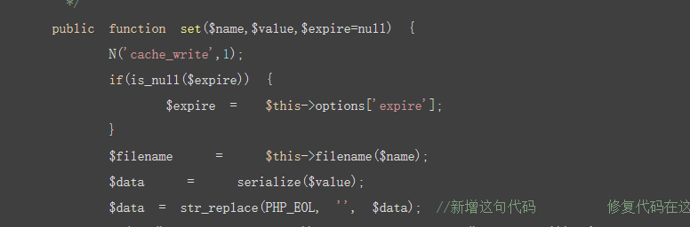

# ThinkPHP 3.2.3 缓存漏洞
* [https://bbs.pediy.com/thread-220375.htm](https://bbs.pediy.com/thread-220375.htm)
* [https://www.seebug.org/vuldb/ssvid-96340](https://www.seebug.org/vuldb/ssvid-96340)
* 官方声明[http://www.thinkphp.cn/topic/51162.html](http://www.thinkphp.cn/topic/51162.html)
## Usage:
```
    %2F%2F%0D%0A payload = //+回车
```
### 换行导致payload逃逸出注释而执行


## 修复 
`thinkphp\library\think\cache\driver\File.php`

`public function set($name, $value, $expire = null)`方法



