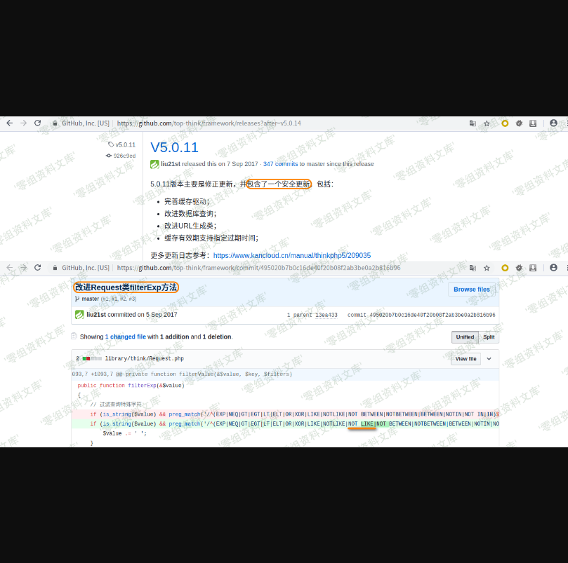
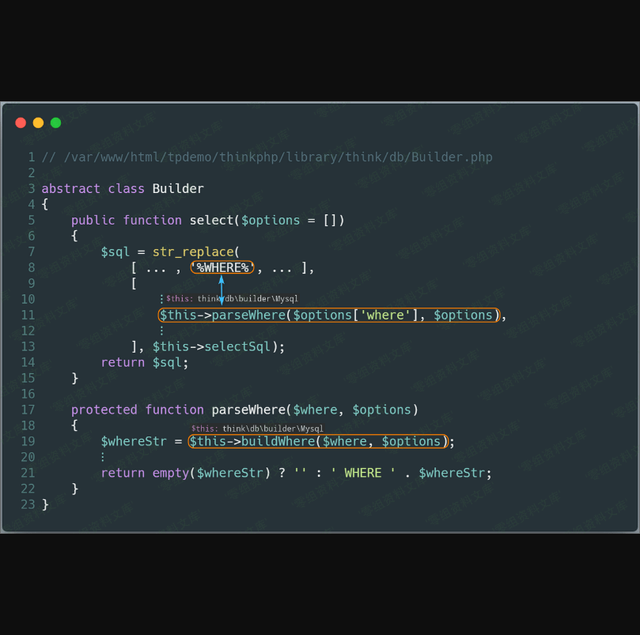
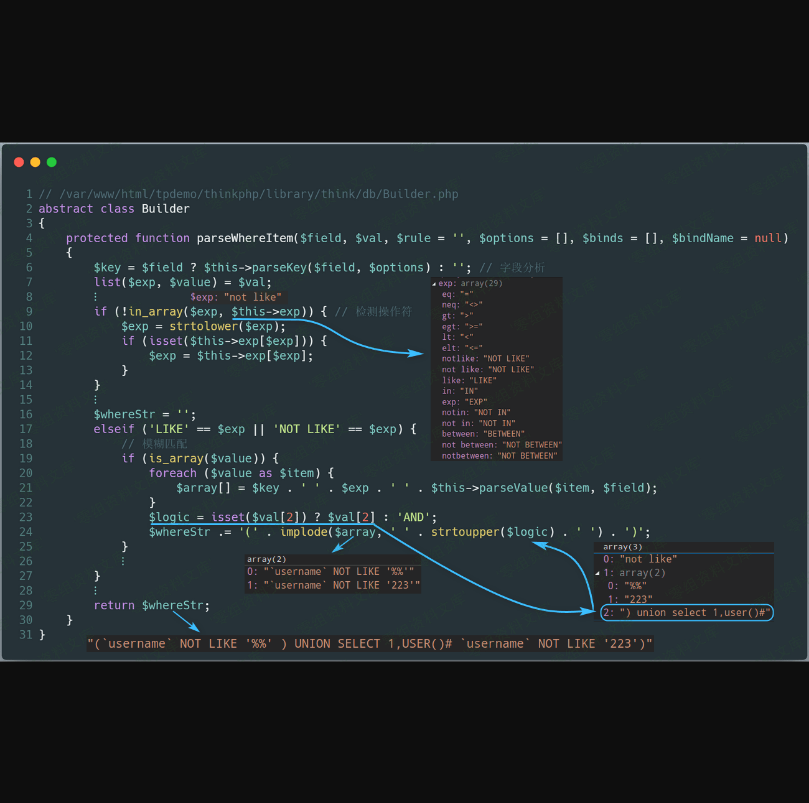
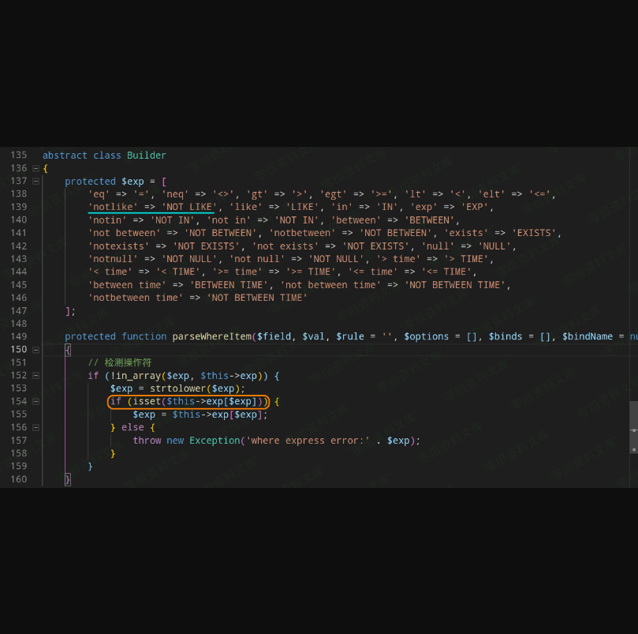

Thinkphp = 5.0.10
=================

一、漏洞简介
------------

本篇文章，将分析 **ThinkPHP** 中存在的 **SQL注入** 漏洞（ **select**
方法注入）。本次漏洞存在于 **Mysql** 类的 **parseWhereItem**
方法中。由于程序没有对数据进行很好的过滤，直接将数据拼接进 **SQL**
语句。再一个， **Request** 类的 **filterValue** 方法漏过滤 **NOT LIKE**
关键字，最终导致 **SQL注入漏洞** 的产生。

二、漏洞影响
------------

ThinkPHP=5.0.10

三、复现过程
------------

### 漏洞环境

通过以下命令获取测试环境代码：

    composer create-project --prefer-dist topthink/think=5.0.10 tpdemo

将 **composer.json** 文件的 **require** 字段设置成如下：

    "require": {
        "php": ">=5.4.0",
        "topthink/framework": "5.0.10"
    },

然后执行 `composer update` ，并将
**application/index/controller/Index.php** 文件代码设置如下：

    <?php
    namespace app\index\controller;

    class Index
    {
        public function index()
        {
            $username = request()->get('username/a');
            $result = db('users')->where(['username' => $username])->select();
            var_dump($result);
        }
    }

在 **config/database.php** 文件中配置数据库相关信息，并开启
**config/app.php** 中的 **app\_debug** 和 **app\_trace**
。创建数据库信息如下：

    create database tpdemo;
    use tpdemo;
    create table users(
        id int primary key auto_increment,
        username varchar(50) not null
    );
    insert into users(id,username) values(1,'mochazz');

访问 **http://localhost:8000/index/index/index?username\[0\]=not
like&username\[1\]\[0\]=%%&username\[1\]\[1\]=233&username\[2\]=) union
select 1,user()\#** 链接，即可触发 **SQL注入漏洞** 。（没开启
**app\_debug** 是无法看到 **SQL** 报错信息的）

### 漏洞分析

首先在官方发布的 **5.0.11** 版本更新说明中，发现其中提到该版本包含了一个安全更新，我们可以查阅其 **commit** 记录，发现其修改的 **Request.php** 文件代码比较可疑。

接着我们直接跟着上面的攻击 **payload** 来看看漏洞原理。首先，不管以哪种方式传递数据给服务器，这些数据在
**ThinkPHP** 中都会经过 **Request** 类的 **input**
方法。数据不仅会被强制类型转换，还都会经过 **filterValue**
方法的处理。该方法是用来过滤表单中的表达式，但是我们仔细看其代码，会发现少过滤了
**NOT LIKE** ，而本次漏洞正是利用了这一点。

我们回到处理 **SQL** 语句的方法上。首先程序先调用 **Query** 类的
**where** 方法，通过其 **parseWhereExp**
方法分析查询表达式，然后再返回并继续调用 **select** 方法准备开始构建
**select** 语句。

上面的 **\$this-\>builder** 为 **\\think\\db\\builder\\Mysql** 类，该类继承于 **Builder** 类，所以接着会调用 **Builder** 类的 **select** 方法。在 **select** 方法中，程序会对 **SQL** 语句模板用变量填充，其中用来填充 **%WHERE%** 的变量中存在用户输入的数据。我们跟进这个 **where** 分析函数，会发现其会调用生成查询条件 **SQL** 语句的 **buildWhere** 函数。

继续跟进 **buildWhere** 函数，发现用户可控数据又被传入了 **parseWhereItem** where子单元分析函数，该函数的返回结果存储在
**\$str** 变量中，并被拼接进 **SQL** 语句。（下图 **第16、20行**）

我们跟进 **parseWhereItem** 方法，发现当操作符等于 **NOT LIKE**
时，程序所使用的 **MYSQL** 逻辑操作符竟然可由用户传来的变量控制（下图
**第23行** ），这样也就直接导致了 **SQL注入漏洞** 的发生。

正是由于 **ThinkPHP** 官方的 **filterValue** 方法漏过滤了 **NOT LIKE**
，同时 **MYSQL** 逻辑操作由用户变量控制，使得这一漏洞可以被利用。

### 漏洞修复

在 **5.0.10** 之后的版本，官方的修复方法是：在 **Request.php** 文件的
**filterValue** 方法中，过滤掉 **NOT LIKE** 关键字。而在 **5.0.10**
之前的版本中，这个漏洞是不存在的，但是其代码也没有过滤掉 **NOT LIKE**
关键字，这是为什么呢？经过调试，发现原来在 **5.0.10**
之前的版本中，其默认允许的表达式中不存在 **not like**
（注意空格），所以即便攻击者可以通过外部控制该操作符号，也无法完成攻击。（会直接进入下入157行，下图是
**5.0.9** 版本的代码）相反， **5.0.10** 版本其默认允许的表达式中，存在
**not like** ，因而可以触发漏洞。

### 攻击总结

最后，再通过一张攻击流程图来回顾整个攻击过程。

参考链接
--------

> https://github.com/Mochazz/ThinkPHP-Vuln
