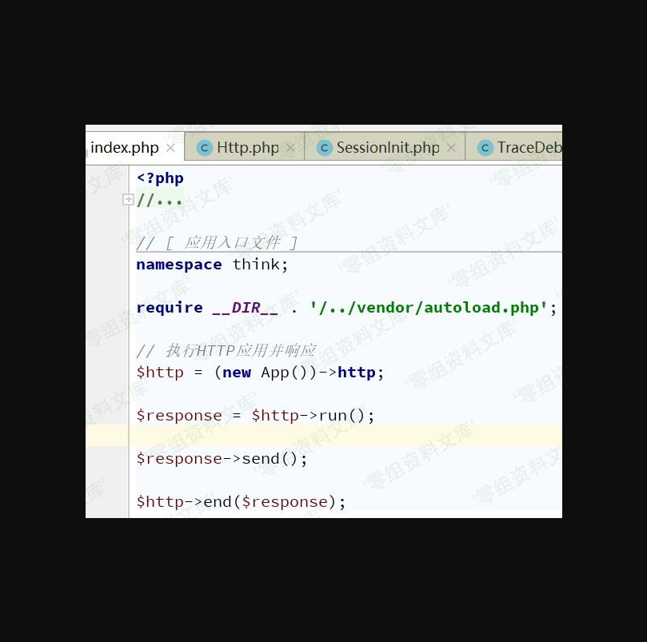
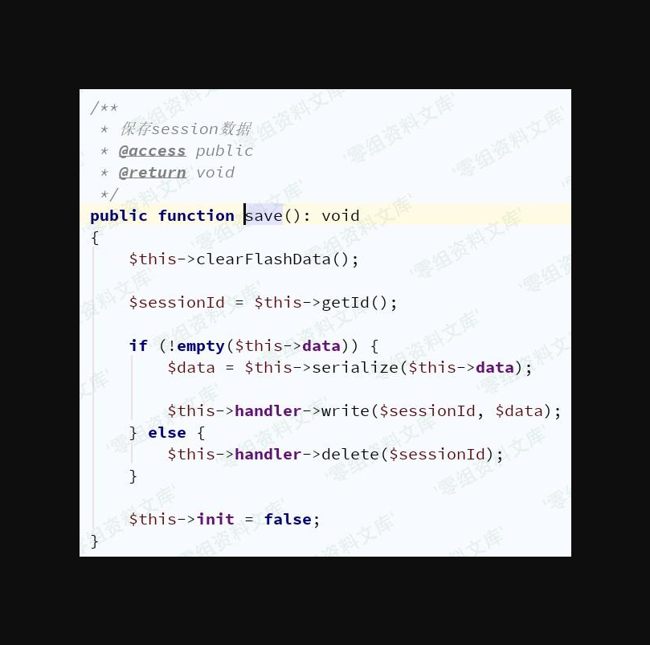
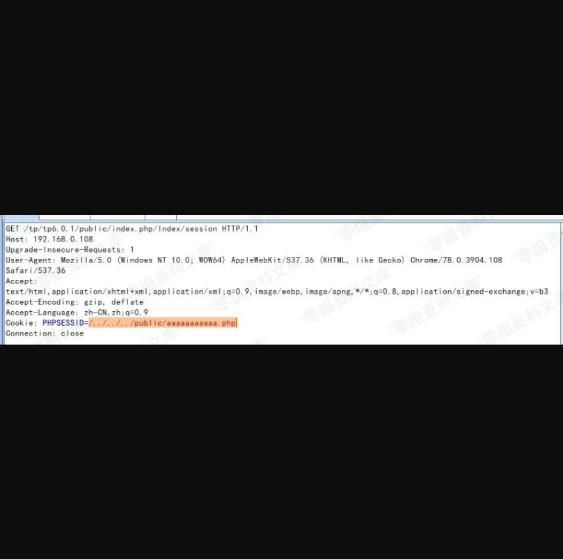

Thinkphp 6.1 任意文件创建&删除漏洞
==================================

一、漏洞简介
------------

漏洞允许攻击者在启用session的目标环境下创建任意文件以及删除任意文件（仅Windows下），在特定情况下还可以getshell。

二、漏洞影响
------------

ThinkPHP\<6.0.2

三、复现过程
------------

### 环境搭建

ThinkPHP6.0.1+PHP7.2+Windows

    composer create-project topthink/think tp6.0.1
    #修改json后
    composer update

1.  **开启session**

middleware.php中添加

    \think\middleware\SessionInit::class

1.  **控制器**

```{=html}
<!-- -->
```
    public function session(){
        session('name', '<?php phpinfo();?>');#模拟写入内容可控
        $SessionName = config('session.name');
        $SessionID = cookie($SessionName);
        echo $SessionID;
    }

### 漏洞分析

官方修复`vendor/topthink/framework/src/think/session/Store.php`中`setId()`方法

在修复之前，参数id为32位时直接将其值赋值给\$this-\>id


回溯该方法调用情况，在`vendor/topthink/framework/src/think/middleware/SessionInit.php`中发现调用

同时从图中可知\$sessionId的值来源途径之一为cookie中获取，而\$cookieName默认值为"PHPSESSID"


`handle()`方法作用是初始化session，在下面发现end()方法，在响应过程中一定会触发end()方法，因为在框架入口文件index.php中已经写明：



end()中存在save()方法：

    public function end(Response $response)
    {
        $this->session->save();
    }

save()位于`vendor/topthink/framework/src/think/session/Store.php`

此处\$sessionId值可来源于cookie\['PHPSESSID'\]，可控，但

\$this-\>data可决定创建文件或删除文件，经过调试得知，其值来源于程序写入session的值，例如：

    session("PHPSESSID","admin");

则\$this-\>data值为"admin"，因此如果写入session可控，则可写入任意内容文件。



写入write()和创建文件delete()均是接口方法


在程序处理过程中肯定会涉及其他类，因此搜索实现了该接口的类，发现：

`vendor/topthink/framework/src/think/session/driver/File.php`符合条件


### 漏洞复现

在上文write()方法中，文件名\$filename经过了getFIleName()的处理，而该方法会在传入参数前添加"sess\_"，也就是说文件名后部分可控，这是比较重要的一个点。


\*\*任意文件删除：\*\*删除public目录下aaaaaaaaaaa.php

> 需开启session，且仅Windows下可行


**文件写入**：

> 要求开启session，且写入session可控

    session('name', '<?php phpinfo();?>');




写入和删除文件时的测试：

    #以下均可行，系统将sess_视作一个目录
    file_put_contents("D:\tp6.0.1\runtime\session\sess_/../../../public/aa.php",1)
    include "D:\tp6.0.1\runtime\session\sess_/../../../public/aa.php"
    #unlink()有区别：Windows下可行,Linux下无法识别目录
    unlink("D:\tp6.0.1\runtime\session\sess_/../../../public/aa.php")#成功删除
    unlink("/var/www/html/runtime\session\sess_/../../../public/aa.php")#删除失败

参考链接
--------

> http://pines404.online/2020/01/21/%E4%BB%A3%E7%A0%81%E5%AE%A1%E8%AE%A1/ThinkPHP/ThinkPHP6.0.1%E4%BB%BB%E6%84%8F%E6%96%87%E4%BB%B6%E5%88%9B%E5%BB%BA%E5%92%8C%E5%88%A0%E9%99%A4%E6%BC%8F%E6%B4%9E%E5%88%86%E6%9E%90/
