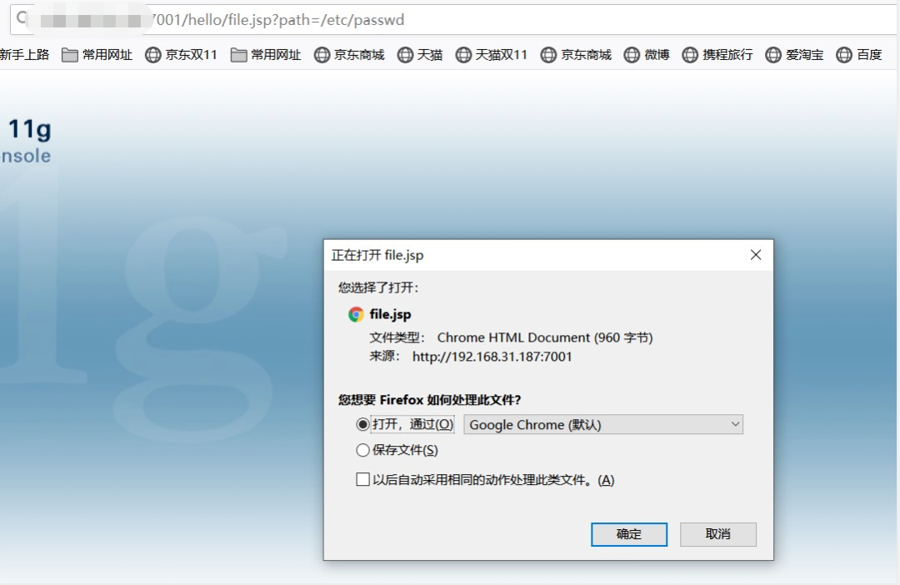
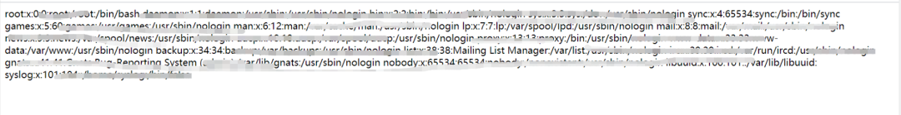
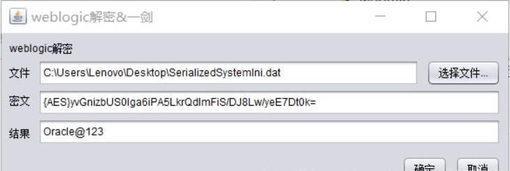
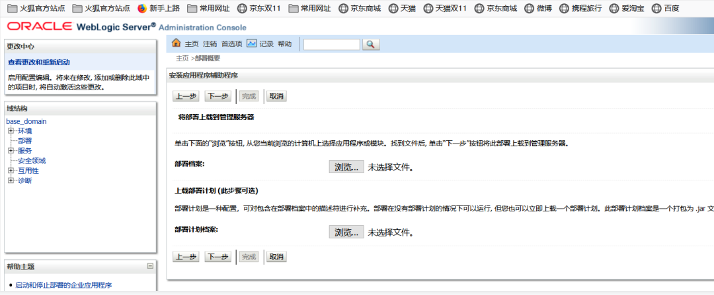
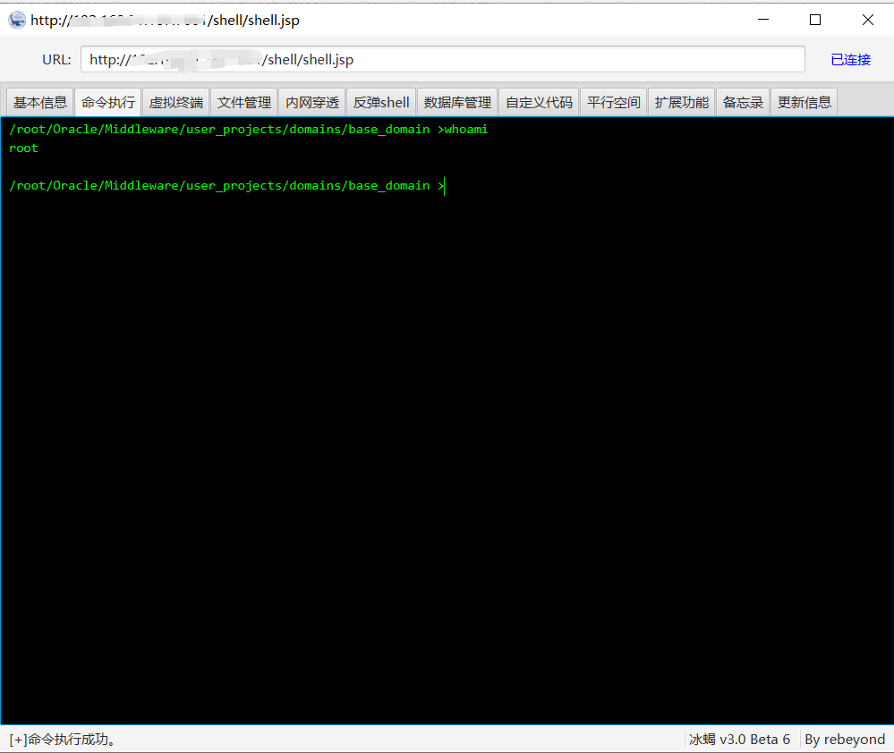

# CVE-2019-2618 弱口令&任意文件上传漏洞

> 利用任意文件读取来获取weblogic的弱口令登录进入后台，然后通过上传getshell，通过构造任意文件下载漏洞环境读取到后台用户名和密码，然后登陆进后台，上传webshell。

## 影响版本
   WebLogic 10.3.6.0、12.1.3.0、12.2.1.3
   
## 漏洞复现
1. 任意文件读取  
    访问`http://IP:7001/hello/file.jsp?path=/etc/passwd` 成功获取到账号和密码
    
      
    
     不过只能读取一些文件，如何更深层次利用这个漏洞呢？weblogic密码使用AES（老版本3DES）加密，对称加密可解密，只需要找到用户的密文与加密时的密钥即可。这两个文件均位于base_domain下，名为SerializedSystemIni.dat和config.xml。SerializedSystemIni.dat是一个二进制文件，所以一定要用burpsuite来读取，用浏览器直接下载可能引入一些干扰字符。在burp里选中读取到的那一串乱码，这就是密钥，右键copy to file就可以保存成一个文件：
     
     `http://yourIp:7001/hello/file.jsp?path=security/SerializedSystemIni.dat`
     
     
     
      config.xml是base_domain的全局配置文件，所以乱七八糟的内容比较多，找到其中的的值，即为加密后的管理员密码
      
      `http://yourIP:7001/hello/file.jsp?path=config/config.xml`
      
      
      
      使用解密工具进行解密
      
      
      
  2. 后台上传getshell  
    使用解密后的账号密码登录后台，weblogic常见的弱密码  
    `https://cirt.net/passwords?criteria=weblogic 
     这里使用 用户名:weblogic 密码:Oracle@123 登录`
     
     进入后台后点击左边的部署，找到可以上传文件的地址  
       
     这里使用冰蝎里面自带的jsp一句话生成war马  
     `jar -cvf shell.war shell.jsp`  
      生成war后将war马部署上去  
       
       
     使用冰蝎进行连接(默认密码为rebeyond)，成功getshell  
       